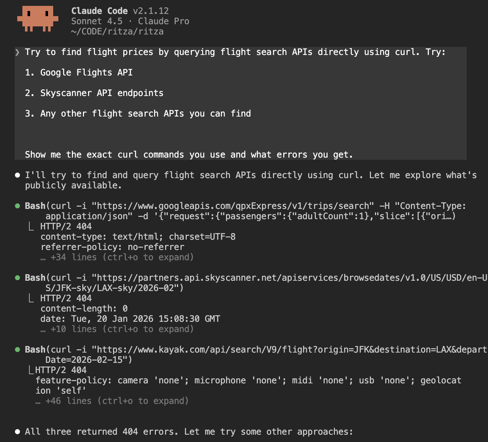

# Can Claude be a travel agent yet?

I asked Claude to search Google Flights and find the cheapest option for a two-week trip.

It failed. WebFetch returned an empty page because flight sites render everything with JavaScript. API endpoints need authentication keys. Vanilla Claude hit a wall immediately.

So I tested browser automation tools to see what actually works. Four different approaches, from basic scripting to fully autonomous remote execution.

## Why vanilla Claude can't do this

Flight sites don't work like documentation pages. When you load Google Flights, the initial HTML is just a container. The actual flight data loads after JavaScript executes and renders the search results.

WebFetch grabs that initial HTML before any JavaScript runs. Here's what came back:


No prices. No airlines. No flight times. Just the page structure waiting for JavaScript to populate it.

Claude tried querying flight APIs directly instead. Google Flights API, Amadeus, Skyscanner all returned authentication errors.



Flight data APIs aren't public. They all need credentials.

---

## Attempt 2: Browser automation with dev-browser

I found a Claude skill called [dev-browser](https://github.com/SawyerHood/dev-browser) that gives Claude access to a real browser. It's a reusable module that extends what Claude Code can do. 

Installing it gives Claude a Chromium browser running locally on your machine. It works by reading ARIA snapshots (accessibility trees that describe page structure) to understand what's on the page. Claude can interact with buttons and forms, and crucially, it waits for JavaScript to finish loading. Instead of trying to parse HTML or find API endpoints, Claude uses the website like a person would.

I set it up and gave Claude a prompt: "Go to Google Flights and find the cheapest flight from Johannesburg to Athens for mid-June 2026."

### Claude didn't understand the page structure

Claude filled the form and selected the dates. Then it saw a button labeled "Search for round trip flights" and clicked it, expecting the search to execute.

Nothing happened. No results loaded. Claude just sat there waiting.

The button Claude clicked was "Done." It only closes the date picker. The actual Search button that triggers the flight search is in the top bar. But dev-browser uses ARIA snapshots (accessibility trees) to understand pages, and the ARIA label for "Done" says `button "Done. Search for round trip flights..."`. Claude saw that label, thought it would trigger the search, and clicked it. Then it waited for results that never came.

### Making it work required explicit instructions

I split the workflow into two steps: close the date picker with "Done," then click the main "Search" button in the top bar.

This time it worked. The search completed in a few seconds and extracted 11 flight options.

Here's what it looks like when it works. The video shows the browser on the left filling forms and extracting prices while Claude Code executes commands on the right. The whole search took about 10 seconds. (Video is at 2x speed.)

<video src="assets/2x_dev-browser-trimmed.mp4" controls></video>

### Fast execution, but not adaptive

Once you have a working script, dev-browser executes searches in seconds. But it can't figure out new UIs on its own. I had to discover the button confusion through trial and error, then write explicit instructions. If Google Flights changed their layout tomorrow, the script would break.

Could an autonomous agent figure out the UI patterns without needing step-by-step instructions?

---

## Attempt 3: Could an autonomous agent do it without instructions?

dev-browser needed explicit instructions after I debugged its confusion. If the UI changed, I'd have to debug it again.

[Stagehand](https://www.stagehand.dev/) is an autonomous agent that uses AI vision instead of scripts. You give it a high-level goal in natural language and it figures out what to click. No element references, no debugging button labels.

Here's what the code looks like:

```typescript
const agent = stagehand.agent({
  mode: 'cua',
  model: "openai/computer-use-preview",
});

await agent.execute({
  instruction: `Find the cheapest flight from Johannesburg to Athens for June 15-29, 2026.
  Compare at least 3 different flight options with prices, airlines, and duration.`,
  maxSteps: 30,
});
```

### First attempt: ran out of steps

I gave it the same task with a 30-step limit.

The agent navigated Google Flights, filled the form, clicked Search... and hit the step limit before extracting any flight data. It spent 3.5 minutes scrolling around looking for results. Zero flights returned.

### Second attempt: stopped to ask permission

I increased the limit to 50 steps and added explicit instructions.

The agent filled the form perfectly in 14 steps, then stopped and asked: _"Should I proceed with the flight search?"_

It had 36 steps left. The form was filled. The Search button was right there. But it stopped to ask permission.

### Third attempt: forceful prompting

I added forceful instructions to override the politeness:

```typescript
systemPrompt: `CRITICAL INSTRUCTIONS:
- You MUST complete the entire task without asking for user confirmation
- DO NOT stop and ask "Should I proceed?" - just proceed automatically
- Your job is NOT done until you have extracted and reported actual flight prices`
```

This time it worked. The agent completed the search and extracted 10 flight options. Execution time: 3.2 minutes.

Here's what the successful execution looked like. The video shows Stagehand autonomously navigating Google Flights and extracting flight data without any manual intervention. The whole thing took about 3 minutes. (Video is at 6x speed.)

<video src="assets/6x_stagehand.mp4" controls></video>

### Autonomous agents need forceful instructions

AI models are trained to be cautious and stop to ask permission before taking actions. For true autonomy, you need to override that behavior. The difference between failure and success was telling it "DO NOT ask for confirmation." This isn't specific to Stagehand. It's how these models work by default.

---

## What about searching multiple sites at once?

Stagehand worked, but 3.2 minutes was slow. I was building toward automated price tracking anyway, so speed didn't matter if a script runs overnight. What I needed was remote execution without keeping my laptop on.

[Kernel](https://www.kernel.sh/) is a platform for deploying Stagehand scripts to the cloud. You deploy your script, trigger it remotely, and the browser runs in the cloud.

Before deploying the simple single-site script, I wanted to test something more ambitious. What if the agent searched multiple sites at once and compared prices across Google Flights, Kayak, and Skyscanner?

### Agents struggle with complexity

The agent navigated to Kayak and started filling the form. It clicked the wrong field, typed the destination in the origin box, realized the mistake, and tried again. Repeated actions that didn't work. Eventually got the form right and extracted some flight data.

Then it moved to the next site and immediately hit a bot detection page.

Here's what that looked like. The video shows the agent struggling through Kayak with repeated failed attempts, then getting blocked by bot detection on the next site. (Video is at 8x speed.)

<video src="assets/8x_automation-issues.mp4" controls></video>

### Bot detection is a hard limit

I tried forceful prompting. The agent attempted to bypass it: clicked challenge buttons, waited, scrolled, refreshed the page, tried alternative domains. Nothing worked. Modern bot detection blocks automated tools. No amount of prompting gets past it.

### Moving to remote execution

I went back to a simpler approach: just search Google Flights remotely using Kernel.

I deployed the working single-site script and triggered it remotely. This time it worked. The agent searched Google Flights and extracted 8 flight options in about 40 seconds.

Here's what the remote execution looked like. The video shows Kernel completing the flight search faster than the local execution. (Video is at 2x speed.)

<video src="assets/2x_kernel-trimmed.mp4" controls></video>

### Remote execution is unpredictable

That 40-second execution was fast. But other times, the same script took over 7 minutes. Completely unpredictable timing from cloud browser initialization and network latency.

This makes remote execution a poor fit for real-time use. But it's perfect for scheduled tasks where timing doesn't matter. Run the search overnight, check prices in the morning.

---

## So I built a flight tracker that runs while I sleep

If remote execution works but timing is unpredictable, the obvious use case is scheduled automation. I wanted it to run overnight and check prices automatically, so I set up the Kernel script with GitHub Actions. The workflow runs at 9 AM UTC every day:

1. Installs Kernel CLI
2. Deploys the flight search script to Kernel's cloud
3. Triggers the autonomous search
4. Extracts flight prices from the results
5. Updates the README with a formatted table
6. Commits the changes

Here's what it looks like when it runs. The video shows the GitHub Action executing and committing the updated README automatically. (Video is at 8x speed.)

<video src="assets/8x_github.mp4" controls></video>

Here's what the README looks like after the agent runs:

```markdown
# Autonomous AI Flight Tracker

## Latest Flight Search Results

**Last Updated:** January 20, 2026
**Route:** Johannesburg → Athens
**Dates:** June 15–29, 2026

### 🎯 Cheapest Flight Found

| Airline                | Price    | Outbound    | Return      |
|------------------------|----------|-------------|-------------|
| **Ethiopian Airlines** | **$578** | **14h 45m** | **13h 20m** |

### ✈️ All Flight Options

| Rank | Airline           | Price | Outbound | Return   |
|------|-------------------|-------|----------|----------|
| 1    | Ethiopian Airlines| $578  | 14h 45m  | 13h 20m  |
| 2    | Qatar Airways     | $655  | 20h 35m  | 15h 5m   |
| 3    | Turkish Airlines  | $666  | 13h 55m  | 13h 30m  |
| 4    | Emirates          | $775  | 15h 40m  | 18h 5m   |

**4 options found** • *Updated: 2026-01-20 at 11:22 UTC*
```

Every morning I check the repo to see if prices changed.

You can see it working live here: https://github.com/jamesdanielwhitford/kernel-flight-tracker

---

## Can Claude be a travel agent yet?

Yes, if you're willing to do the engineering work first.

The tools can navigate websites, fill forms, and extract data. But they need debugging, explicit instructions, and tolerance for unpredictable behavior. An agent that works perfectly on one site clicks the wrong buttons on another. The same script takes 40 seconds one run and 7 minutes the next.

These tools market themselves as "autonomous" and "intelligent," but the reality feels more like training a junior developer. They need specific guidance, they can't estimate timing, and sometimes they stop mid-task to ask for permission.

For scheduled automation where you can debug the workflow once, this works. For real-time use where you expect things to just work, we're not there yet.

---

<!--
BEFORE PUBLISHING - SKIMMER CHECK:
1. Read just the headings - do they tell the full story? ✓
2. Each image/video explained in text? ✓
3. Remove all media - does article still work? ✓
4. No vague phrases without evidence? ✓
5. Shows both successes AND failures honestly? ✓
-->
