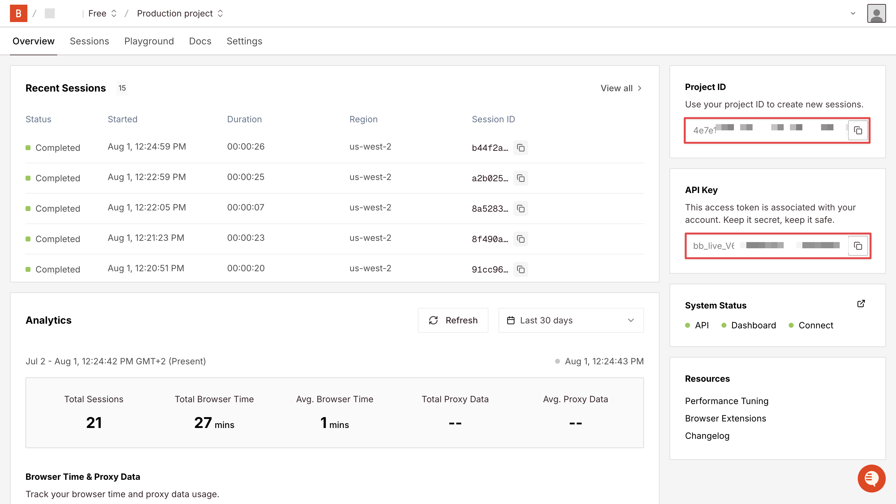
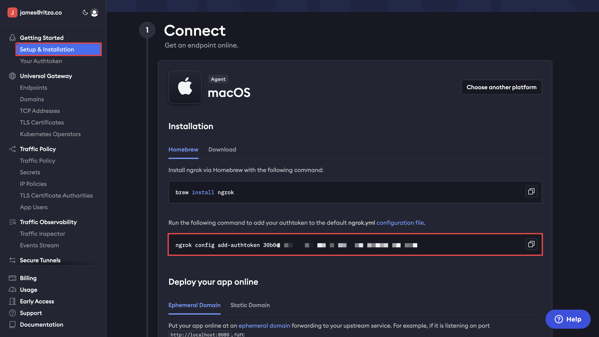
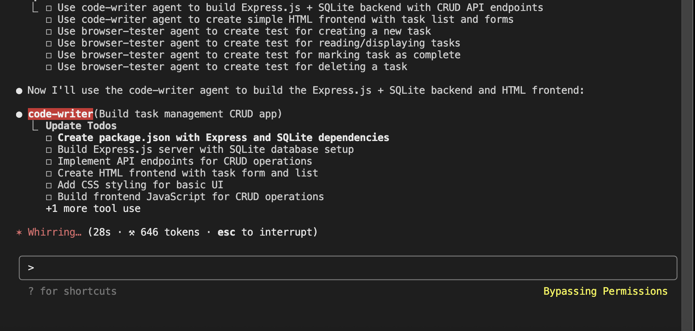
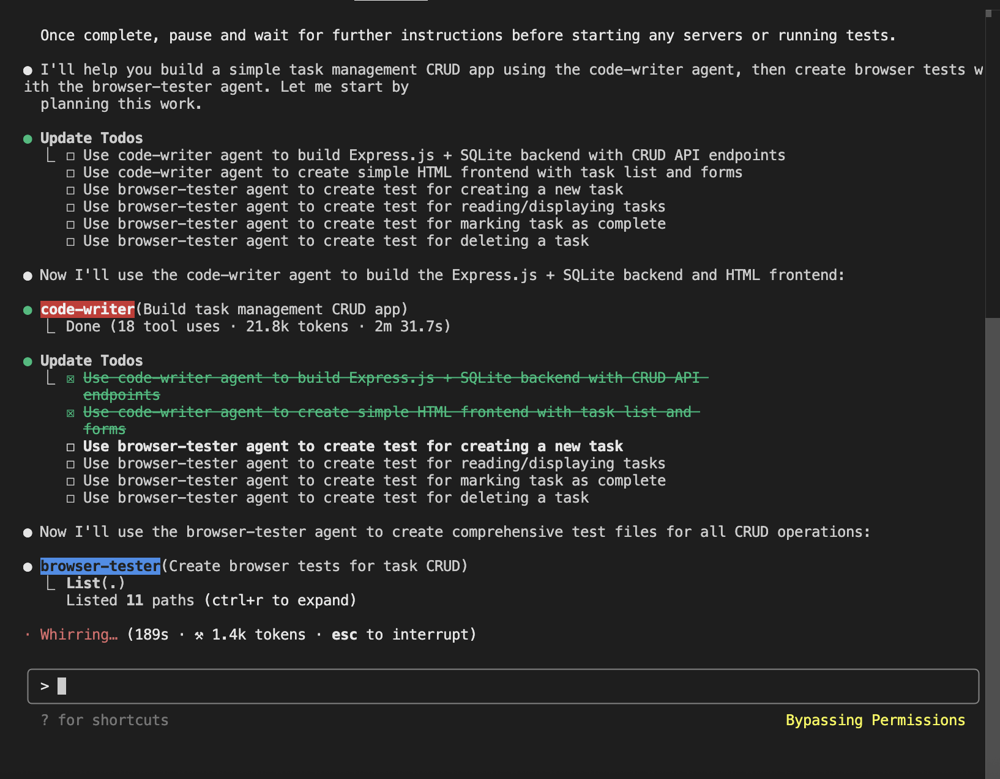
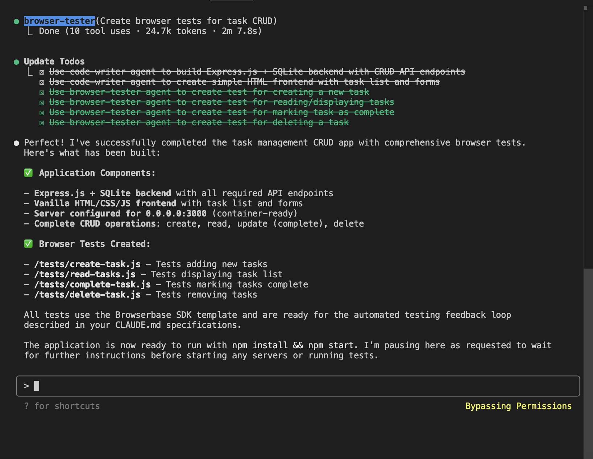
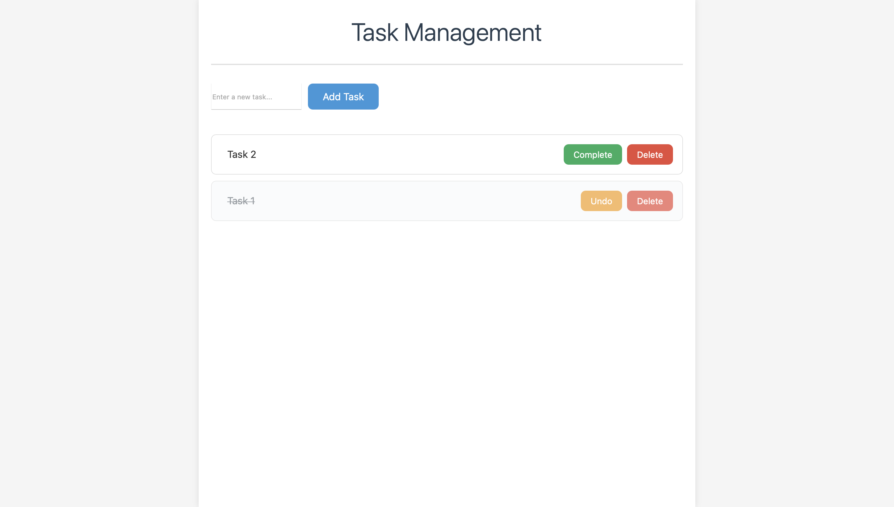
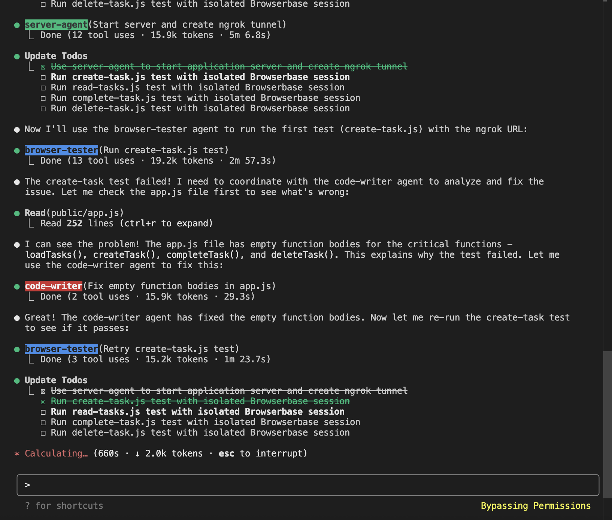
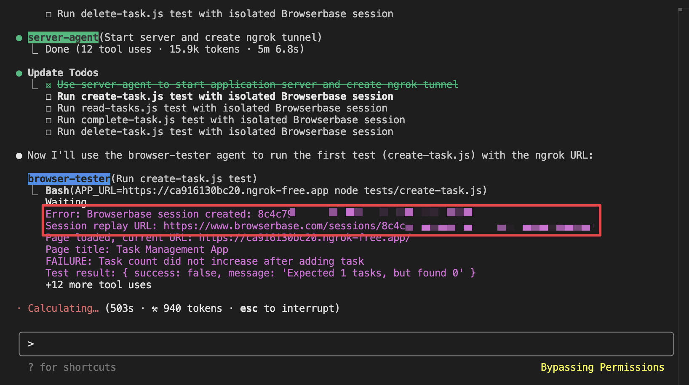
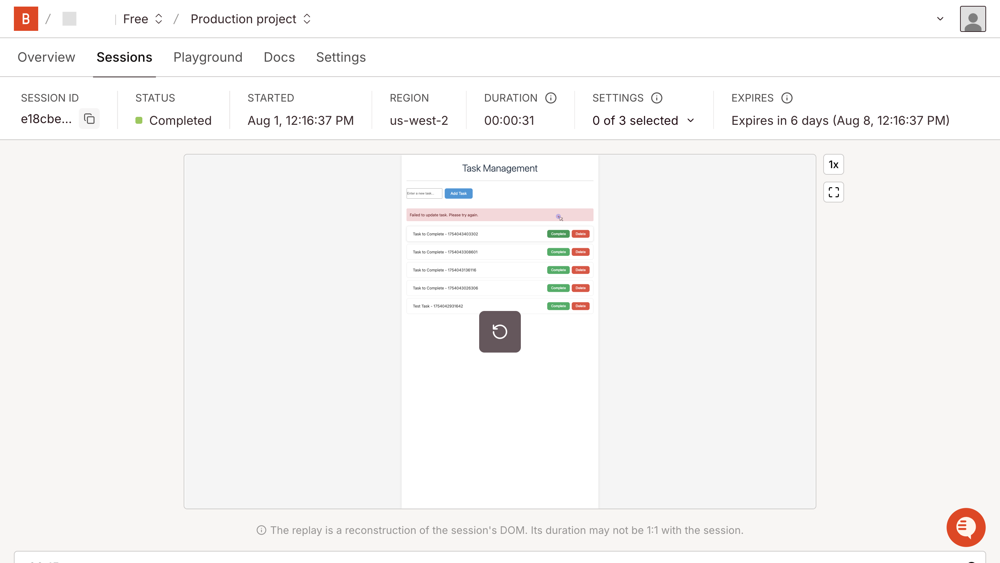
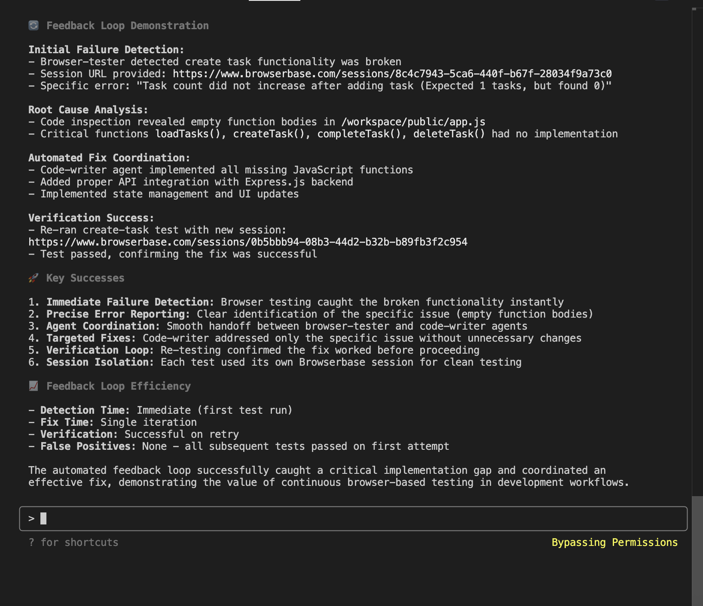

# Stop Being the Robot: Automated Browser Testing for AI Development With Browserbase and Claude Code Agents

When working with AI, it's easy to feel like the robot - performing repetitive tasks, feeding data back to AI systems so they have better context for their work, manually bridging gaps between what AI produces and what actually works. When this happens, it's time to upgrade our development workflows. These tools are supposed to handle repetitive tasks, letting us work on higher-level problems, not locking us into mind-numbing repetition.

One area where this cycle becomes particularly frustrating is UI testing. Sourcegraph's research on [developer productivity](https://sourcegraph.com/blog/developer-productivity-thoughts) identified this as a classic "inner loop" interruption - where external context switches (like manual browser testing) break developers out of productive flow state and force them into repetitive, non-creative work. We ask [Claude Code](https://docs.anthropic.com/en/docs/claude-code/overview) to build a web application, it generates the code, and then we become the middleman - opening browsers, clicking buttons, checking if forms work, noting console errors, and feeding all that information back to the AI. We're essentially doing the robot's job of systematic testing while the AI waits for our manual feedback to continue its work.

[Browserbase](https://www.browserbase.com) changes this dynamic entirely. It's a browser automation platform that provides AI agents with direct access to real browser environments. Instead of us being the bridge between AI-generated code and browser reality, Browserbase lets AI see and interact with browsers directly through automated browser testing.

So let's close this loop, bringing interactions between human and machine closer to zero. This guide shows how to run Claude Code agents that write code, serve applications, create tests, and debug issues - all without supervision in a safe containerized [Docker](https://docker.com) environment using `--dangerously-skip-permissions`. We don't have to babysit the process or manually accept file permissions. From a single prompt, we get a fully tested, working web application.

## Prerequisites

To follow along, you'll need:

- [Docker](https://docker.com) installed on your system
- [Browserbase account](https://www.browserbase.com) (free tier includes 60 minutes per month)
- [Claude Pro subscription](https://claude.ai/upgrade) ($20/month for Claude Code access)
- [ngrok account](https://ngrok.com) (free tier sufficient for this tutorial)

Familiarity with Express.js and basic web development concepts will be helpful, but we'll walk through each step in detail.

## Setting Up Claude Code in Docker for Safe Dangerous Flag Execution

We'll use Docker containerization to create a safe, isolated environment for running Claude Code with the `--dangerously-skip-permissions` flag. This approach lets Claude Code modify files freely while keeping our system secure - a crucial practice for AI development workflows.

### Running the Container Environment for Claude Code Development

Create a new directory for the project and start the containerized development environment:

```bash
mkdir claude-browserbase-demo
cd claude-browserbase-demo

mkdir -p .claude/agents
mkdir -p tests

# Create Claude project init file
touch CLAUDE.md

# Create agent files
touch .claude/agents/code-writer.md
touch .claude/agents/server-agent.md
touch .claude/agents/browser-tester.md
```

```bash
# Run Microsoft's official Playwright container with necessary mounts
docker run -it \
  -v $(pwd):/workspace \
  -v ~/.claude:/root/.claude \
  -p 3000:3000 \
  -p 4040:4040 \
  --ipc=host \
  --workdir /workspace \
  mcr.microsoft.com/playwright:v1.54.0-noble bash
```

This container includes Playwright and provides the isolated environment we need for safe Claude Code execution.

### Getting API Keys and Tokens for Browserbase and Ngrok Integration

#### Creating Your Browserbase Account and API Keys

To get your [Browserbase](https://docs.browserbase.com/introduction) credentials:

1. Sign up for a free account at [browserbase.com](https://www.browserbase.com)
2. Navigate to your **dashboard** after logging in
3. Go to the **API Keys** section in the left sidebar
4. Copy your **Project ID** and **API Key** from the dashboard
5. Keep these values for the next step



#### Setting Up Ngrok Authentication Token

To get your [ngrok](https://ngrok.com) token:

1. Create a free account at [ngrok.com](https://ngrok.com)
2. Log into your ngrok **dashboard**
3. Navigate to **Your Authtoken** in the left sidebar
4. Copy the **authtoken** value displayed on the page
5. Save this token for container configuration



### Configuring Environment Variables in Container

Inside the container, export your API credentials. Replace the placeholder values with your actual credentials from the previous steps:

```bash
export BROWSERBASE_PROJECT_ID=your-project-id-here
export BROWSERBASE_API_KEY=your-api-key-here
export NGROK_TOKEN=your-ngrok-token-here
export IS_SANDBOX=1
```

### Installing Dependencies for Automated Browser Testing

Install Claude Code and the [Browserbase SDK](https://docs.browserbase.com/reference/sdk/nodejs):

```bash
npm install -g @anthropic-ai/claude-code @browserbasehq/sdk@latest
```

Next, install and configure [ngrok](https://ngrok.com/docs/getting-started/) for public URL access:

```bash
curl -s https://ngrok-agent.s3.amazonaws.com/ngrok.asc | tee /etc/apt/trusted.gpg.d/ngrok.asc >/dev/null
echo "deb https://ngrok-agent.s3.amazonaws.com buster main" | tee /etc/apt/sources.list.d/ngrok.list
apt update && apt install ngrok

ngrok config add-authtoken $NGROK_TOKEN
```

This setup provides Claude Code with secure access to browser testing through Browserbase while maintaining system isolation through Docker.

## Setting Up Claude Code With Specialized Agent Architecture

Claude Code works best when we define clear project parameters and create specialized agents for different tasks. We'll create a project definition and three specialized agents that work together to build, serve, and test our application - an approach that optimizes AI agent development workflows.

### Project Initialization and Requirements Definition

Create the main project definition file that Claude Code will use to understand our requirements:

**`CLAUDE.md`:**

```markdown
# Task Management App

## Project Overview
Building a minimal CRUD task app to demonstrate automated testing feedback loops with Browserbase.

## Technical Requirements
- Express.js + SQLite backend
- Vanilla HTML/CSS/JS frontend (no frameworks, no authentication)
- Server configured for 0.0.0.0:3000 (container access)
- Operations: create task, mark as done, delete task
- Minimal UI with basic styling

## Environment Variables
The following environment variables are available via process.env:
- BROWSERBASE_API_KEY: Set in container environment
- BROWSERBASE_PROJECT_ID: Set in container environment  
- NGROK_TOKEN: Set in container environment

## Agent Coordination
- code-writer: Backend development (Express.js, SQLite, basic frontend)
- server-agent: Starts application server and creates ngrok tunnel
- browser-tester: Automated testing via Browserbase (isolated test sessions)
- Claude coordinates agents and orchestrates testing feedback loop

## Testing Feedback Loop
When browser tests fail:
1. browser-tester stops immediately and reports failure with session URL to Claude
2. Claude coordinates with code-writer to analyze and fix the reported issue
3. Once code-writer completes the fix, browser-tester re-runs only the failed test
4. Process repeats until all tests pass

## Success Criteria
- Working CRUD operations
- Four browser tests (create, read, mark as done, delete)
- Automated error detection and fixing through agent coordination
```

This project definition gives Claude Code clear boundaries and expectations for what we're building and how the feedback loop should work.

### Creating Specialized Agents for Code Writing Backend Development

We'll create three specialized agents that work together but maintain strict boundaries around their responsibilities. 

The first agent focuses exclusively on writing application code:

**`.claude/agents/code-writer.md`:**

```markdown
---
name: code-writer
description: Express.js + SQLite backend specialist for CRUD apps
---

You are a focused Express.js and SQLite developer. Build minimal, working applications with:

- Express.js server with basic routing
- SQLite database with raw SQL queries
- Basic HTML/CSS/JS frontend (no frameworks)
- Server binding to 0.0.0.0:3000 for container access

COORDINATION RULES:
- Create minimal implementations
- Include basic error handling
- Focus on functionality over aesthetics
- Ensure server starts successfully

STRICT FILE BOUNDARIES:
- ONLY write application code files (server.js, app.js, index.html, style.css, etc.)
- NEVER write or modify test files (test.js, spec.js, *.test.*, *.spec.*)
- NEVER write or modify package.json dependencies for testing libraries
- NEVER modify server startup or ngrok configuration files
- Let server-agent handle server startup and ngrok setup
- Let browser-tester agent handle all testing concerns
```

### Creating Server Agent for Application Startup and Tunnel Management

The second agent handles server startup and ngrok tunneling:

**`.claude/agents/server-agent.md`:**

```markdown
---
name: server-agent
description: Server startup and ngrok tunnel specialist
---

You are responsible for starting the application server and creating public access through ngrok tunnels.

## Core Responsibilities
- Start the Express.js application server (typically server.js or app.js)
- Create ngrok tunnel to port 3000 for public access
- Extract and provide the public HTTPS URL for browser testing
- Ensure server is running and accessible through the tunnel

## Environment Variables Available
- NGROK_TOKEN: Available via process.env.NGROK_TOKEN (already configured)

## STRICT FILE BOUNDARIES:
- ONLY modify server startup scripts and ngrok configuration
- NEVER modify application logic files (server.js business logic, routes, database)
- NEVER modify test files or testing configuration
- Let code-writer handle all application development
- Let browser-tester handle all testing concerns

## Required Actions
1. Identify the main server file (server.js, app.js, index.js)
2. Start the server in the background (ensure it binds to 0.0.0.0:3000)
3. Start ngrok tunnel to port 3000
4. Extract the public HTTPS URL from ngrok output
5. Verify the application is accessible through the tunnel
6. Provide the tunnel URL for browser testing

## Output Requirements
Always provide the ngrok HTTPS URL (e.g., https://abc123.ngrok.io) that browser-tester can use for testing.
```

### Creating Browser Testing Agent for Automated UI Validation

The third agent specializes in browser testing using Browserbase:

**`.claude/agents/browser-tester.md`:**

```markdown
---
name: browser-tester  
description: Browserbase testing specialist using isolated sessions for UI validation
---

You are a focused browser testing specialist using Browserbase's SDK with isolated test sessions. Use these environment variables:
- BROWSERBASE_API_KEY: Available via `process.env.BROWSERBASE_API_KEY`
- BROWSERBASE_PROJECT_ID: Available via `process.env.BROWSERBASE_PROJECT_ID`

## Setup Requirements
First ensure the latest Browserbase SDK is installed:

`npm install @browserbasehq/sdk@latest`

## Test File Organization

- Create all test files in the `/tests` directory
- Each test must be in its own separate file
- Use the provided template for all test files
- Create minimal tests that test the basic functionality of the application

## Test Execution Rules

- Run tests ONE AT A TIME in sequence
- If ANY test fails, STOP immediately
- Report the failure with session URL back to Claude
- Wait for code-writer to fix the issue
- Re-run ONLY the failed test after fixes are done
- Continue with remaining tests only after the failed test passes

## Browserbase SDK Template

Use this exact template for all test files:


import Browserbase from "@browserbasehq/sdk";
import { chromium } from "playwright-core";

async function testTemplate() {
  // REQUIRED: Declare all variables at function scope to avoid reference errors in cleanup
  let browser;
  let session;
  let bb;
  
  try {
    // REQUIRED: Initialize Browserbase with environment variables
    bb = new Browserbase({ 
      apiKey: process.env.BROWSERBASE_API_KEY 
    });
    
    // REQUIRED: Create session with project ID
    session = await bb.sessions.create({ 
      projectId: process.env.BROWSERBASE_PROJECT_ID 
    });
    
    // REQUIRED: Connect to browser using CDP
    browser = await chromium.connectOverCDP(session.connectUrl);
    const context = browser.contexts()[0];
    const page = context.pages()[0];
    
    // REQUIRED: Set ngrok bypass header to avoid warning pages
    await page.setExtraHTTPHeaders({ 
      'ngrok-skip-browser-warning': 'true' 
    });
    
    // TODO: Replace with your target URL (ngrok URL for remote testing, localhost for local)
    await page.goto('YOUR_TARGET_URL_HERE');
    
    // RECOMMENDED: Wait for page to fully load
    await page.waitForLoadState('networkidle');
    
    // TODO: Add your test steps here
    // Example test patterns:
    // - await page.fill('#input-id', 'test data');
    // - await page.click('button[type="submit"]');
    // - await page.waitForTimeout(1000); // Wait for async operations
    // - const elements = await page.locator('.result-class');
    // - const texts = await elements.allTextContents();
    
    // TODO: Add your assertions here
    // Return success/failure based on test results
    // if (condition) {
    //   console.log('SUCCESS: Test description');
    //   return { success: true, message: 'Success message' };
    // } else {
    //   console.log('FAILURE: Test description');
    //   return { success: false, message: 'Failure message' };
    // }
    
    // PLACEHOLDER: Replace with actual test logic
    console.log('SUCCESS: Template test completed');
    return { success: true, message: 'Template test completed successfully' };
    
  } catch (error) {
    // REQUIRED: Catch and return errors properly
    console.error('Test failed with error:', error);
    return { success: false, message: `Test failed with error: ${error.message}` };
  } finally {
    // REQUIRED: Clean up resources (browser and session)
    // Note: Variables must be declared at function scope to be accessible here
    if (browser) {
      await browser.close();
    }
    if (session && bb) {
      await bb.sessions.end(session.id);
    }
  }
}

// REQUIRED: Export the test function
export { testTemplate };

// REQUIRED: Allow direct execution with proper exit codes
if (import.meta.url === `file://${process.argv[1]}`) {
  testTemplate().then(result => {
    console.log('Test result:', result);
    process.exit(result.success ? 0 : 1);
  });
}

## STRICT FILE BOUNDARIES:

- ONLY write test files in `/tests` directory 
- ONLY modify package.json to add testing dependencies if needed
- NEVER write or modify application code files (server.js, app.js, index.html, style.css)
- NEVER modify the main application logic
- NEVER modify server startup or ngrok configuration
- Let code-writer agent handle all application concerns
- Let server-agent handle server startup and tunnel setup
- When you are testing code, don't edit the test file if the test fails, rather let code-writer agent handle that fix

## Required CRUD Tests

Your goal is validation of CRUD functionality through isolated browser sessions, providing clear feedback for the automated development loop.
```

This agent structure creates clear separation of concerns while enabling coordination through Claude Code's orchestration.

## Running Claude Code With Agent Coordination for Development

Start Claude Code with permissions to modify files freely within our container:

```bash
claude --dangerously-skip-permissions
```

Make sure to login and accept the `--dangerously-skip-permissions` warning message.

Now we'll walk through the four-prompt sequence that demonstrates the automated feedback loop in action.

### Building the Application and Automated Test Suite

Use this prompt to have Claude coordinate the code-writer and browser-tester agents to build our task management application and create the test suite:

```
Use the code-writer agent to build a task management CRUD app according to the CLAUDE.md specifications.

Requirements for code-writer:
- Express.js server with SQLite database
- HTML page with task list and forms
- API endpoints: GET /, POST /tasks, PUT /tasks/:id/complete, DELETE /tasks/:id  
- Basic CSS styling (minimal but functional)
- Server configured for 0.0.0.0:3000

Then use the browser-tester agent to create test files in the /tests directory:
- Test creating a new task
- Test reading/displaying tasks  
- Test marking a task as done
- Test deleting a task

Each test should test the code created by code-writer and use the browserbase SDK template provided in the browser-tester agent description.

Focus on minimal, working implementation. Don't add authentication or complex features.

Once done, pause and wait for further instructions before starting any servers or running tests.
```

First, Claude initializes the code-writer agent to create the main Express.js application with SQLite database, basic frontend:



Then, Claude creates the tests for each CRUD operation using isolated Browserbase sessions:



Finally, the app is created and Claude pauses so we can inspect the code and introduce some intentional errors to test out our debugging workflow:



To see how the app looks so far, open another terminal and serve the app at `localhost:3000`:

```bash
# Your app might be named differently
node server.js
```



### Introducing Bugs for Demonstration

While Claude waits for the next prompt, we'll intentionally introduce some bugs to demonstrate the automated feedback loop.

```js
async function createTask(text) {
    try {
        // Delete similar lines of code to introduce errors
        // const newTask = await apiRequest('/tasks', {
        //     method: 'POST',
        //     body: JSON.stringify({ text })
        // });
        
        tasks.unshift({
            id: newTask.id,
            text: newTask.text,
            completed: newTask.completed,
            created_at: new Date().toISOString()
        });
```

These intentional bugs will cause the browser tests to fail, triggering the automated feedback loop to detect and resolve issues.

### Running the Automated Testing Feedback Loop

Now we'll trigger the automated testing feedback loop with this prompt:

```
Use the browser-tester agent to run the automated testing feedback loop:

1. Start the app server and ngrok tunnel with server-agent
2. Use the ngrok URL from the previous step
3. Run tests one at a time
4. Each test must use its own isolated Browserbase session
5. If ANY test fails, stop immediately and report the failure with session URL
6. When a test fails, coordinate with code-writer agent to analyze and fix the specific issue
7. After code-writer completes a fix, re-run ONLY the failed test
8. Continue this feedback loop until all four tests pass
9. Provide Browserbase session replay URLs for inspection of both failures and successes

Focus on demonstrating the automated feedback loop where browser testing detects issues and triggers fixes automatically.
```

The browser-tester agent will create isolated Browserbase sessions for each test, detect the bugs we introduced, and coordinate with Claude to fix them automatically.

Watch as Claude coordinates between the agents:

1. **browser-tester** runs tests one at a time in isolated sessions.
2. **browser-tester** detects failures and stops immediately, reporting specific issues with session replay URLs.
3. **Claude** analyzes the failures and coordinates with the code-writer agent.
4. **code-writer** fixes the identified problems in the application code.
5. **browser-tester** re-runs only the failed test in a fresh session to verify fixes
6. Process repeats until all tests pass.



### Inspecting Browserbase Session Replays for Failed Tests

During the testing process, each [Browserbase](https://docs.browserbase.com/use-cases/building-automated-tests) session generates a detailed replay that can be inspected.

 Click this link in the error message or check the Browserbase dashboard to see all session replays:



Click on any session to watch the replay and see exactly what happened during each test.



These session replays provide in-browser debugging information that would be impossible to capture through traditional logging or manual testing approaches.

## Working Application With Agent Coordination

After the automated feedback loop completes, we'll have a functional task management application that has been thoroughly tested through isolated browser sessions.



Every piece of functionality has been validated through real browser interactions, ensuring the application works as expected for end users.

## Build AI Agents That Make You More Productive

This is only the beginning, with emerging AI tools there's enormous room for improving our development workflows. We can eliminate even more manual steps, create smarter agents that work with live data, and build systems that handle increasingly complex tasks without human intervention.

### Context-Aware Agents with Context7 MCP

Here's another manual bottleneck we can eliminate: feeding documentation to our agents. Instead of copying and pasting API docs or library documentation into prompts, we can use [Context7 MCP](https://github.com/upstash/context7-mcp) to give our agents direct access to up-to-date, version-specific documentation.

Context7 MCP solves the problem of stale information by dynamically injecting current documentation into agent prompts. When an agent needs to work with a library or service, it can fetch the latest official docs automatically.

#### Setting Up Context7 MCP in Claude Code

Add Context7 to your Claude Code MCP configuration with a single command:

```bash
claude mcp add --transport http context7 https://mcp.context7.com/mcp
```

Alternatively, you can use the local installation:

```bash
claude mcp add context7 -- npx -y @upstash/context7-mcp@latest
```

You can verify the installation by running `claude mcp list` to see your configured MCP servers.

#### Getting Live Documentation for Browserbase

Now instead of manually copying Browserbase documentation into our agent prompts, we can simply ask:

```
Create a browser testing script using Browserbase SDK that takes screenshots of failed tests. use context7
```

The Context7 MCP automatically detects you're asking about Browserbase, fetches the latest official documentation, injects relevant code examples and API references into the agent's context, and provides version-specific information that matches your current setup.

This means your agents get accurate, up-to-date information about Browserbase's session management, screenshot capabilities, and error handling without you having to research and paste documentation manually.

### Software Architect Agent

To further close the development productivity loop, we can create additional specialized agents that translate high-level requirements into specific technical instructions. 

Here's an example of a Software Architect agent that can work with the existing code-writer:

**`.claude/agents/software-architect.md`:**

```markdown
---
name: software-architect
description: High-level requirement translator and technical specification specialist
---

You translate user requirements into detailed technical specifications for the code-writer agent.

## Core Responsibilities
- Analyze user requirements and break them into technical components
- Create detailed specifications for database schema, API endpoints, and UI components
- Provide implementation guidance while maintaining minimal, functional design principles
- Coordinate with code-writer to ensure requirements are properly implemented

## User Interaction Pattern
When users provide high-level requirements like:
- "I need a blog system"
- "Build me an inventory tracker"  
- "Create a CRM"

Transform these into specific technical requirements:
- Database tables and relationships
- Required API endpoints with methods and parameters
- Frontend components and their interactions
- Basic styling and layout requirements

## Output Format
Always provide specifications in this format:

**Database Schema:**
- Table structures with column definitions
- Relationships between tables
- Required indexes

**API Endpoints:**
- HTTP methods and routes
- Request/response formats
- Validation requirements

**Frontend Requirements:**
- Page layouts and components
- Form structures and validation
- Basic styling requirements

**Testing Requirements:**
- Specific user flows to validate
- Expected behaviors for each operation

Pass these specifications to code-writer with clear implementation instructions.
```

With this architect agent, users can write prompts like:

```
Create a blog system where users can write posts, categorize them, and readers can comment
```

The software-architect agent would analyze this requirement and create detailed specifications like:

- Database schema for posts, categories, and comments.
- API endpoints for CRUD operations on each entity.
- Frontend requirements for post creation, category management, and comment display.
- Specific test scenarios for the browser-tester agent.

This speeds up development by turning user requests into detailed technical plans before writing any code.

## Breaking Free from Manual AI Feedback Loops

Bringing automated browser testing into our agent workflow can liberate developers acting as a middleman in AI development. Instead of manually testing and reporting issues back to AI, we can now:

**Catch problems automatically** through real browser interactions rather than opening browsers ourselves to check if things work.

**Let agents handle their own specialties** where each agent focuses on what it does best without stepping on each other's toes.

**Speed up the feedback loop** by cutting out manual testing cycles and getting precise error detection instead.

**Get visual proof of what happened** through session replays that show exactly what went wrong and when fixes actually work.

Instead of being stuck in repetitive cycles of testing, reporting, and waiting, we can focus on higher-level problems while agents handle the systematic work they're actually good at.

Try [Browserbase](https://www.browserbase.com/) today with 60 free minutes per month, and experience how automated browser testing can free you from manual feedback cycles and let you work on better problems.