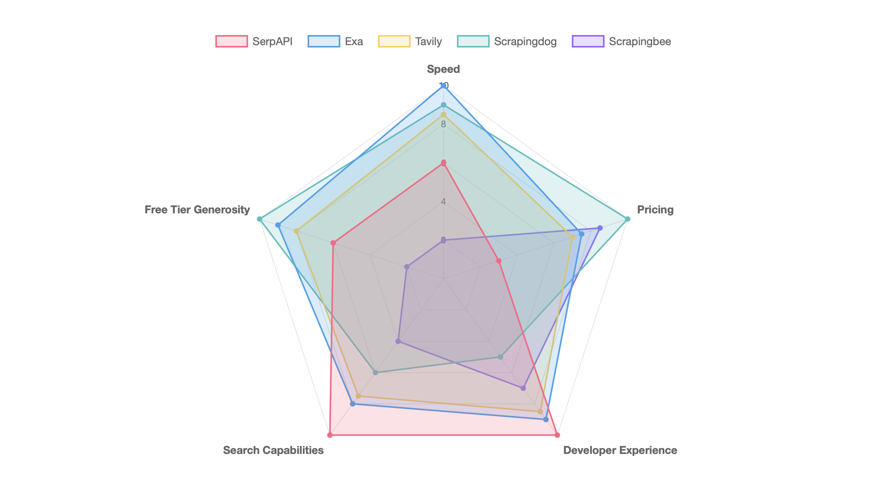
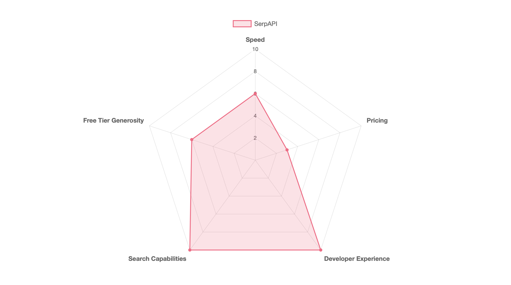
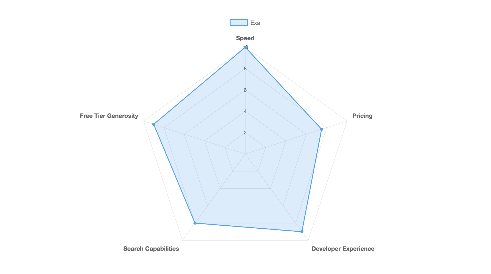
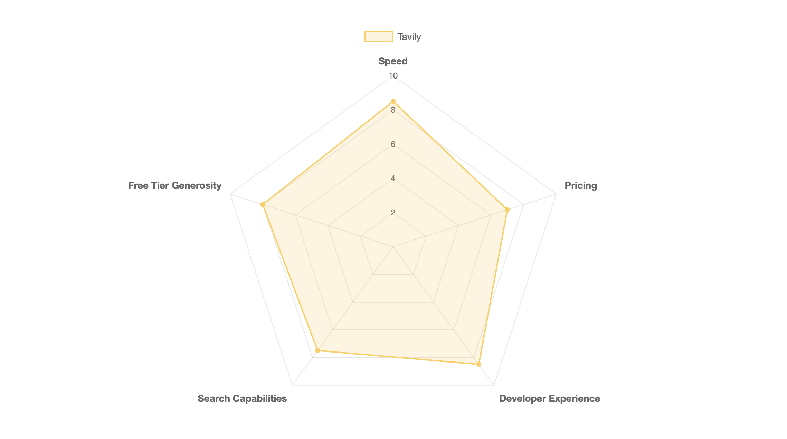
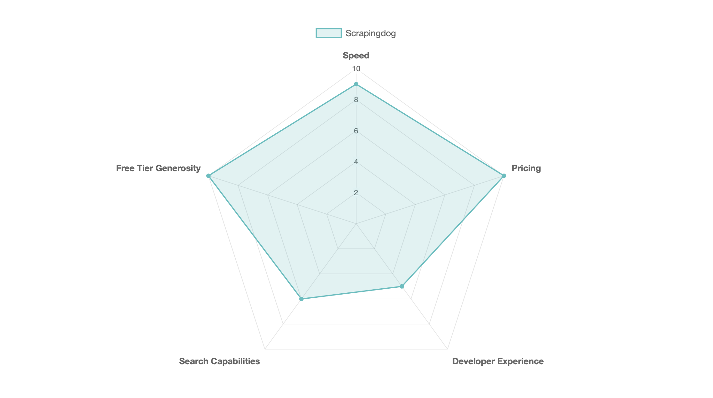
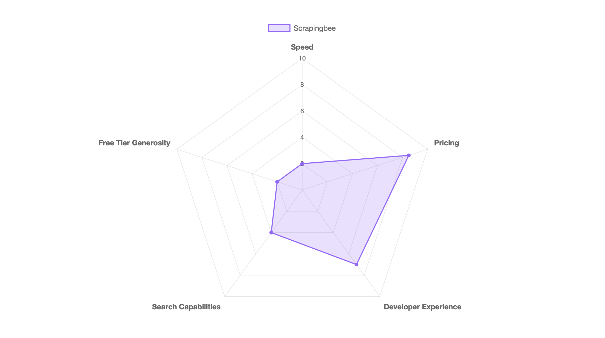

# 5 Best SERP APIs for 2025: SerpAPI vs ScrapingDog vs ScrapingBee vs Exa vs Tavily

We tested five SERP APIs with standardized benchmarks to find which performs best for different use cases. [SerpAPI](https://serpapi.com) delivered the fastest responses at 0.072 seconds. [Exa](https://exa.ai) provides semantic search over a proprietary index at $5 per 1,000 queries. [Tavily](https://tavily.com) aggregates and parses content for LLM applications. [Scrapingdog](https://www.scrapingdog.com) offers the lowest per-request pricing at under $0.001 at scale. [Scrapingbee](https://www.scrapingbee.com) bundles SERP access with general web scraping.

This comparison helps you choose a SERP API for SEO monitoring, AI agents, RAG applications, or price comparison tools. Each section includes benchmark data, pricing breakdowns, and code examples.

## Overview Comparison

We tested five SERP APIs using this [Python benchmark script](#testing-methodology) that measured response time, success rate, cost, and free tier across five real-world queries.

| API | Avg Response Time | Success Rate | Cost per 1,000 Searches | Free Tier |
|-----|-------------------|--------------|-------------------------|-----------|
| **SerpAPI** | 0.072s | 100% | $15 | 250/month |
| **Exa** | 1.190s | 100% | $5 | 2,000 one-time |
| **Tavily** | 2.327s | 100% | $5-$8 | 1,000/month |
| **Scrapingdog** | 3.762s | 100% | $0.20-$0.06 | 1,000+ one-time |
| **Scrapingbee** | 5.411s | 100% | $0.56-$1.44 | 66 one-time |



Response times vary based on what each API delivers: [SerpAPI](https://serpapi.com) returns raw SERP data, [Exa](https://exa.ai) performs semantic search with embeddings generation, and [Tavily](https://tavily.com) aggregates content from multiple sources with AI ranking. These tests used free tiers, but some providers offer faster speeds for additional cost (for example, [SerpAPI's Ludicrous Speed tiers](https://serpapi.com/pricing) claim 2.2x faster responses).

# SerpAPI

[SerpAPI](https://serpapi.com) scrapes 20+ search engines and returns structured JSON. The service handles [CAPTCHA solving and proxy rotation](https://serpapi.com/search-api) automatically, so you make a request and get back parsed data without dealing with blocks or rate limits.



Most competitors support 3-5 search engines. SerpAPI covers Google (including AI Mode and AI Overview), Bing, Yahoo, Baidu, DuckDuckGo, Yandex, Amazon, eBay, Walmart, Home Depot, YouTube, Google Scholar, Google Patents, TripAdvisor, and Yelp. Each platform has its own API endpoint with consistent JSON formatting.

## Performance

Our benchmark tests measured 0.072s average response time with 100% success rate across 5 queries. This was the fastest of all tested APIs. [SerpAPI's status page](https://serpapi.com/status) reports 99.911% uptime over the last 30 days.

The free tier uses "Best Effort" speed with automatic refunds for failed searches. Paid tiers can add [Ludicrous Speed](https://serpapi.com/pricing) for faster responses.

## Pricing

[SerpAPI's pricing](https://serpapi.com/pricing) uses monthly subscriptions based on search volume. The free tier provides 250 searches per month with no credit card required. Paid plans start at $75/month for 5,000 searches ($0.015 per search).

For 1,000 searches you'd pay $15 on the Developer plan. Production tier and above include [U.S. Legal Shield](https://serpapi.com/legal-shield), which provides legal defense for crawling public search data under First Amendment rights.

## Developer Experience

[SerpAPI provides SDKs](https://serpapi.com/integrations) for Ruby, Python, JavaScript, Golang, PHP, Java, Rust, and .NET. Setup takes about 5 minutes:

```python
from serpapi import GoogleSearch

params = {
    "q": "coffee",
    "location": "Austin, Texas",
    "api_key": "your_api_key"
}

search = GoogleSearch(params)
results = search.get_dict()

for result in results["organic_results"]:
    print(result["title"])
```

[SerpAPI's Playground](https://serpapi.com/playground) lets you test queries through a web interface before writing code. You modify parameters through form controls and see both the rendered SERP and JSON response. The dashboard tracks your usage with response time graphs and search history.


## Choose SerpAPI when you need breadth of coverage

SerpAPI works best when you need access to multiple search engines or specialized platforms through one provider. SEO tools monitoring rankings across Google, Bing, and Yahoo avoid maintaining separate integrations. E-commerce price monitoring pulls structured data from Amazon, Walmart, and eBay. Academic research platforms integrate Google Scholar without parsing citation formats. The $15 per 1,000 searches pays for itself when infrastructure complexity is the bottleneck.

Skip SerpAPI if you only need Google search on a tight budget. At $0.015 per search, you're paying 3-15x more than alternatives. AI applications requiring semantic search or embeddings should use Exa or Tavily instead.

# Exa

[Exa](https://exa.ai) is a search API built for AI applications using a proprietary embeddings-based index. Instead of scraping Google or Bing, Exa maintains its own crawl optimized for semantic search.



The [API](https://docs.exa.ai/reference/search) provides multiple search modes (neural for semantic matching, keyword for traditional results, auto for intelligent combination) plus endpoints for content retrieval, similarity search, direct question answering, and automated research tasks. [Exa's Playground](https://dashboard.exa.ai) lets you test queries with controls for search type, filters, and AI features while generating code snippets in Python or JavaScript.


## Performance

Benchmark tests measured 1.189s average response time with 100% success rate across 5 queries. Response times ranged from 1.049 to 1.354 seconds.

[Exa's published benchmarks](https://exa.ai/blog/fastest-search-api) claim P50 latency below 425ms. Our higher numbers likely include network overhead and full result retrieval, while published metrics measure API response only. The 1.189s average still represents strong performance for a semantic search system processing embeddings.

## Pricing

[Exa's pricing](https://exa.ai/pricing) charges $5 per 1,000 searches for 1-25 results ($0.005 per search). Requesting 26-100 results jumps to $25 per 1,000 searches ($0.025 per search), a 5x increase. Additional endpoints cost separately: contents retrieval runs $1 per 1,000 pages, answers and research tasks run $5 per 1,000 calls.

For 1,000 standard searches (1-25 results), you pay $5. Custom plans offer volume discounts, enterprise security, custom rate limits, and early feature access.

## Developer Experience

[Exa provides SDKs](https://docs.exa.ai/reference/getting-started) for Python (`exa-py`) and JavaScript (`exa-js`), both with full TypeScript definitions. Setup takes about 5 minutes:

```python
from exa_py import Exa

exa = Exa(api_key="your-api-key")
results = exa.search("coffee")

for result in results.results:
    print(result.title)
```

The [Playground](https://dashboard.exa.ai) removes the need to write code during testing. You adjust parameters through form controls and see both rendered results and JSON responses. The dashboard tracks usage by endpoint with graphs for monthly spend and API key management.


[Documentation](https://docs.exa.ai) includes integration examples for LangChain, LlamaIndex, CrewAI, Anthropic, and OpenAI. The service provides an [MCP integration](https://docs.exa.ai/mcp) for Cursor and other MCP-compatible tools with functions like `GetCodeContext` for code snippet retrieval and `DeepResearcher` for autonomous research.

## Free Trial Generosity

The free tier provides $10 in credits with no expiration and no credit card requirement. At $5 per 1,000 searches for standard queries (1-25 results), this translates to 2,000 free searches, or allocate across other endpoints (research/answers at 2,000 calls, content retrieval at 10,000 pages). All features work on the free tier including semantic search, similarity search, and AI-powered summaries.

## Search Engine Coverage

Exa maintains a [proprietary search index](https://exa.ai/exa-api) built for AI applications rather than scraping Google or Bing. The embeddings-based index covers web content, research papers, news, GitHub repositories, tweets, and PDFs with [category filters](https://docs.exa.ai/reference/search) and date filtering. Applications get semantic search capabilities instead of exact Google SERP replication, meaning no knowledge graphs, shopping results, or local pack results.

## Choose Exa when you need semantic search

Exa works best for AI agents, RAG systems, or LLM-powered research tools that benefit from meaning-based search. Voice AI companions leverage sub-2-second response times for fast web retrieval. Research platforms use the structured research endpoint to generate reports with citations. Chatbots get clean, parsed HTML without dealing with CAPTCHA.

Skip Exa if you need exact Google SERP replication for SEO monitoring or Google Shopping data for price comparison. Watch the 5x price jump when requesting 26-100 results per query ($0.025 per search approaches premium pricing without multi-engine coverage).

# Tavily

[Tavily](https://tavily.com) is a search API optimized for LLMs and RAG applications. Instead of returning URLs with snippets, Tavily aggregates content from up to 20 sources per query, ranks them using proprietary AI, and delivers parsed content ready for LLM consumption.



The API provides [four endpoints](https://docs.tavily.com): search (factual queries with AI ranking), extract (clean content from specified URLs), map (page discovery across domains), and crawl (combined mapping and extraction). Search supports [basic and advanced depth modes](https://docs.tavily.com/documentation/api-credits), topic filtering (general, news, finance), and time range filtering (daily to yearly).

[Tavily's Playground](https://app.tavily.com) generates real-time code as you build queries. Adjust parameters like search depth and result count, and the right panel updates with Python, JavaScript, or cURL code. The playground includes tabs for search, extract, and crawl testing with live result previews.


## Performance

Our benchmark tests measured 2.327 seconds average response time with 100% success rate across 5 queries (range: 1.814-2.768s).

[Tavily's published benchmarks](https://blog.tavily.com/tavily-evaluation-part-1-tavily-achieves-sota-on-simpleqa-benchmark/) focus on accuracy rather than raw speed. The service achieved 93.3% accuracy on OpenAI's SimpleQA benchmark while providing 92% faster latency in RAG workflows. The benchmark measures end-to-end performance including retrieval and content processing, which differs from our simple query response measurement.

The 2.3-second response time reflects that Tavily fetches, parses, and ranks content before responding. Traditional SERP APIs return URLs and leave content extraction to you, which is faster per API call but requires follow-up requests.

## Pricing

[Tavily's pricing](https://tavily.com/#pricing) uses a credit-based system. The free Researcher tier includes 1,000 credits per month with no credit card required. Pay-as-you-go charges $0.008 per credit. Subscription tiers start at $30/month for 4,000 credits ($0.0075 per credit) and scale down to $0.005 per credit on the Growth plan ($500/month for 100,000 credits).

Basic search consumes 1 credit per request ($8 per 1,000 searches on pay-as-you-go), while advanced search uses 2 credits. Extract operations cost 1 credit per 5 URLs (basic) or 2 credits per 5 URLs (advanced). Map operations cost 1 credit per 10 pages (basic) or 1 credit per 5 pages (with custom instructions). Crawl operations combine mapping and extraction costs.

[Credits reset monthly](https://docs.tavily.com/documentation/api-credits) on subscription plans without rollover. Pay-as-you-go credits don't expire.

## Developer Experience

[Tavily provides SDKs](https://docs.tavily.com) for Python (`tavily-python`) and JavaScript/TypeScript (`@tavily/core`). The Python SDK supports synchronous and asynchronous clients, while the JavaScript SDK provides async functions with TypeScript definitions.

Setup takes about 5 minutes:

```python
from tavily import TavilyClient

client = TavilyClient(api_key="tvly-YOUR_API_KEY")
response = client.search("coffee")

for result in response["results"]:
    print(result["title"])
```

The Playground interface updates code in real time as you modify parameters. Test queries in the browser, then copy working Python, JavaScript, or shell commands directly into your application.

The dashboard shows [API usage tracking](https://app.tavily.com) with credits consumed and remaining, pay-as-you-go billing toggles, API key management, and a Remote MCP section for generating IDE connection URLs. [Tavily Expert](https://app.tavily.com) provides contextual help for API integration within AI-native IDEs.


[Tavily's documentation](https://docs.tavily.com) includes quickstart guides, endpoint references, SDK examples, and integration guides for LangChain, LlamaIndex, OpenAI, Anthropic, Vercel AI, and Zapier. Rate limiting applies at 100 requests per minute on the free tier and 1,000 requests per minute on paid tiers.

## Free Trial Generosity

The free tier provides 1,000 credits per month with no credit card requirement. At 1 credit per basic search, this translates to 1,000 free searches monthly, or allocate across advanced searches (2 credits), content extraction (1 credit per 5 URLs), or mapping (1 credit per 10 pages). All features including advanced search depth, topic filtering, and time range controls work on the free tier with 100 requests per minute rate limiting.

## Search Engine Coverage

Tavily does not provide access to specific search engines like Google or Bing. Instead, it uses [proprietary AI ranking](https://docs.tavily.com/documentation/about) to aggregate content from up to 20 sources per query with [topic filters](https://docs.tavily.com/documentation/api-reference/endpoint/search) (general, news, finance), time range filters (day, week, month, year), and domain inclusion/exclusion. The service emphasizes factual accuracy with [93.3% accuracy on SimpleQA benchmarks](https://blog.tavily.com/tavily-evaluation-part-1-tavily-achieves-sota-on-simpleqa-benchmark/) rather than replicating search engine interfaces.

## Choose Tavily for AI-optimized search

Tavily fits RAG applications, AI agents, or LLM-powered assistants that need factual, grounded web information. Chatbots get ranked content with source citations, research automation tools use the crawl endpoint to map entire domains, and content aggregation platforms pull clean text without handling CAPTCHA. The 93.3% accuracy on factual benchmarks and automatic content filtering reduce manual validation needs.

Skip Tavily for exact Google or Bing SERP layouts needed in SEO monitoring or structured shopping results for price comparison. The 2.3-second average response time reflects content aggregation work, so applications needing only URLs without content extraction should consider lighter-weight SERP APIs.

# Scrapingdog

[Scrapingdog](https://www.scrapingdog.com) is a web scraping service offering SERP API access alongside scrapers for Amazon, LinkedIn Jobs, Instagram, and other platforms. The service provides a [Google Search API](https://www.scrapingdog.com/google-search-api/) and a [Universal Search API](https://www.scrapingdog.com/universal-search-api/) that aggregates and de-duplicates results across Google, Bing, Yahoo, and DuckDuckGo.



## Performance

Our benchmark tests measured Scrapingdog at 3.762 seconds average response time with 100% success rate across 5 queries. Response times ranged from 1.178 to 4.683 seconds.

The measured performance contradicts [Scrapingdog's published benchmarks](https://www.scrapingdog.com/blog/serpapi-vs-serper-vs-scrapingdog/), which claim 1.25 second response times for Google SERP requests. Our independent testing shows 3.762 seconds average, roughly 3x slower than their self-reported figure. The wide response time variance (1.178s to 4.683s) indicates less predictable latency than competitors.

## Pricing

[Scrapingdog's pricing](https://www.scrapingdog.com/pricing) uses a credit-based system with monthly subscriptions and pay-as-you-go options. Plans start at $40/month for 200,000 credits (Light) and scale to $30,000/month for 1 billion credits (Nova Pro). At 1 credit per Google search, the cost per 1,000 searches ranges from $0.20 (Light) to under $0.06 at high-volume tiers.

Concurrency limits scale with plan tiers: Light supports 5 concurrent connections, Standard supports 50, Pro supports 100, and Nova Pro supports 2,200. The free tier provides 1,000 credits with no credit card required. [Social media promotions](https://www.scrapingdog.com/dashboard) add 4,000 credits for following on X and 6,000 for posting a LinkedIn review, bringing the total free tier to 11,000 credits.

## Developer Experience

[Scrapingdog's documentation](https://www.scrapingdog.com/documentation) covers authentication, error codes, and endpoint references. Some pages returned 404 errors during testing, and the service lacks official SDKs with helper functions found in competing APIs. Integration requires direct REST API calls using standard HTTP libraries.

The dashboard's request builder generates code in cURL, Python, Java, Node.js, Ruby, PHP, Go, and C# as you configure parameters. This real-time code generation simplifies testing without writing initial integration code.


Setup takes approximately 5-10 minutes from signup to first API call. Here's a Python example:

```python
import requests

url = "https://api.scrapingdog.com/google"
params = {
    "api_key": "YOUR_API_KEY",
    "query": "coffee",
    "results": 10
}

response = requests.get(url, params=params)
data = response.json()

for result in data.get("organic_results", []):
    print(result["title"])
```

The Universal Search API aggregates results across four engines:

```python
url = "https://api.scrapingdog.com/universal-search"
params = {
    "api_key": "YOUR_API_KEY",
    "query": "coffee",
    "engines": "google,bing,yahoo,duckduckgo"
}

response = requests.get(url, params=params)
```

## Free Trial Generosity

The free tier provides 1,000 request credits with no expiration and no credit card requirement. Optional [social media promotions](https://www.scrapingdog.com/dashboard) add 4,000 credits for following on X and 6,000 for posting a LinkedIn review, bringing the total to 11,000 credits. Free tier users access all API endpoints including the Universal Search API, JavaScript rendering, geo-targeting, and AI extraction features.

## Search Engine Coverage

[Scrapingdog's Google Search API](https://www.scrapingdog.com/google-search-api/) provides access to Google web search with organic results, People Also Ask sections, related searches, location-based searches, and multiple search types (web, images, news, shopping). The [Universal Search API](https://www.scrapingdog.com/universal-search-api/) aggregates and de-duplicates results from Google, Bing, Yahoo, and DuckDuckGo in a single request. Beyond search engines, Scrapingdog provides dedicated scrapers for Amazon, Walmart, eBay, LinkedIn Jobs, Instagram, X, YouTube, Baidu, Google Maps, and Google Scholar.

## Choose Scrapingdog for cost-optimized scraping

Scrapingdog fits high-volume projects where per-request cost matters more than response time. Data collection pipelines requiring millions of monthly searches benefit from pricing that drops to $0.000058 per request at scale. Lead generation tools can consolidate Google search results alongside LinkedIn profiles, Instagram accounts, or e-commerce platforms through a single provider. The Universal Search API's de-duplication feature benefits SEO tools comparing rankings across Google, Bing, Yahoo, and DuckDuckGo without manual result matching.

Skip Scrapingdog for latency-sensitive applications requiring sub-second response times. The 3.762-second average response with wide variance (1.178s to 4.683s) makes it unsuitable for real-time voice assistants or live search suggestions. Projects requiring official SDKs and comprehensive documentation should consider alternatives given the REST-only API and documentation gaps observed during testing.

# Scrapingbee

[Scrapingbee](https://www.scrapingbee.com/) is a general-purpose web scraping service that includes Google Search API functionality. Acquired by [Oxylabs in June 2025](https://www.scrapingbee.com/blog/scrapingbee-acquisition/), it targets developers needing headless browser rendering, JavaScript execution, and proxy rotation across multiple websites including e-commerce platforms, social media sites, and search engines.



## Performance

Our benchmark tests measured Scrapingbee at 5.411 seconds average response time with 100% success rate across 5 queries. Response times ranged from 2.094 to 11.044 seconds, creating a 5x performance spread that makes response time prediction difficult.

[Competitor benchmarks from Scrapingdog](https://www.scrapingdog.com/blog/scrapingbee-vs-scraperapi-vs-scrapingdog/) show 90% success rate with 16.28 second average response time for Google SERP requests. The extreme variability suggests inconsistent proxy selection or resource allocation during request handling, reflecting Scrapingbee's positioning as a general web scraper rather than a SERP-optimized service.

## Pricing

[Scrapingbee's pricing](https://www.scrapingbee.com/pricing/) uses a credit-based system where Google Search API requests cost 15 credits per call. Monthly plans start at $49.99 for 250,000 credits. For 1,000 Google searches at 15 credits per request, costs range from $0.56 to $1.44 depending on tier.

Variable credit costs create billing unpredictability. Enabling premium proxies increases request cost from 5 to 25 credits (5x multiplier), while screenshot capture, custom wait conditions, and JavaScript rendering add incremental charges. The request builder's real-time cost estimator helps predict expenses during development. Monthly credits do not roll over.

## Developer Experience

[Scrapingbee's documentation](https://www.scrapingbee.com/documentation/) provides endpoint references, authentication guides, and code examples across Python, Node.js, Java, Ruby, PHP, Go, and C#. The request builder interface shows real-time credit costs and generates code in multiple languages as you configure parameters.

Authentication uses API keys passed as query parameters. Setup takes approximately 5-10 minutes from signup to first API call:

```python
import requests

url = "https://app.scrapingbee.com/api/v1"
params = {
    "api_key": "YOUR_API_KEY",
    "search": "coffee",
    "search_type": "search"
}

response = requests.get(url, params=params)
data = response.json()

for result in data.get("organic_results", []):
    print(result["title"])
```

Scrapingbee provides [official Python and Node.js SDKs](https://www.scrapingbee.com/documentation/) that wrap authentication and parameter formatting. Credits are charged for failed requests in many cases, creating cost uncertainty when scraping unreliable targets.

## Free Trial Generosity

The free tier provides 1,000 API credits with no credit card required and no time expiration. At 15 credits per Google search, this translates to approximately 66 free searches. The 1,000 credits cover diverse use cases including HTML scraping (5 credits), Amazon scraping (15 credits), and Walmart scraping (15 credits), with all platform features available including JavaScript rendering, geo-targeting, and premium proxies at higher credit costs.

## Search Engine Coverage

[Scrapingbee's Google Search API](https://www.scrapingbee.com/features/google/) provides access to Google web search only with structured JSON including organic results, local results, ads, related queries, images, news results, knowledge graph data, and top stories. Scrapingbee supports [multiple Google search types](https://www.scrapingbee.com/documentation/google/) including web, news, Maps, and image search. The platform provides dedicated scrapers for Amazon, Walmart, and ChatGPT API alongside general HTML scraping with JavaScript rendering and proxy rotation.

## Choose Scrapingbee for unified web scraping

Scrapingbee fits projects requiring both SERP data and general web scraping in a unified platform. Teams already scraping e-commerce sites, social media profiles, or JavaScript-heavy web applications can consolidate Google search results through the same service. Projects with flexible latency requirements can tolerate 5.4-second average response times and high variability for data collection pipelines, batch processing systems, or research workflows prioritizing breadth over speed.

Skip Scrapingbee for dedicated SERP API needs. The 66-search free tier limits evaluation, Google-only coverage restricts multi-engine analysis, and 5.411-second average response times with 11-second worst-case performance make it unsuitable for real-time voice assistants or live autocomplete suggestions.

# SerpAPI vs Tavily

[SerpAPI](https://serpapi.com) and [Tavily](https://tavily.com) represent different approaches to SERP data. SerpAPI scrapes existing search engines like Google and Bing, returning their results as structured JSON. Tavily runs its own search engine that aggregates content from up to 20 sites and ranks it using proprietary AI. This architectural difference determines which one fits your use case.

## Mirror Google or aggregate multiple sources?

When you query [SerpAPI for Google results](https://serpapi.com/search-api), you get exactly what appears on Google with all its ranking signals, personalization, and algorithmic biases. When you query Amazon, you get Amazon's product listings ranked by Amazon's algorithm. This matters for SEO monitoring, competitor analysis, and applications that need to replicate what users see on specific platforms. [SerpAPI supports 20+ search engines](https://serpapi.com) with dedicated endpoints for each.

Tavily doesn't scrape existing engines. It [aggregates and ranks content](https://docs.tavily.com/documentation/about) from multiple sources per query, scoring relevance with AI and formatting results for LLM consumption. You can't get "Bing results" from Tavily because Tavily is the search engine. This matters for AI agents and RAG applications where answer accuracy matters more than which search engine provided it.

Our benchmarks measured SerpAPI at 0.072 seconds average response time versus Tavily's 2.327 seconds. The 32x speed difference reflects Tavily's extra processing: searching up to 20 sites, applying AI ranking, extracting content, and formatting for LLM context windows. SerpAPI returns Google's results as-is with minimal overhead.

## Choose SerpAPI when you need specific search engines

Build with [SerpAPI](https://serpapi.com) when you need to replicate what users see on specific platforms. SEO monitoring tools that track keyword rankings across Google, Bing, and other engines require SerpAPI's multi-engine support. Price comparison tools need Amazon, eBay, and Walmart product listings. Academic research applications can use [SerpAPI's Scholar endpoint](https://serpapi.com/google-scholar-api) instead of building separate scrapers.

The 0.072-second response time fits latency-sensitive applications like browser extensions, real-time dashboards, and user-facing search features. When your application needs to feel instant, the 32x speed advantage matters.

## Choose Tavily when you're feeding LLMs

Build with [Tavily](https://tavily.com) when creating AI agents, RAG applications, or LLM-powered tools that need accurate information rather than specific search engine results. [Tavily's 93.3% accuracy on SimpleQA](https://blog.tavily.com/tavily-evaluation-part-1-tavily-achieves-sota-on-simpleqa-benchmark/) and LLM-optimized formatting reduce the post-processing needed to integrate search into your agent's workflow.

The multi-source aggregation helps when you care about answer quality over result provenance. Instead of scraping Google's top result and hoping it's accurate, Tavily retrieves up to 20 sources and ranks them by relevance. If your application shows users "here's what I found about X" rather than "here are Google's top 10 results for X," Tavily's AI-scored relevance provides better raw material.

The 2.327-second response time becomes acceptable when the alternative is making multiple follow-up requests to scrape and parse content from traditional SERP results.

# How to Choose the Right SERP API

[SerpAPI](https://serpapi.com) works best when you need exact Google (or Bing, or Amazon) results with sub-100ms response times. The $15 per 1,000 searches pays for 20+ search engine coverage and infrastructure that handles CAPTCHA solving automatically. SEO monitoring tools and price comparison platforms that need traditional SERP layouts benefit from the 0.072-second average we measured.

[Exa](https://exa.ai) fits AI applications needing semantic search over a proprietary index. The $5 per 1,000 searches includes embeddings and meaning-based matching that keyword APIs don't provide. At 1.189 seconds average, Exa delivers the fastest semantic search among tested options. The 2,000 free searches make evaluation straightforward.

[Tavily](https://tavily.com) targets RAG pipelines requiring factual, multi-source content. The service aggregates up to 20 sites per query and formats results for LLM consumption at $5-$8 per 1,000 searches. The 1,000 monthly free credits that reset support sustained prototyping. Choose Tavily when accuracy matters more than speed.

[Scrapingdog](https://www.scrapingdog.com) offers the lowest per-request pricing at scale, dropping to $0.000058 per request for high-volume users. Our 3.762-second average contradicted their claimed 1.25-second benchmark, but the cost advantage persists for budget-focused projects. The Universal Search API de-duplicates across four engines in single requests.

[Scrapingbee](https://www.scrapingbee.com) makes sense for teams already scraping e-commerce or general websites who want to consolidate SERP access through one provider. The 5.411-second average and high variability make it unsuitable for latency-sensitive applications. At 66 free searches versus competitors offering 250-2,000, the free tier limits evaluation depth.

# Frequently Asked Questions

## What is a SERP API?

A SERP API provides programmatic access to search engine results through structured JSON responses. Instead of manually searching Google and scraping HTML, you send an HTTP request with query parameters and receive formatted data including organic results, ads, knowledge panels, and related searches. These APIs handle CAPTCHA solving and proxy rotation automatically.

## Are SERP APIs legal?

SERP APIs operate in a legal gray area. In the United States, [hiQ Labs v. LinkedIn (2019)](https://en.wikipedia.org/wiki/HiQ_Labs_v._LinkedIn) established that scraping publicly accessible data doesn't violate the Computer Fraud and Abuse Act. Search engine terms of service typically prohibit automated access, but enforcement focuses more on technical countermeasures than legal action. [SerpAPI offers U.S. Legal Shield](https://serpapi.com/legal-shield) on paid plans, covering legal fees if you face action for scraping public search data.

## How do SERP APIs avoid getting blocked?

SERP APIs use rotating residential proxies, CAPTCHA solving services, and request pattern randomization to avoid detection. They distribute requests across thousands of IP addresses that appear as regular user traffic. When search engines implement new anti-bot measures, the APIs update their infrastructure to maintain access. This is why using an API makes more sense than building your own scraping system.

## Can I use SERP APIs for commercial projects?

Yes, all five APIs support commercial use. Check your plan's terms of service for specific restrictions. Most APIs prohibit reselling raw SERP data to competitors but allow using the data in your own products. [SerpAPI's pricing page](https://serpapi.com/pricing) and [Tavily's documentation](https://docs.tavily.com) specify commercial terms. Free tiers typically allow commercial use with volume limitations.

## Testing Methodology

[Back to comparison results](#overview-comparison)

We tested each API with fifty standardized queries: "python tutorials", "best coffee makers 2025", "machine learning", "weather forecast" etc. The Python script measured response time from request to complete JSON parsing and verified successful responses. Each test ran once per API to simulate real-world usage.

```python
import requests
import time
import os
import json
from dotenv import load_dotenv
from urllib.parse import quote_plus

load_dotenv()

def test_serpapi(query):
    start = time.time()
    response = requests.get("https://serpapi.com/search", params={
        "q": query,
        "api_key": os.getenv("SERPAPI_KEY")
    })
    elapsed = time.time() - start
    return elapsed, response.status_code == 200

def test_exa(query):
    start = time.time()
    response = requests.post("https://api.exa.ai/search",
        headers={"x-api-key": os.getenv("EXA_KEY")},
        json={"query": query, "numResults": 10})
    elapsed = time.time() - start
    return elapsed, response.status_code == 200

def test_tavily(query):
    start = time.time()
    response = requests.post("https://api.tavily.com/search",
        json={"api_key": os.getenv("TAVILY_KEY"), "query": query})
    elapsed = time.time() - start
    return elapsed, response.status_code == 200

def test_scrapingdog(query):
    start = time.time()
    response = requests.get("https://api.scrapingdog.com/google", params={
        "api_key": os.getenv("SCRAPINGDOG_KEY"),
        "query": query
    })
    elapsed = time.time() - start
    return elapsed, response.status_code == 200

def test_scrapingbee(query):
    start = time.time()
    encoded_query = quote_plus(query)
    response = requests.get("https://app.scrapingbee.com/api/v1/", params={
        "api_key": os.getenv("SCRAPINGBEE_KEY"),
        "url": f"https://www.google.com/search?q={encoded_query}",
        "render_js": "false",
        "custom_google": "True"
    })
    elapsed = time.time() - start
    return elapsed, response.status_code == 200

queries = [
    "python tutorials", "best coffee makers 2025", "machine learning",
    "weather forecast", "electric cars", "react hooks tutorial",
    "best restaurants near me", "data science courses", "yoga poses",
    "home workout routines", "javascript async await", "docker compose",
    "kubernetes tutorial", "aws lambda pricing", "terraform vs ansible",
    "best noise cancelling headphones", "meal prep ideas", "sourdough recipe",
    "running shoes 2025", "meditation techniques", "typescript generics",
    "postgres indexing", "redis caching", "mongodb aggregation",
    "git rebase vs merge", "vim shortcuts", "linux commands",
    "css flexbox", "tailwind css", "nextjs routing",
    "graphql vs rest", "microservices architecture", "api gateway",
    "oauth2 flow", "jwt authentication", "password hashing",
    "sql injection prevention", "xss attack", "csrf protection",
    "seo best practices", "meta tags", "sitemap xml",
    "google analytics", "conversion rate optimization", "a/b testing",
    "email marketing", "social media strategy", "content marketing",
    "project management tools", "agile methodology", "scrum vs kanban"
]

apis = {
    "SerpAPI": test_serpapi,
    "Exa": test_exa,
    "Tavily": test_tavily,
    "Scrapingdog": test_scrapingdog,
    "Scrapingbee": test_scrapingbee
}

results = {}

for api_name, test_func in apis.items():
    print(f"\nTesting {api_name}...")
    times = []
    successes = 0
    for i, query in enumerate(queries, 1):
        try:
            elapsed, success = test_func(query)
            times.append(elapsed)
            if success:
                successes += 1
            print(f"  {i}/50: {query[:30]:30s} - {elapsed:.3f}s - {'✓' if success else '✗'}")
        except Exception as e:
            print(f"  {i}/50: {query[:30]:30s} - ERROR: {str(e)[:50]}")
            times.append(0)

    avg_time = sum(times) / len(times) if times else 0
    success_rate = (successes / len(queries)) * 100
    fastest = min(times) if times else 0
    slowest = max(times) if times else 0

    results[api_name] = {
        "avg_time": round(avg_time, 3),
        "success_rate": round(success_rate, 1),
        "fastest": round(fastest, 3),
        "slowest": round(slowest, 3),
        "total_queries": len(queries),
        "successful_queries": successes
    }

    print(f"\n{api_name} Results:")
    print(f"  Average: {avg_time:.3f}s")
    print(f"  Success Rate: {success_rate}%")
    print(f"  Fastest: {fastest:.3f}s")
    print(f"  Slowest: {slowest:.3f}s")

# Save results to JSON
with open("test_results.json", "w") as f:
    json.dump(results, f, indent=2)

# Print summary
print("\n" + "="*60)
print("FINAL SUMMARY")
print("="*60)
for api_name, data in results.items():
    print(f"{api_name:15s} {data['avg_time']:6.3f}s avg, {data['success_rate']:5.1f}% success")
```

The benchmark script is available in the project repository. We ran tests with a 100Mbps connection. Network latency impacts absolute times but relative performance remains consistent. Your results may vary based on location, query complexity, and API server load.
