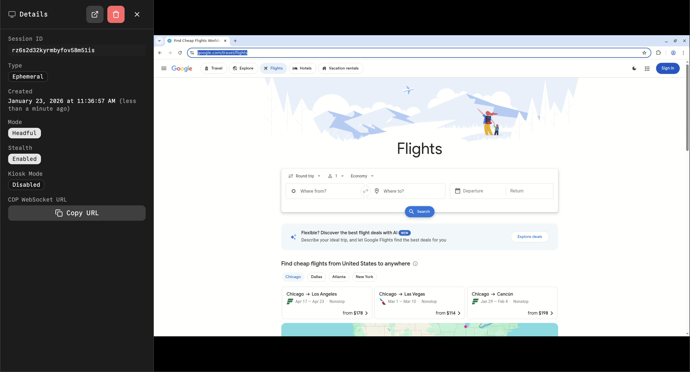
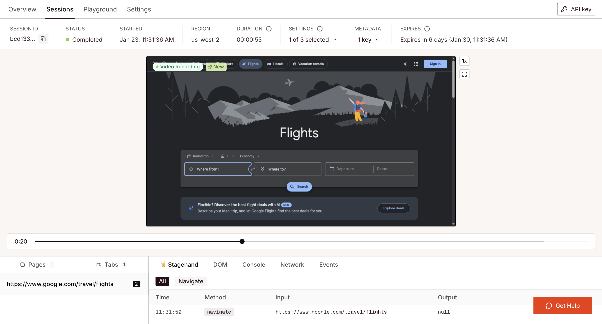
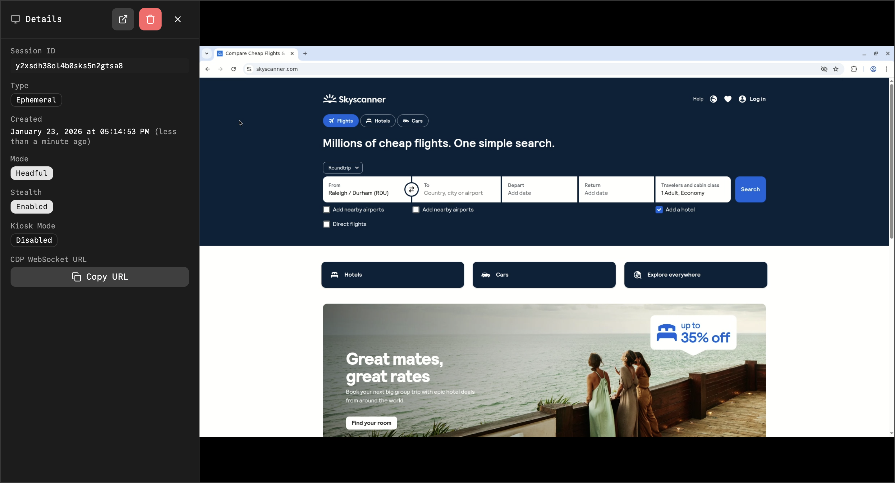
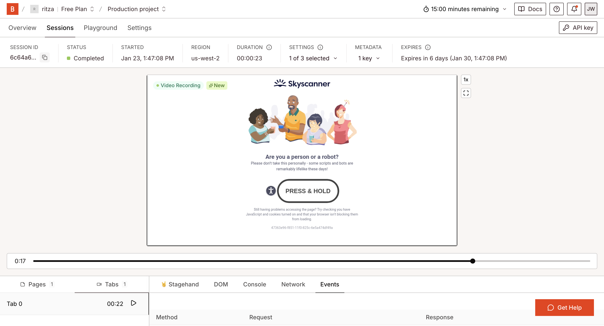
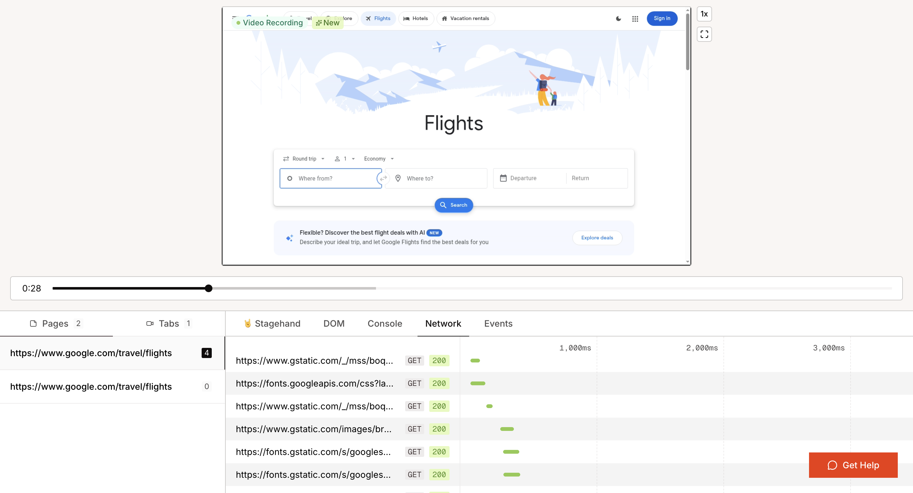
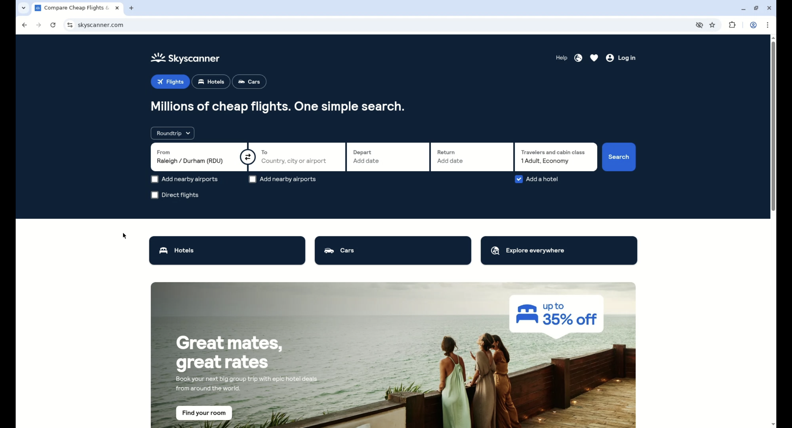

---
hide:
  - navigation
---

# Browserbase vs Kernel: Cloud Browser Automation for AI Agents

AI models run on remote servers. They can't open Chrome on your computer. That's the infrastructure constraint that makes remote browser platforms necessary: they provide cloud Chrome instances that AI can access and control.

We wanted to understand how remote browser automation actually works in practice. How do these platforms handle real-world complexity like bot detection, dynamic forms, and debugging failures? What are the trade-offs between them?

To test this, we built an automated travel agent that searches Google Flights and extracts structured flight data:

<video src="/articles/assets/browserbase-vs-kernel/example-for-intro.mp4" controls></video>

We built the same flight search agent on both Browserbase and Kernel using identical Stagehand code. This isolated the platform differences: startup speed, debugging tools, stealth capabilities, and cost structures.

## Why Remote Browsers Exist

AI models like GPT-4 and Claude can't open Chrome on your computer. They run on remote servers. That's the infrastructure problem remote browsers solve: they provide cloud Chrome instances that AI can access via WebSocket connections.

You have three approaches to browser automation:

**1. Write Playwright scripts directly**

You write explicit code: `await page.click('#submit-button')`. Scripts are repeatable and deterministic, but brittle. When websites change CSS selectors, your scripts break. Every UI change requires manual updates. The upside is cost—no LLM calls means low operating expenses.

**2. Use computer-use models (Anthropic Claude, OpenAI's vision models)**

AI sees screenshots and controls the browser visually. UI changes don't break automation because the model adapts automatically. The trade-off is cost and speed. Every action requires vision model inference on screenshots, making this approach slower (screenshot → inference → action → screenshot) and more expensive. It works on any visual interface, including desktop applications.

**3. Use Stagehand with remote browsers**

You write natural language instructions: `stagehand.act("click the search button")`. An LLM analyzes page structure (the DOM) to identify elements. Skipping screenshots makes this faster than computer-use models. Text analysis uses fewer tokens than vision, making it cheaper. It still requires LLM calls for each action, and needs cloud browsers so AI can access Chrome remotely.

This comparison tests the third approach. We use Stagehand identically on both Browserbase and Kernel to isolate the platform differences.

## The Test: Building a Flight Search Agent

We built a flight search agent that navigates Google Flights, fills in search criteria (NYC to London, specific dates), and extracts structured flight data. This real-world test reveals how each platform handles complex forms, bot detection, debugging, and cost optimization.

Google Flights has complex autocomplete dropdowns, aggressive bot detection, dynamic content loading, and frequently changing DOM structure. It exercises stealth features, AI-powered form filling, data extraction, and requires good debugging tools when things break.

---

## Spinning Up Remote Browsers

AI models like GPT-4 and Claude run on remote servers. They can't open Chrome on your computer. They need browsers running in the cloud that they can access remotely.

Browserbase and Kernel provide cloud Chrome browsers. You request a browser, they start a Chrome instance in a virtual machine, and send back a connection URL. Your code connects and controls the browser.

Why use cloud browsers instead of running Chrome locally? Resource management. Ten browsers consume 8GB of RAM on a typical laptop. Running dozens or hundreds of automation tasks requires dedicated servers, monitoring for crashes, and cleanup code for orphaned processes. Cloud browser services handle that infrastructure.

Both platforms work similarly. The difference is what they optimize for. Browserbase prioritizes debugging and observability. Kernel prioritizes speed and cost control.

### Creating a Browser on Kernel

Kernel gives you direct control over the browser lifecycle. Create a browser using their SDK, get back a connection URL, then connect your automation code.

```typescript
import Kernel from "@onkernel/sdk";
import { Stagehand } from "@browserbasehq/stagehand";

const kernel = new Kernel({
  apiKey: process.env.KERNEL_API_KEY,
});

const browser = await kernel.browsers.create({
  timeout_seconds: 300,
  stealth: true,
});

const stagehand = new Stagehand({
  env: "LOCAL",
  localBrowserLaunchOptions: {
    cdpUrl: browser.cdp_ws_url,
  },
});

await stagehand.init();
const page = stagehand.context.pages()[0];
await page.goto("https://www.google.com/travel/flights");

console.log("Live view:", browser.browser_live_view_url);
```

**Timing:** Browser creation (1.12s) + Stagehand init (4.43s) + page navigation (1.42s) = 7.57s total.

The `stealth: true` flag makes the browser look like a real human is using it. Websites detect automated browsers and block them with CAPTCHAs. With stealth enabled, the browser passes detection checks.

Kernel provides a live view URL. Open it in your regular browser to watch the remote browser in real-time.



### Creating a Session on Browserbase

Browserbase built Stagehand, so the integration is simpler. Stagehand handles browser creation automatically when you initialize.

```typescript
import { Stagehand } from "@browserbasehq/stagehand";

const stagehand = new Stagehand({
  env: "BROWSERBASE",
  apiKey: process.env.BROWSERBASE_API_KEY,
  projectId: process.env.BROWSERBASE_PROJECT_ID,
});

await stagehand.init();

const sessionId = stagehand.browserbaseSessionID!;
const sessionUrl = `https://browserbase.com/sessions/${sessionId}`;

const page = stagehand.context.pages()[0];
await page.goto("https://www.google.com/travel/flights");

console.log("Session Inspector:", sessionUrl);
```

**Timing:** Stagehand init including browser creation (14.87s) + page navigation (4.01s) = 25.85s total.

The Session Inspector shows the browser in real-time and records everything automatically: network requests, console logs, and page structure snapshots.



### Startup Speed Comparison

| Step | Kernel | Browserbase |
|------|--------|-------------|
| Browser/session creation | 1.12s | 14.87s |
| Stagehand initialization | 4.43s | Included above |
| Page navigation | 1.42s | 4.01s |
| **Total** | **7.57s** | **25.85s** |

**Kernel is 3.4x faster.** Browserbase's overhead comes from recording infrastructure that captures everything from the start. Kernel provisions a bare browser without recording.

At scale: 1,000 browser startups take ~2.1 hours on Kernel vs ~7.2 hours on Browserbase.

---

## Running the Automation

Stagehand provides an AI layer for browser automation. Instead of writing CSS selectors like `button.submit-form[data-testid="search"]`, you write natural language instructions like "click the search button." An LLM analyzes the page to identify which element you mean and executes the action.

You supply your own LLM API key (OpenAI, Anthropic, or Google). Stagehand sends page context to the LLM, receives element selectors or coordinates, then executes actions using Playwright.

```typescript
const stagehand = new Stagehand({
  env: "BROWSERBASE",
  apiKey: process.env.BROWSERBASE_API_KEY,
  projectId: process.env.BROWSERBASE_PROJECT_ID,
  model: "openai/gpt-4o",
});
```

Stagehand is platform-agnostic. The same automation code runs on Browserbase, Kernel, or your local machine. Only the connection setup changes.

### Connecting Stagehand

**Browserbase** (built by the same team as Stagehand):

```typescript
import { Stagehand } from "@browserbasehq/stagehand";

const stagehand = new Stagehand({
  env: "BROWSERBASE",
  apiKey: process.env.BROWSERBASE_API_KEY,
  projectId: process.env.BROWSERBASE_PROJECT_ID,
});

await stagehand.init();
const page = stagehand.context.pages()[0];
```

**Kernel** (connects via CDP WebSocket):

```typescript
import Kernel from "@onkernel/sdk";
import { Stagehand } from "@browserbasehq/stagehand";

const kernel = new Kernel({
  apiKey: process.env.KERNEL_API_KEY,
});

const browser = await kernel.browsers.create({
  timeout_seconds: 300,
  stealth: true,
});

const stagehand = new Stagehand({
  env: "LOCAL",
  localBrowserLaunchOptions: {
    cdpUrl: browser.cdp_ws_url,
  },
});

await stagehand.init();
const page = stagehand.context.pages()[0];
```

### The Flight Search Agent

Our test agent navigates Google Flights, fills search criteria (New York to London, March 15-22, 2026), and extracts structured flight data.

```typescript
const agent = stagehand.agent({
  cua: false, // DOM mode (element-based)
  model: "openai/gpt-4o",
});

await page.goto("https://www.google.com/travel/flights");

await agent.execute({
  instruction: `Fill out the flight search:
    - Departure city: New York
    - Destination city: London
    - Departure date: March 15, 2026
    - Return date: March 22, 2026
    Then click Search and wait for results to load.`,
  maxSteps: 30,
});
```

<video src="/articles/assets/browserbase-vs-kernel/kernel-agent-filling-out-form.mp4" controls></video>

The agent breaks the task into steps: click the departure field, type "New York," click the autocomplete suggestion, and so on. Each step requires an LLM inference to identify elements and determine actions.

After results load, we extract structured data with a Zod schema:

```typescript
const flightSchema = z.object({
  flights: z.array(
    z.object({
      airline: z.string(),
      departureTime: z.string(),
      arrivalTime: z.string(),
      duration: z.string(),
      price: z.string(),
      stops: z.string(),
    })
  ),
});

const flightData = await stagehand.extract({
  instruction: "extract all visible flights with their details",
  schema: flightSchema,
});

console.log(`Found ${flightData.flights.length} flights`);
```

The output shows structured flight data:

```json
{
  "flights": [
    {
      "airline": "British Airways",
      "departureTime": "7:00 PM",
      "arrivalTime": "7:10 AM+1",
      "duration": "7h 10m",
      "price": "$347",
      "stops": "Nonstop"
    },
    {
      "airline": "Virgin Atlantic",
      "departureTime": "8:30 PM",
      "arrivalTime": "8:40 AM+1",
      "duration": "7h 10m",
      "price": "$362",
      "stops": "Nonstop"
    },
    {
      "airline": "Delta",
      "departureTime": "10:45 PM",
      "arrivalTime": "11:00 AM+1",
      "duration": "7h 15m",
      "price": "$389",
      "stops": "Nonstop"
    },
    {
      "airline": "Norse Atlantic",
      "departureTime": "1:30 AM",
      "arrivalTime": "1:45 PM",
      "duration": "7h 15m",
      "price": "$279",
      "stops": "Nonstop"
    },
    {
      "airline": "American Airlines",
      "departureTime": "6:15 PM",
      "arrivalTime": "9:30 AM+1",
      "duration": "10h 15m",
      "price": "$425",
      "stops": "1 stop (PHI)"
    }
  ]
}
```

Found 5 flights

---

## Handling Bot Detection

Websites detect automated browsers before your code runs. They check browser fingerprints, IP addresses, and behavioral patterns. By the time a CAPTCHA appears, detection has already happened. AI agents can't solve their way out because the browser itself has been flagged.

Both platforms handle this with stealth mode: randomized browser fingerprints, residential proxies, and automatic CAPTCHA solving.

### Kernel: Stealth Included Free

Kernel provides stealth mode on all plans through a single flag:

```typescript
const browser = await kernel.browsers.create({
  stealth: true,
  timeout_seconds: 300,
});
```



We tested against Skyscanner, which blocks automation aggressively. With stealth disabled, we got blocked immediately. With stealth enabled, the page loaded normally across three tests.

One test did trigger a CAPTCHA. Kernel's auto-solver handled it in 30 seconds without requiring code changes.

### Browserbase: Stealth Requires Paid Plan

Browserbase's stealth features are on the Developer plan ($20/month minimum). The free plan gets blocked immediately on the same sites where Kernel's free stealth works.

```typescript
const stagehand = new Stagehand({
  env: "BROWSERBASE",
  apiKey: process.env.BROWSERBASE_API_KEY,
  projectId: process.env.BROWSERBASE_PROJECT_ID,
});

await stagehand.init();
const page = stagehand.context.pages()[0];
await page.goto("https://www.skyscanner.com");
// Blocked: "Press & Hold Human Challenge" appears
```



We tried having Stagehand's AI agent solve the challenge:

```typescript
const agent = stagehand.agent({
  model: "openai/gpt-4o",
});

await agent.execute({
  instruction: "Click and hold the verification button to pass the challenge",
  maxSteps: 15,
});
```

The agent failed after 10 attempts over 80 seconds. The challenge iframe has protections that block automated interaction.

**Error:** "Node does not have a layout object"

Browserbase's Developer plan includes fingerprint randomization, residential proxies (1GB included), and CAPTCHA auto-solving. According to their documentation, these work similarly to Kernel's stealth features. We couldn't test this without a paid subscription.

The Scale plan ($499/month) adds advanced stealth with a custom Chromium build. Browserbase Identity partners with Cloudflare's "Signed Agents" program to cryptographically authenticate automation instead of hiding it.

**For travel sites and flight searches:** Stealth features determine whether your automation works or gets blocked on the first page load. Kernel includes this free. Browserbase requires the Developer plan.

---

## Debugging When Things Break

Remote browsers run on cloud servers. You can't attach a debugger or use browser DevTools like you would locally. Both platforms solve this with different approaches to observability.

Browserbase automatically records every session. Kernel provides real-time live view on the free tier, with optional video recording on paid plans.

We tested both by deliberately breaking our flight search automation. We removed the code that closed Google's autocomplete dropdown, causing the return date picker to fail.

### Browserbase Session Inspector

Browserbase records every session automatically. The Session Inspector combines video replay with Chrome DevTools: timeline with all events, console logs, network inspector, and video synced to the timeline.



We opened the session and saw exactly where it failed. The video showed Stagehand getting stuck on the return date picker because the autocomplete dropdown covered it.

The Stagehand debugging tab shows every `.act()` call, token consumption, and AI decisions. Stagehand tried to click the picker three times before timing out.

Console logs captured Stagehand's internal reasoning automatically:

```
[stagehand] Attempting to click return date picker
[stagehand] Element found but not clickable: covered by dropdown
[stagehand] Retrying with alternate selector...
[stagehand] Retry failed: element still not clickable
```

The fix:

```typescript
await stagehand.act("press Escape key");
await stagehand.page.waitForTimeout(500);
await stagehand.act("click the return date picker");
```

Diagnosed in 30 seconds without adding logging or reproducing locally.

### Kernel Live View (Free Tier)

Kernel's free tier provides a live view URL that streams the browser in real-time:

```typescript
const browser = await kernel.browsers.create();
console.log("Live View:", browser.browser_live_view_url);

await stagehand.goto("https://www.google.com/travel/flights");
// Open the live view URL to watch in real-time
```



The live view is read-only. You can watch but not interact.

We opened the live view and watched the automation get stuck on the return date picker. We saw where it failed, but not why. The live view shows visual state but doesn't capture console logs or provide debugging tools.

We added manual logging:

```typescript
page.on("console", (msg) => {
  console.log(`[Browser Console]: ${msg.text()}`);
});

try {
  await stagehand.act("click the return date picker");
} catch (error) {
  console.error("[Automation Failed]:", error.message);
  await stagehand.page.screenshot({ path: "debug-failure.png" });
}
```

The terminal output combined with live view visual feedback let us diagnose the issue.

The free tier doesn't include video replay. Once the browser terminates, the live view URL stops working. You need to watch failures happen in real-time or reproduce them with logging.

### Kernel Replay Recording (Paid Plans)

Kernel's paid plans (starting at $19/month) add manual video recording:

```typescript
const replay = await kernel.browsers.replays.start(browser.session_id);

await stagehand.goto("https://www.google.com/travel/flights");
// Run automation...

await kernel.browsers.replays.stop(replay.replay_id, {
  id: browser.session_id
});

const replays = await kernel.browsers.replays.list(browser.session_id);
console.log("Replay URL:", replays[0].replay_view_url);
```

You control when recording starts and stops. Record only specific parts of your session or create multiple recordings per session. Replays download as MP4 files.

The trade-off: you need to know when to record. If a failure happens unexpectedly, you miss it unless you recorded the entire session.

**Performance difference:** Kernel's free tier (no recording) ran our test in 14.48 seconds. Browserbase's automatic recording took 35.81 seconds (2.5x slower).

### Debugging Comparison

| Feature | Browserbase Free | Kernel Free | Kernel Paid |
|---------|-----------------|-------------|-------------|
| Live view during session | ✅ Session Inspector | ✅ Live View URL | ✅ Live View URL |
| Video replay after session | ✅ Automatic | ❌ | ✅ Manual |
| Console log capture | ✅ Built-in | Manual listener | Manual listener |
| Network inspector | ✅ | ❌ | ❌ |
| Stagehand debugging tab | ✅ Token usage | ❌ | ❌ |

**Browserbase:** Automatic recording on free tier. Diagnosed our broken automation in 30 seconds by watching the replay. Downside: 2.5x slower due to recording overhead. You can't disable it.

**Kernel free tier:** Real-time live view with no recording overhead (2.5x faster). Downside: no post-session replay. You must watch failures live or reproduce them with logging.

**Kernel paid tier:** Manual recording. Start/stop recording when needed. Downside: you need to predict when failures will happen.

Choose Browserbase if you need post-mortem debugging for CI/CD failures. Choose Kernel free tier if you want faster iteration during active development. Choose Kernel paid tier if you want selective recording control.

---

## Remote Browser Automation Works

Remote browsers solve an infrastructure problem: AI models run on servers that can't open Chrome locally. Cloud browsers provide remote Chrome instances that AI can access. That infrastructure works reliably on both platforms.

The platforms differ in debugging and cost trade-offs.

**Browserbase optimizes for debugging.** The free tier automatically records every session. The Session Inspector provides video replay synced to Chrome DevTools. We diagnosed broken automation in 30 seconds using post-session replay. The trade-off is startup speed. Recording overhead makes Browserbase 2.5x slower (25.85s vs 7.57s). You can't disable recording to improve performance.

**Kernel optimizes for speed and cost.** Browser startup takes 7.57 seconds—3.4x faster than Browserbase. The free tier includes real-time live view without recording overhead. Paid plans add manual video recording that you control (record only when needed). The trade-off is post-session debugging. The free tier doesn't capture replays. You must watch failures live or add logging to diagnose issues later.

The bottleneck isn't browser infrastructure. LLM inference dominates costs. Our flight search consumed 115,627 tokens (~$0.23) per search. Browser session costs were fractions of a cent. How efficiently you use LLM calls matters more than which cloud browser you choose.

Stagehand makes platform choice flexible. The same automation code runs on Browserbase, Kernel, or local browsers by changing one connection parameter. This removes vendor lock-in and lets you optimize for your specific workflow: automatic debugging during development on Browserbase, then switch to Kernel's faster startup for production.

The challenge isn't getting remote browser automation to work. It works. The challenge is writing efficient automation that minimizes LLM calls while handling real-world web complexity like bot detection, dynamic forms, and changing page structure.

Choose Browserbase for automatic post-mortem debugging. The free tier's Session Inspector helps diagnose CI/CD failures or debug complex automation during active development.

Choose Kernel for faster iteration and cost optimization. The free tier's live view accelerates development without recording overhead. Paid tiers provide selective recording control for production workloads.

Both platforms handle the core requirement: cloud browsers accessible to AI models. The rest is trade-offs between debugging tools and performance optimization.
