---
hide:
  - navigation
---

# How to create a simple survey app with React using Next.js and Sanity

Adding a survey form to a website allows you to get feedback from users, customers, employees or potential customers. You can use online survey creators such as Google Forms or Microsoft Forms. Another option is to create your own, which allows you to customize it however you want to and you'll have more control over the data.

In this tutorial, we'll learn how to create a React survey app using [Next.js](https://nextjs.org/) and [Sanity](https://www.sanity.io/). Next.js will be used to create the front end survey form and send the survey responses to Sanity. Sanity, which is a CMS (content management system) platform, will store the survey submissions and we'll be able to view the submissions in Sanity as well. This tutorial assumes that you know the basics of React. It doesn't matter if you haven't used Next.js or Sanity before.

You can find the code for the final React survey app in [our GitHub repository](https://github.com/MattDClarke/React-survey-app_Next.js-and-Sanity).

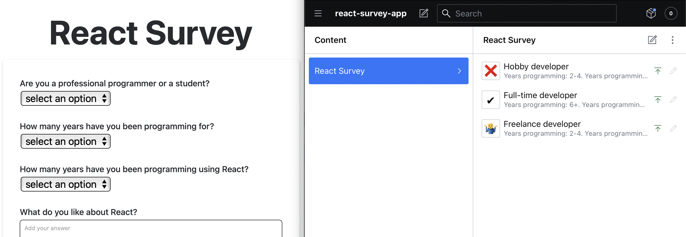

## Why use Next.js?

We'll use [Next.js](https://nextjs.org/), which is popular React framework that has many useful built-in features for building production-ready websites. The feature that's important for our survey app is the [API routes](https://nextjs.org/docs/api-routes/introduction) that provide back end functionality. We'll create an API route that will use a [serverless function](https://vercel.com/docs/concepts/functions/serverless-functions) to send survey data to our Sanity CMS.

Our serverless function will run on the backend in Node. This will allow us to securely use the Sanity access token, which should be kept secret, that we'll need to send API requests to Sanity.

## Why use Sanity?

[Sanity](https://www.sanity.io/) is a CMS platform for structured content. The structure is provided by a schema that you create to describe your data content. [Sanity Studio](https://www.sanity.io/studio) creates a UI from the schema that will allow you to easily create content. Sanity Studio is an open-source, easy to use, and highly customizable CMS built with React that's used to manage content on the Sanity platform.

We won't use Sanity Studio to create content, we'll use it to view survey submissions. Sanity studio is a highly customizable React app, we'll modify it to have a custom preview of our survey responses. The Sanity Studio UI updates in real-time without needing to refresh the browser so you'll be able to see survey results as they come in.

## Getting started - cloning the starter repository

We'll start this project by cloning the following [starter GitHub repository](https://github.com/MattDClarke/React-survey-app_Next.js-and-Sanity_Tutorial). This repository consists of two folders: `web` and `studio`. The `web` folder is for our Next.js app. We'll deploy it to [Vercel](https://vercel.com/), which is the company that created Next JS. The `studio` folder is for our Sanity Studio CMS code. We'll deploy it to Sanity.

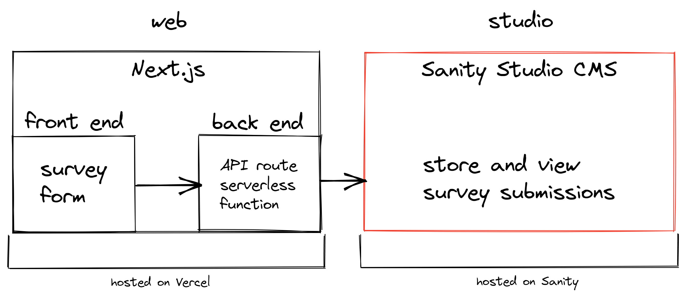

If you don't want to use Sanity CMS, you can swap it out for any other CMS or you can add the submissions to a database and view the submissions there. You can also choose to host your Sanity app anywhere else as the Sanity Studio build code consists of only static HTML, CSS, and JavaScript files. This will require more configuration than hosting on Sanity, to find out more you can check the [Sanity docs](https://www.sanity.io/docs/deployment#ed3cd78ea4eb).

You can also host the Next.js app elsewhere if the hosting provider supports Node.js. This will not be as quick as deploying on Vercel. To find out more you can check the [Vercel docs](https://nextjs.org/docs/deployment#self-hosting).

### VS Code settings, linting and code formatting

Both the `web` and `studio` folders have a `.vscode` folder for some VS Code settings and extension recommendations. The title bar will be black for the web folder and orange for the studio folder so that the two can be easily distinguished if both are open in separate VS Code windows. There are also settings for [ESLint](https://eslint.org/) and [Prettier](https://prettier.io/). If you don't use VS Code as an IDE, you can delete this file. ESLint and Prettier were added for code quality. ESLint is a linter, which means it helps find and fix errors in your JavaScript code. Prettier is used for code formatting. These have been configured to format your code on paste and on save in the `.vscode` folder. If you don't use VS Code, you'll need to configure this for your IDE.

## Requirements

Before starting, make sure that you have Node version 12.22.0 or greater installed on your operating system. You'll also need Yarn package manager installed, you can see how to install it in the [Yarn docs](https://yarnpkg.com/getting-started/install). All of the yarn packages that we'll use have been added to the starter repository `package.json` files.

Now let's start with creating the front end of our survey app.

## Getting started with the Next.js survey form

Change the current directory to the web folder and install the dependencies:

```bash
cd web
yarn install
```

Now run the development server:

```bash
yarn dev
```

You'll see the following in your browser:

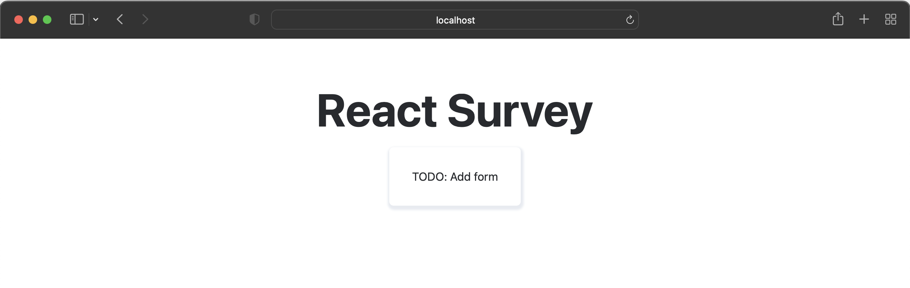

You'll find the code for this page in `pages/index.js`. Next.js uses [file-system routing](https://nextjs.org/docs/routing/introduction). Any file added to the `pages` folder will be a route. Every page is [pre-rendered](https://nextjs.org/docs/basic-features/pages#pre-rendering) by default. This means that Next.js creates the HTML needed for each page at build time. When a page is loaded in the browser, only the JavaScript needed for the page is loaded. For example, the survey form that we'll create will be displayed on the page without needing JavaScript. The JavaScript code needed to make the form interactive will then run, this is called hydration. If you disable JavaScript in your browser, you'll see that the development server will still display the message "TODO: Add form".

The advantage of pre-rendering is better performance and SEO. You won't get these advantages if you create a client-side rendered React app using [Create React App](https://create-react-app.dev/) or [Vite](https://vitejs.dev/) for example. Also, when you deploy to Vercel, Vercel automatically configures a global CDN for your project which further boosts performance.

The `index` page renders the `SurveyForm` component. This is the component that we'll use to create our survey form.

## Adding CSS

The CSS styles are defined in the `styles` folder. There's basic styling added for the page and the form that we'll create. Feel free to change the styles if you want to. The global styles, `globals.css`, are imported into the `_app.js` file. Next.js uses an [`app` component](https://nextjs.org/docs/advanced-features/custom-app) to initialize pages. You can override it and control the page initialization by creating an  `_app.js` file in the `pages` directory. We did this in order to add global CSS styles.

The `index` page and `SurveyForm` component have locally scoped CSS: `Home.module.css` and `SurveyForm.module.css`. These [CSS modules](https://github.com/css-modules/css-modules) scope CSS by automatically creating unique class names. To learn more about the built-in CSS support in Next.js, you can check the [docs](https://nextjs.org/docs/basic-features/built-in-css-support).

## Creating the survey form

Now let's create the survey form. We'll use [Formik](https://formik.org/) to create our form. Formik is a form library for React and React Native. It makes form validation, controlling form state, error handling, testing, refactoring, and form submission easier to implement.

Formik is especially useful if you have a complex form such as a multi-step form or if you have many forms. We'll also use the JavaScript library [Yup](https://github.com/jquense/yup) with Formik for form validation. Yup will make validation more convenient as we can define our validations in an object schema.

In the `SurveyForm` component, import the following:

```react
import { Formik, Form, Field, ErrorMessage } from 'formik';
import { JOB_TYPES } from '../constants';
```

The `constants.js` file contains some constants that we'll use to populate the `<select>` inputs of the form. They'll also be used for form validation.

Now replace the "TODO: Add form" text with the following code:

```react
      <Formik
        initialValues={{ jobType: '' }}
        onSubmit={async (values) => {
          await new Promise((resolve) => setTimeout(resolve, 500));
          alert(JSON.stringify(values, null, 2));
        }}
      >
        <Form className={styles.form}>
          <label htmlFor="jobType">
            Are you a professional programmer or a student?
          </label>
          <Field as="select" name="jobType">
            <option disabled defaultValue value="">
              select an option
            </option>
            {JOB_TYPES.map((job) => (
              <option key={job.value} value={job.value}>
                {job.title}
              </option>
            ))}
          </Field>
          <small>
            <ErrorMessage name="jobType" />
          </small>
          <button type="submit" className={styles.button}>
            Submit
          </button>
        </Form>
      </Formik>
```

The `Formik` component helps build a form, it holds the form state using [React Context](https://reactjs.org/docs/context.html). The `intialValues` property is an object that contains the initial field values of our form inputs. At the moment, the only input is `jobType`. The `onSubmit` property contains the submit handler function. At the moment it waits 500 ms after the form is submitted before displaying the submitted form values in an alert dialog.

The `Field` component hooks up inputs to Formik. It uses the `name` attribute to match up with the Formik state. The `<Field>` component will default to an `input` element. The `as` property indicates how the `Field` component should be rendered. In this case, the `jobType` field is rendered as a `select` element. The `JOB_TYPES` are mapped over to create `option` elements for each job type.

The `ErrorMessage` component will be used to display form validation error messages. It renders an error message if there's a validation error.

You'll see a short form in your development server now. If you submit the form, you'll get an alert dialog that shows the value of the `jobType` that you selected:

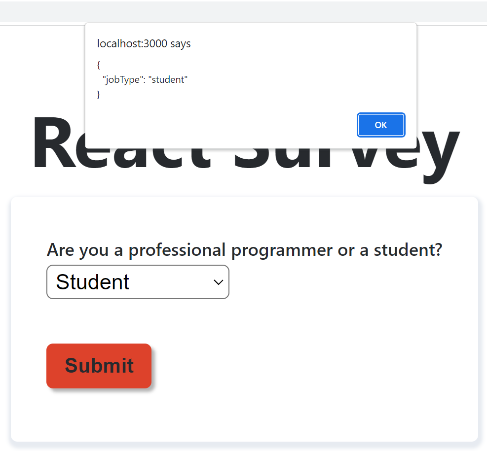

Now let's add the rest of the form fields, there will be six in total.

Import the following from `constants.js`:

```react
import { JOB_TYPES, CODING_EXPERIENCE, WORKSHOP_INTEREST } from '../constants';
```

Change the `Formik` component's `initialValues` property to the following:

```react
        initialValues={{
          jobType: '',
          yearsProgramming: '',
          yearsProgrammingReact: '',
          likes: '',
          dislikes: '',
          workshopInterest: '',
        }}
```

Then add the remaining form fields:

```react
          <label htmlFor="yearsProgramming">
            How many years have you been programming for?
          </label>
          <Field as="select" name="yearsProgramming">
            <option disabled defaultValue value="">
              select an option
            </option>
            {CODING_EXPERIENCE.map((value) => (
              <option key={value} value={value}>
                {value}
              </option>
            ))}
          </Field>
          <small>
            <ErrorMessage name="yearsProgramming" />
          </small>

          <label htmlFor="yearsProgrammingReact">
            How many years have you been programming using React?
          </label>
          <Field as="select" name="yearsProgrammingReact">
            <option disabled defaultValue value="">
              select an option
            </option>
            {CODING_EXPERIENCE.map((value) => (
              <option key={value} value={value}>
                {value}
              </option>
            ))}
          </Field>
          <small>
            <ErrorMessage name="yearsProgrammingReact" />
          </small>

          <label htmlFor="likes">What do you like about React?</label>
          <Field
            id="likes"
            name="likes"
            placeholder="Add your answer"
            as="textarea"
          />
          <small>
            <ErrorMessage name="likes" />
          </small>

          <label htmlFor="dislikes">What do you dislike about React?</label>
          <Field
            id="dislikes"
            name="dislikes"
            placeholder="Add your answer"
            as="textarea"
          />
          <small>
            <ErrorMessage name="dislikes" />
          </small>

          <label htmlFor="workshopInterest">
            Are you interested in attending an in-person React workshop?
          </label>
          <Field as="select" name="workshopInterest">
            <option disabled defaultValue value="">
              select an option
            </option>
            {WORKSHOP_INTEREST.map((value) => (
              <option key={value} value={value}>
                {value}
              </option>
            ))}
          </Field>
          <small>
            <ErrorMessage name="workshopInterest" />
          </small>
```

You can change the questions on the form to suit your own needs. Now let's validate our form inputs.

## Form input validation

We'll first create the Yup validation schema for our form fields. Create a `helpers` folder in the root directory and then create a `validationSchema.js` file inside of it. Add the following code for validating our first form field, `jobType`:

```javascript
import * as yup from 'yup';
import { CODING_EXPERIENCE, JOB_TYPES, WORKSHOP_INTEREST } from '../constants';

export const validationSchema = yup.object({
  jobType: yup
    .string()
    .strict()
    .required('Answer is required')
    .test('validJob', 'Invalid job type', function (value) {
      const validJobTypes = JOB_TYPES.map((job) => job.value);
      return validJobTypes.includes(value);
    }),
});
```

We use Yup to define a validation schema object. For each field, we use yup methods to parse and test the field values. If any of the fields fail validation, an error will be thrown that'll contain information about the validation error. This validation schema will be used by Formik for validation. The keys should match the `name` properties of the form `Field` components. The `string()` method is used to define a string value. It can coerce an input to a string by calling the `toString` method if the value exists. The `strict()` method sets `strict` to `true`. This prevents coercion, so a number won't be coerced into a string for example. The `required()` method means that the field value can't be `null` or `undefined`. The `test()` method allows us to create a custom validation function. If the value is valid, the function must return `true`. If the value is not valid, the function must return `false` or a `ValidationError`. You can read more about all of the available methods in the [`Yup GitHub repository`](https://github.com/jquense/yup#schematestname-string-message-string--function--any-test-function-schema).

Now add the rest of the keys for our `validationSchema` yup object below the `jobType` key:

```javascript
  yearsProgramming: yup
    .string()
    .strict()
    .required('Answer is required')
    .test(
      'validYearsProgramming',
      'Invalid number of years programming range',
      function (value) {
        return CODING_EXPERIENCE.includes(value);
      }
    ),
  yearsProgrammingReact: yup
    .string()
    .strict()
    .required('Answer is required')
    .test(
      'validYearsProgrammingReact',
      'Invalid number of years programming React range',
      function (value) {
        return CODING_EXPERIENCE.includes(value);
      }
    ),
  likes: yup
    .string('Enter what you like about React.')
    .strict()
    .min(2, 'Answer must be at least 2 characters long')
    .max(1000, 'The maximum number of characters is 1000')
    .required('Answer is required'),
  dislikes: yup
    .string('Enter what you dislike about React.')
    .strict()
    .min(2, 'Answer must be at least 2 characters long')
    .max(1000, 'The maximum number of characters is 1000')
    .required('Answer is required'),
  workshopInterest: yup
    .string()
    .strict()
    .required('Answer is required')
    .test(
      'validWorkshopInterest',
      'Invalid workshop interest',
      function (value) {
        return WORKSHOP_INTEREST.includes(value);
      }
    ),
```

Now let's add the validation schema to our form. In the `SurveyForm` component import the `validationSchema`:

```react
import { validationSchema } from '../helpers/validationSchema';
```

In the `Formik` component, add the following property below the `initialValues` prop:

```react
validationSchema={validationSchema}
```

​

The Formik [`validationSchema`](https://formik.org/docs/guides/validation#validationschema) property is a special configuration property for Yup. It transforms Yup validation error messages into an object that has keys that should match, if we named them correctly, the form field `values` / `initialValues`. If there's a validation error, the error message will be displayed in the `ErrorMessage` component that has a `name` property that matches the error object key.

Now if you try submit the form without filling in a field or if you add an invalid value, you'll get an error message, as defined in `validationSchema.js`:

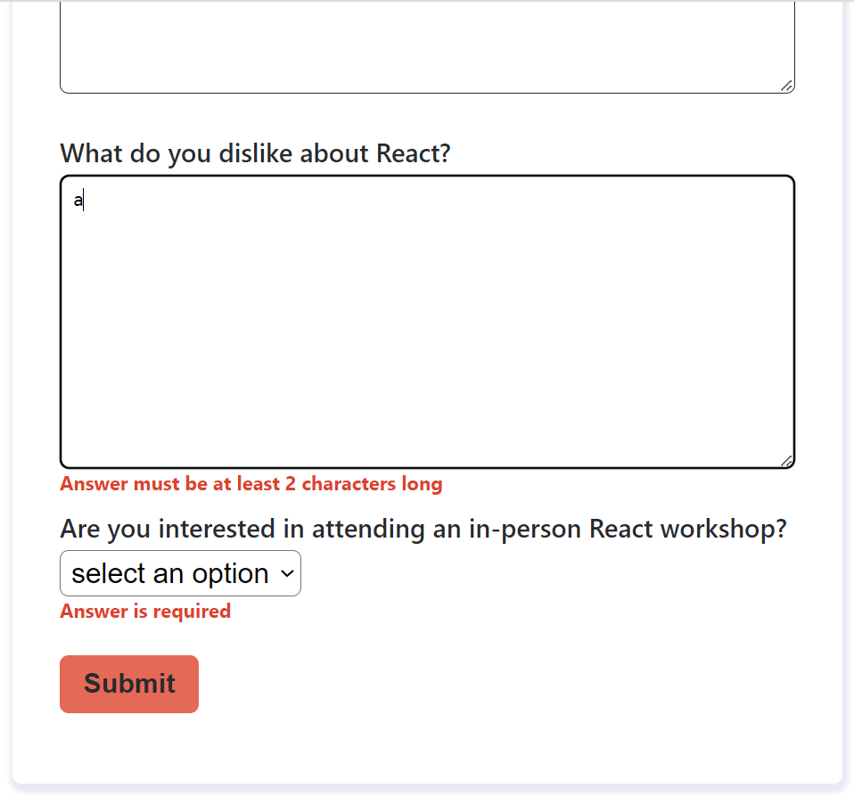

## Creating the Next.js API endpoint to submit survey data

Let's set up the form submission in our Next.js app. First, we'll create the Next.js API endpoint that will send our form data to Sanity. Go to the `pages/api/createResponse.js` file, this server-side Node.js code is our serverless function. In Next.js, any file inside of `pages/api` is mapped to the `/api/*` route. For the API route to work, we need to export the request handler function as default.

If a `POST` request is made to this route, `http://localhost:3000/api/createResponse`, a JSON response will be returned with the `message` value: "Response submitted". Any other type of HTTP request will return a JSON response with the `message` value: "Method not allowed". You can see this message by going to the API route in your development server. Our API route only needs to handle `POST` requests.

Import the Sanity Client:

```javascript
import { sanityClient } from '../../utils/sanityClient';
```

The `sanityClient.js` is part of the starter repo. It uses the [`next-sanity`](https://github.com/sanity-io/next-sanity) library which is a toolkit that will allow us to easily connect with Sanity and add survey submissions as new documents in Sanity Studio. It uses the `createClient` method to connect with Sanity. We'll add the `projectId`, `dataset`, and `token` as environmental variables once we've created a Sanity project later in the tutorial. The `useCdn` property is set to false, you'd set this to true if you wanted to fetch content from Sanity's cache delivery network. You'll be able to see what the latest `apiVersion` is in your Sanity Studio later. You can add the current date (`YY-MM-DD`) to get the newest version of the query API.

In the `createResponse` request function, add the following code above the `POST` request `return`:

```javascript
  // Destructure the pieces of our request
    const {
      jobType,
      yearsProgramming,
      yearsProgrammingReact,
      likes,
      dislikes,
      workshopInterest,
    } = req.body;
    try {
      // Use our Client to create a new document in Sanity with an object
      await sanityClient.create({
        _type: 'surveyResponse',
        jobType,
        yearsProgramming,
        yearsProgrammingReact,
        likes,
        dislikes,
        workshopInterest,
      });
    } catch (err) {
      return res.status(500).json({ message: `Couldn't submit response` });
    }
```

We'll get the form field values from the `req.body`. We then use the `sanityClient` `create` method to create a survey response [Sanity document](https://www.sanity.io/docs/document-type). A document is what you create and edit inside of Sanity Studio.

## Adding validation to the Next.js API endpoint

When you validate a form, you should validate the input on the client as well as on the server. Client-side validation can be bypassed easily, for example by disabling JavaScript or using [curl](https://en.wikipedia.org/wiki/CURL). Client-side validation is used so that the user can get feedback, such as an error message, quickly if there was a validation error. We're going to use the same Yup `validationSchema` that we used to validate our form client-side. Yup allows us to easily use the same validation for our front end and back end code.

First let's create a function that we'll use to check if our request data is valid. In the `utils` folder, create a file named `isReqValid.js` and add the following code:

```javascript
export async function isReqValid(schema, body) {
  try {
    await schema.validate(body);
  } catch (error) {
    return false;
  }
  return true;
}
```

This function will take in a Yup schema and the request `body` containing our form data. It will try validate the schema using the Yup `validate` method. If there are no validation errors, this `async` function will return `true`. If there are validation errors, Yup will throw an error and the function will return `false`.

Now go back to the `createResponse.js` API route and import the following:

```javascript
import { validationSchema } from '../../helpers/validationSchema';
import { isReqValid } from '../../utils/isReqValid';
```

Then add the following above the `req.body` destructuring:

```javascript
    // validation
    const isValid = await isReqValid(validationSchema, req.body);
    if (!isValid) {
      return res.status(422).json({
        message: 'Invalid request',
      });
    }
```

Our API endpoint will not make a request to Sanity if there's a validation error. Now that we've set up the backend API route, let's set up the front end `fetch` requests that we'll make to pass our form data to our API route.

## Sending data to the API endpoint from the front end

In the starter repo, there's an `apiClient.js` file in the `utils` folder. This contains a `fetch` API wrapper function that we'll use to make HTTP requests to our API endpoint. The [`fetch` API](https://developer.mozilla.org/en-US/docs/Web/API/Fetch_API) is [promise](https://developer.mozilla.org/en-US/docs/Web/JavaScript/Reference/Global_Objects/Promise) based. This wrapper makes modifying `fetch` requests and handling errors easier. Handling errors with the `fetch` API is a bit tricky because it will only reject a promise if the actual request failed, for example due to a network error. It won't reject a promise if the response returned an error code and message. You need to check the `ok` property of the `Response` object and explicitly reject the promise if the `ok` property is false. The `apiClient` wrapper deals with this.

This wrapper function was copied from the following Kent C. Dodd's article: [Replace axios with a simple custom fetch wrapper](https://kentcdodds.com/blog/replace-axios-with-a-simple-custom-fetch-wrapper). You can learn more about the fetch wrapper in the article. Let's use this fetch wrapper function to send a request from our survey form to our API endpoint.

In `SurveyForm.js` import the following:

```react
import { useState } from 'react';
import { client } from '../utils/apiClient';
```

We're going to use local React state for some form state. Add the following state variables and state variable setters:

```react
  const [hasSubmitCompleted, setHasSubmitCompleted] = useState(false);
  const [responseMessage, setResponseMessage] = useState(false);
```

We'll use the `hasSubmitCompleted` state to show the user a message once the form submission is complete. The message will be stored in the `responseMessage` state variable.

Replace the `onSubmit` property of the `Formik` component with the following:

```react
        onSubmit={(values, { resetForm, setSubmitting }) => {
          client('/api/createResponse', { body: values }).then(
            (data) => {
              // console.log('here is the data', data);
              setHasSubmitCompleted(true);
              setResponseMessage('Thanks for your response!');
              resetForm();
            },
            (error) => {
              // console.error('oh no, submission failed', error);
              setSubmitting(false);
              setHasSubmitCompleted(true);
              setResponseMessage(
                'There was an error submitting your response. Try again please.'
              );
            }
          );
        }}
```

We obtain the field `values` as well as the `resetForm` method and `setSubmitting` state setter from the form handler props. The [`resetForm`](https://formik.org/docs/api/formik#resetform-nextstate-partialformikstatevalues--void) method is part of the `formik` object. We'll use it to reset the form values after the form is submitted successfully. The `setSubmitting` state setter is used to set the `isSubmitting` state value. We set it to `false` if there's a submission error. Formik automatically sets it to `false` if the request is resolved successfully.

We use the  `fetch` API wrapper function `client` to make the request to our API endpoint. We pass in the API URL and field values as arguments. If the request is successful, we set `hasSubmitCompleted` to `true`, set a success message for the user, and reset the form values.

If there the request is unsuccessful, we set `isSubmitting` to `false`, `hasSubmitCompleted` to `true` and set an error message for the user.

To display the `responseMessage` to the user, we'll use some `if` statements to determine what the `SurveyForm` component should render based on the form's `isSubmitting` and `hasSubmitCompleted` state.

Add the following code just above the `<Form className={styles.form}>` line:

```react
        {({ isSubmitting }) => {
          if (isSubmitting) {
            return <div>Submitting survey response…</div>;
          }
          if (hasSubmitCompleted) {
            return (
              <>
                <div>{responseMessage}</div>
              </>
            );
          }
          return (
```

To close the all of the parentheses and curly brackets, add the following code just above the `</Formik>` line:

```react
          );
        }}
```

The `Formik` component accepts a function as its children. This function returns a React Element. This is known as a [render prop](https://reactjs.org/docs/render-props.html). This function implements the render logic for the `Formik` component. If `isSubmitting` is `true`, we render a `div` element with the text "Submitting survey response…" instead of the form. If `hasSubmitCompleted` is `true`, the `responseMessage` is shown in a `div`. If neither of these is `true` the form is rendered.

If you try to submit the survey form  in your development server, you'll briefly see the `isSubmitting` message and then you'll see the following response message:

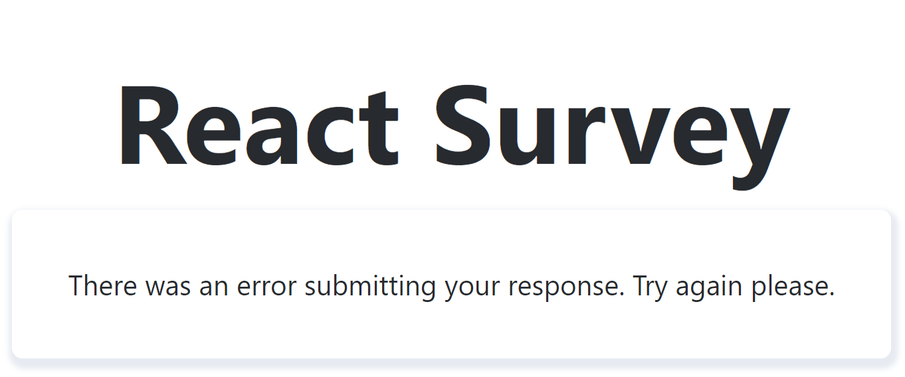

The survey user would need to refresh the page to try submitting again.

Now let's set up Sanity Studio so that we can successfully submit our survey responses and view the submissions.

## Getting started with Sanity Studio

The first thing we'll do is install the [Sanity CLI](https://www.sanity.io/docs/getting-started-with-sanity-cli) globally:

```bash
npm install -g @sanity/cli
```

We'll use the Sanity CLI to create a new project.

Then change the current directory to the studio folder and install the dependencies for Sanity Studio:

```bash
cd studio
yarn install
```

Now we'll set up a new project:

```javascript
sanity init
```

This command can also be used to connect to an existing project.

You'll get a message in your terminal that says:

```bash
The current folder contains a configured Sanity studio. Would you like to reconfigure it? (Y/n)
```

Type `y` and press enter as we're going to reconfigure the existing Sanity Studio boiler plate code from the starter template.

You'll get a message in your terminal to log in or create a new account. Choose one of the Login types presented:

```bash
? Login type
  Google
  GitHub
  E-mail / password
```

Once you've selected a login type, a new browser tab will be opened where you can create an account and login using the selected login type. Once you are done, you can close the tab and go back to your terminal.

The terminal message should say `Login successful`. Now in your terminal select:

```bash
create new project
```

Give your project a name, for example, `react-survey-app` then hit enter. You'll then get the following message:

```bash
Your content will be stored in a dataset that can be public or private, depending 
on
whether you want to query your content with or without authentication.
The default dataset configuration has a public dataset named "production".        
? Use the default dataset configuration? (Y/n) 
```

Type `n` and hit enter. You'll then get a message to name your dataset. Give it a name such as `results`. You'll then get the following message:

```bash
 Choose dataset visibility – this can be changed later (Use arrow keys)
> Public (world readable) 
  Private (authenticated requests only) 
```

Select `Private`. We want a private dataset as we don't want anyone to be able to query the survey results.

Now let's run our Sanity Studio, which is a React app:

```bash
sanity start
```

A browser tab will open and you'll be asked sign in to Sanity:

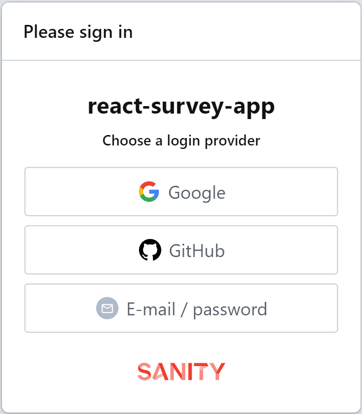

Once you've logged in you'll see your Sanity Studio. It's not empty as the starting code has a basic Sanity schema for our survey:

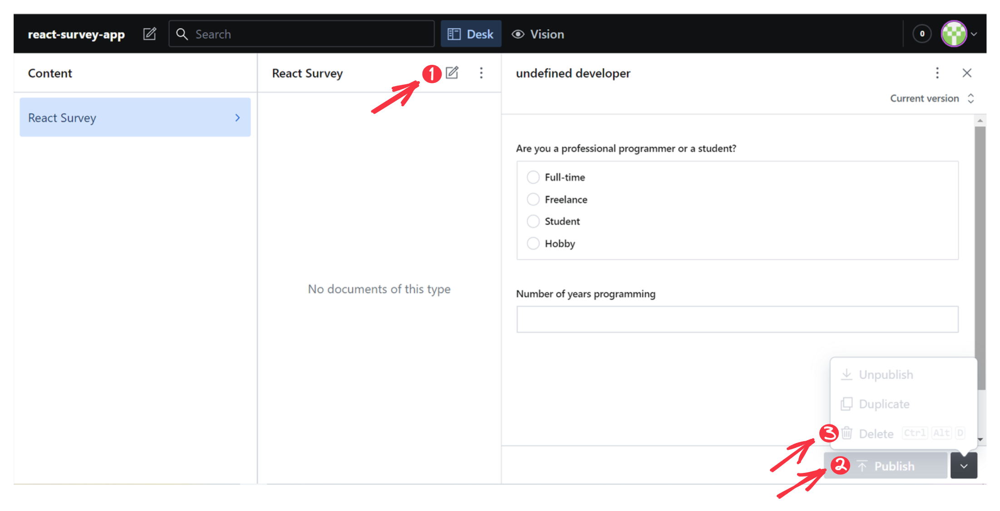

If you press the add document icon (1), the form on the right will appear. If you select one of the radio button options and add "0-1" for the "Number of years programming" input the Publish button (2) will turn green. If you press "Publish" it will add the [Sanity document](https://www.sanity.io/docs/document-type) to your dataset. If you add "a" to the "Number of years programming" input, you'll get the following validation warning: "Invalid number of years programming range". This is defined in the starter code schema, we'll see how this is done soon. Once you've published a document, it'll appear in the middle column. You can delete it by selecting it and then going to the drop-down menu next to the "Publish" button and pressing "Delete" (3).

If you were creating a blog with Sanity, for example, this is how you would add data to Sanity Studio. We'll create documents from user input, using the `sanityClient.create` method in our Next.js API route.

## Creating the Sanity Schema for survey responses

We need to set up the [schema](https://www.sanity.io/docs/content-modelling) for our survey response data. To add a schema, you add a file to the `schemas` folder. The starter code already has a `surveyResponse.js` schema added. We'll need to fill it out for all of our survey questions. This file exports an object describing the survey data. It's imported into the  `schemas/schema.js` file where it's used to create our schema. If we had multiple schemas, they'd all be imported into this file and combined to create our schema.

Now let's add to the existing survey response schema to describe the data for all of the survey questions. In the `surveyResponse.js` file, you'll see that there are some constants at the top of the file, these are the same constants that are in the  `web/constants.js` file. The exported object describes our survey data, currently, it only describes the `jobType` and `yearsProgramming` fields. For each survey question, we'll add an object that describes the question data.

The `title` property is the title that we'll see in Sanity Studio. The `name` field should match the `name` property of the Formik `Field` component in our survey form on the front end. All of the fields that we'll use have a `type` of `string`. Sanity Studio has many different [schema types](https://www.sanity.io/docs/schema-types).

The `options` property is for questions that have multiple options that can be selected. You can specify the `list` array containing all of the options and you can specify the `layout`, for example, "radio".

The [validation](https://www.sanity.io/docs/validation) property takes a function that receives `Rule` as its first argument. The function returns `true` if validation is successful. If validation fails, it returns an error message as a string. There are built-in validation methods such as `required()` to help you validate fields. If these methods aren't enough, you can create your own validation function using the `custom()` method.

Let's add all of the fields, add the following objects below the `yearsProgramming` object:

```javascript
    {
      name: 'yearsProgrammingReact',
      title: 'Number of years programming using React',
      type: 'string',
      validation: (Rule) =>
        Rule.required().custom((yearsProgrammingReact) => {
          return CODING_EXPERIENCE.includes(yearsProgrammingReact)
            ? true
            : 'Invalid number of years programming React range';
        }),
    },
    {
      name: 'likes',
      title: 'What do you like about React?',
      type: 'string',
      validation: (Rule) => Rule.required().min(2).max(1000),
    },
    {
      name: 'dislikes',
      title: "What don't you like about React?",
      type: 'string',
      validation: (Rule) => Rule.required().min(2).max(1000),
    },
    {
      title: 'Are you interested in attending an in-person React workshop?',
      name: 'workshopInterest',
      type: 'string',
      options: {
        list: WORKSHOP_INTEREST,
        layout: 'radio', // <-- defaults to 'dropdown'
      },
      validation: (Rule) =>
        Rule.required().custom((workshopInterest) => {
          return WORKSHOP_INTEREST.includes(workshopInterest)
            ? true
            : 'Invalid workshop interest';
        }),
    },
```

You'll now see all of the fields for entering survey data in your Sanity Studio.

## Connecting our Next.js app to Sanity Studio

Let's connect our Next.js app to Sanity Studio so that we can start receiving survey responses. In the `web` folder create a `.env.local` file and add the following lines to it:

```
NEXT_PUBLIC_SANITY_PROJECT_ID=
NEXT_PUBLIC_SANITY_DATASET=
SANITY_API_TOKEN=
```

You can find the `projectId` and `dataset` name in the `studio/sanity.json` file. We'll need to create a Sanity API token. Go to <https://www.sanity.io/manage>, click on the block with your React survey project name, click on the "API" tab and then click "Add API token".

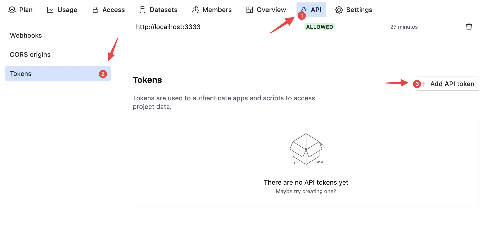

Give the token a name and then set the Permissions to "Editor".

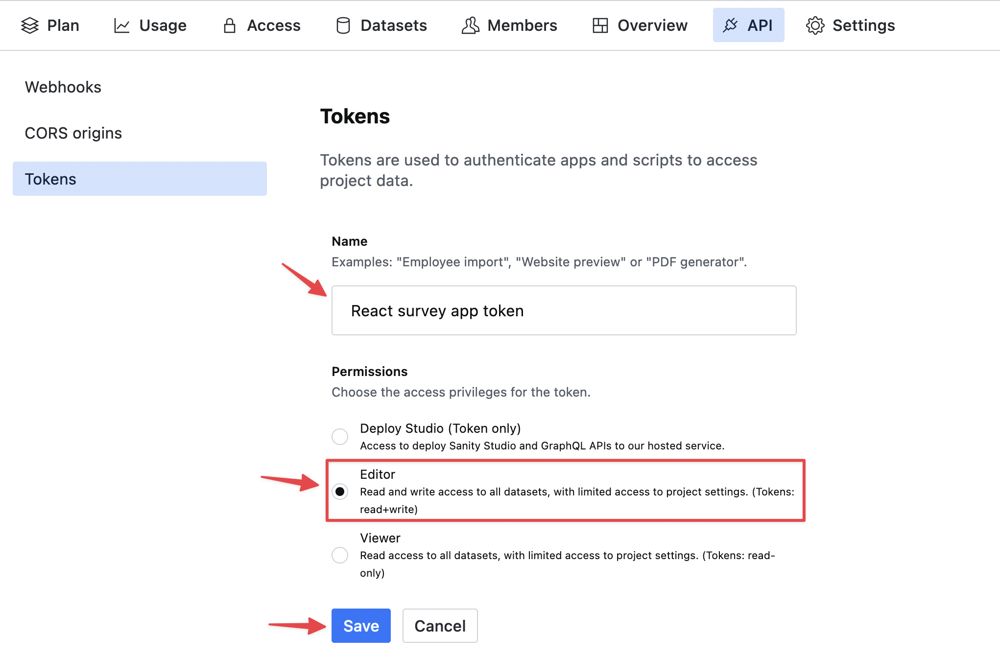

Copy and add the token to the `web/.env.local` file, we'll call it `SANITY_API_TOKEN`. Now start your Next.js development server:

```bash
cd web
yarn dev
```

Submit a survey response. You'll be able to see your survey response in Sanity Studio.

## Improving the Sanity Studio preview for the survey responses in the list view

You'll notice that the list view for our React survey responses in the middle column of our Sanity Studio is not very helpful. Let's improve it so that we can get more information about each survey response at a glance.

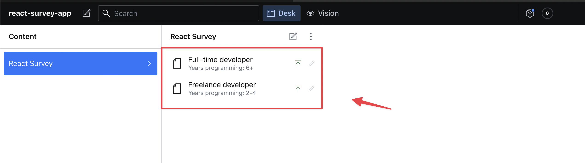

In the `studio/schemas/surveyResponse.js` file, import React at the top:

```react
import React from 'react';
```

Replace the `preview` property with the following:

```react
  preview: {
    select: {
      yearsProgramming: 'yearsProgramming',
      yearsProgrammingReact: 'yearsProgrammingReact',
      jobType: 'jobType',
      workshopInterest: 'workshopInterest',
    },
    prepare(selection) {
      const {
        yearsProgramming,
        yearsProgrammingReact,
        jobType,
        workshopInterest,
      } = selection;
      const jobName =
        jobType &&
        JOB_TYPES.flatMap((option) =>
          option.value === jobType ? [option.title] : []
        );
      const EMOJIS = {
        yes: '✔',
        no: '❌',
        maybe: '🤷‍♂️',
      };
      return {
        title: `${jobName} developer`,
        subtitle: `Years programming: ${yearsProgramming}. Years programming React: ${yearsProgrammingReact}`,
        // Remember to import React from 'react' if you are rendering React components like below
        media: (
          <span style={{ fontSize: '1.5rem' }}>
            {workshopInterest ? EMOJIS[workshopInterest] : '❔'}
          </span>
        ),
      };
    },
  },
```

The `preview` object is used to determine what's displayed in the Sanity Studio list view. If you don't add the `preview` object, Sanity guesses which fields should be used for the preview and displays them. Inside of this object, we use the `select` property to get data from our schema. This data is then passed to the `prepare` method, which returns the `title` and `subtitle` and `media` for our preview. The `media` property is used to show a thumbnail image in the preview. You can also use JSX to render the thumbnail. We use JSX to render an emoji based on the `workshopInterest` value of the survey submission.

Now the Sanity Studio list preview is much more useful:

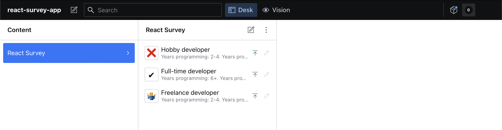

You can also sort the list by clicking the three-dot menu in the top-right corner of the list view and selecting a sort type:

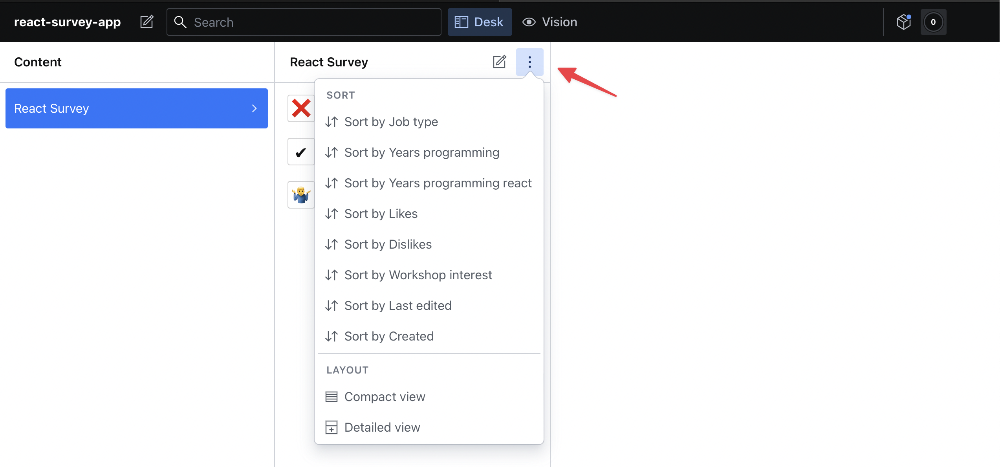

Our survey app is done! Before we deploy our app, let's learn how to query data in Sanity's data store using the query language, [GROQ](https://www.sanity.io/docs/groq) (Graph-Relational Object Queries). This will be useful to query all or part of the data as well as to delete data in bulk.

## Deleting Sanity data in bulk

The contains a script to delete all of the survey data in the Sanity data store. To use it run:

```bash
sanity exec deleteDocsByFilter.js --with-user-token
```

You can also have more specific GROQ filters by changing the query in the script, you can refer to the [GROQ query cheat sheet](https://www.sanity.io/docs/query-cheat-sheet) for more information.

## Querying Survey data in Sanity using GROQ

You can also query your Sanity data in the Sanity Studio development server:

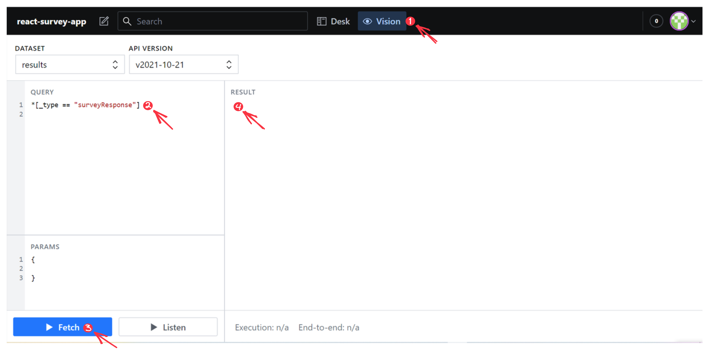

Go to the "Vision" tab at the top (1) and then enter your GROQ query (2). Enter the following query in the "QUERY" input:

```gr
*[_type == "surveyResponse"]
```

Then press the "Fetch" button (3). The JSON response will be displayed in the "RESULT" section (4). If you hover over the response text, a "Copy to clipboard" icon will pop up. If you click it, the results will be copied to your clipboard. You can also query this data by using an [HTTP request](https://www.sanity.io/docs/http-query). This can be used to export all documents with one request or pull the data into an admin dashboard, for example.

## Deploying our Sanity Studio

We'll host our Sanity Studio on Sanity. To build and deploy your Studio, run the following command in your terminal:

```bash
sanity deploy
```

You'll then get a message in your terminal that asks you to provide a unique name for your Sanity URL, which will be hosted at `https://my-unique-name.sanity.studio`. Once the build and deployment steps are complete, you'll get a success message with a link to your deployed Sanity Studio.

You can manage your studio by going to <https://www.sanity.io/manage> where you can do all sorts of things including monitoring usage and adding project members with [different levels of access](https://www.sanity.io/docs/access-control) to the  data.

## Deploying our Next.js application

Push your whole completed React survey app project, including the `web` and `studio` folder, to a GitHub repository on your personal GitHub account if you haven't done so already. The repository can be public or private. This will make deployment easier.

First, [create a Vercel account](https://vercel.com/signup). Choose "Continue with GitHub" and go through the sign-up process.  Now import your GitHub repository on Vercel, you can do this from [here](https://vercel.com/import/git). You’ll see that you need to install Vercel for GitHub. You can give it access to all of your repositories or just to repositories that you select.

Once you have given Vercel permission to access your React survey app GitHub repository, click the "Import Button". You'll then be taken to a page to configure your project. For the "FRAMEWORK PRESET" select "Next.js". If we only had a Next.js repo, Vercel would automatically detect this. Set the "ROOT DIRECTORY" to "web".

You don't need to change the "Build and Output Settings". Vercel adds default values used for a typical Next.js project.

Add the environmental variables from the `.env.local` file to the "Environment Variables" section. Now click the "Deploy" button to deploy your Next.js app. Once deployment is complete, go to the live URL and submit a survey response. You'll see it in your Sanity Studio.

## Next steps

One major issue with our survey form is that users can submit as many responses as they want to. A user could spam our survey with many responses by using browser automation tools such as [Selenium](https://www.selenium.dev/). You minimize this by:

- Adding [Google's invisible reCAPTCHA](https://developers.google.com/recaptcha/docs/invisible) to the form.
- Rate limiting form submissions by IP address using a library such as [rate-limiter-flexible](rate-limiter-flexible)

Another thing that you could do to improve the survey app is to pull data from Sanity into an admin dashboard in Next.js to visualize the survey data. You can create tables, graphs and other data visualizations to understand the data better by using a library such as [React Charts](https://react-charts.tanstack.com/).

