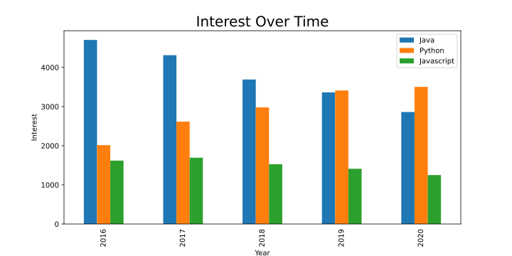
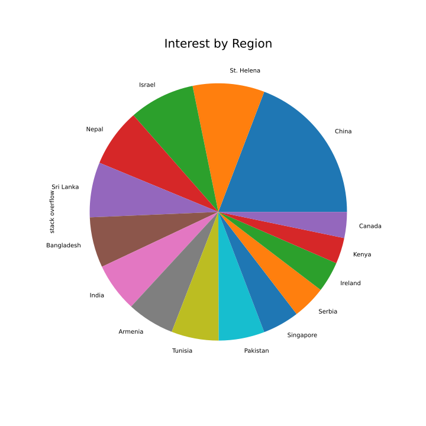
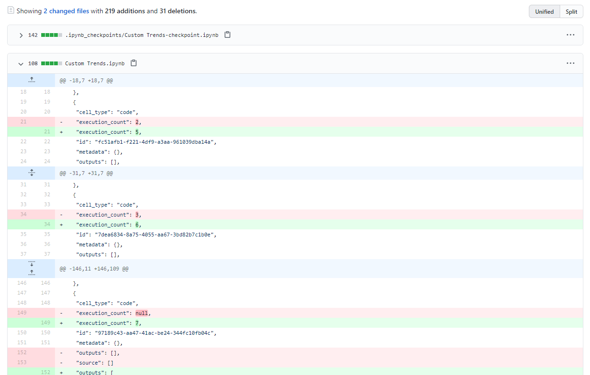
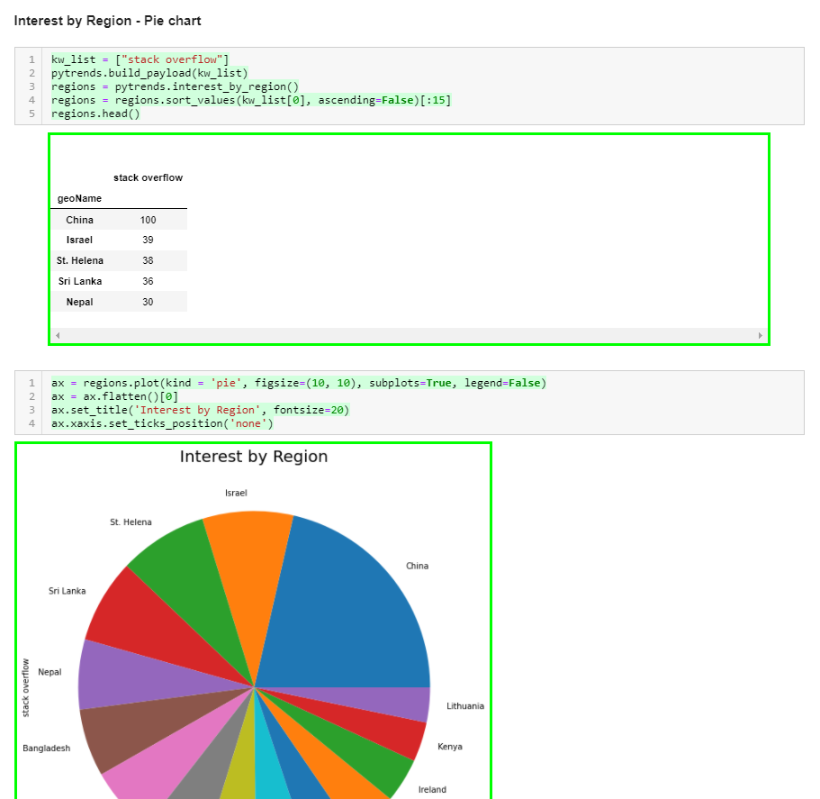

---
hide:
- navigation
---

# Creating Custom Graphs with Google Trends and pandas


In this article you will learn how to:

- Get data from Google Trends automatically using Python [Pytrends](https://pypi.org/project/pytrends/) (an unofficial Google Trends library)
- Visualise this data in Jupyter notebook using Matplotlib and pandas.
- Source control your notebook with nice diffs using GitHub and ReviewNB.

This article assumes you have some prior experience using Python and GitHub.

## Setting up and getting data from Google Trends

First we need to install our dependencies. Run the following in your shell.

```
pip install pytrends
```

Now import all the modules that we'll be using by adding the following code to the first cell of the notebook.

```python
import matplotlib.pyplot as plt
import pandas as pd
import pytrends
from pytrends.request import TrendReq
```

Connect to Google Trends with the `TrendReq` class, using this code:

```python
pytrends = TrendReq(hl='en-US')
```

This initializes our Pytrends object and establishes a connection to Google Trends. The `hl`(host language) is set to American English.

## Creating a chart to visualise interest over time

Now we can get Google Trends data for our first graph. Let's plot the data for the search terms "Java", "Python" and "JavaScript" over a given timeframe as a bar chart to illustrate Google users' interest in the topics.

Add the following code to a new cell and run it.

```python
kw_list = ["Java", "Python", "Javascript"]
pytrends.build_payload(kw_list, geo='', timeframe='2016-01-01 2020-12-31')
```

- The item `kw_list` is always required, and supplies the list of keywords we're querying. You can specify a maximum of five items.
- `geo` defines the location to limit the returned results. In this instance, the location is set to 'global' by using an empty string. You can narrow the results by using a two-letter (_capitilized_) [country code](https://www.iban.com/country-codes).
- `timeframe` is set to `'today 5-y'` by _default_, which means from five years back until today's date. To avoid partial data for the currenty year, we explicitly set the timeframe to ignore results after the end of 2020.

Now, retrieve the 'interest over time' data with the following command:

```python
time_interest = pytrends.interest_over_time()
del time_interest['isPartial']
```

The `interest_over_time()` method returns data as a pandas dataframe. We can delete the `isPartial` (boolean) column from our dataframe, as we limited the time frame so we know that all our data should be complete. You can run `time_interest.head()` to see a summary of our data.

\[Add screenshot\]

You can plot this data using `time_interest.plot()`, which returns a graph similar to what you see on the Google Trends website. But we want to customise our visualisation, which we can do as follows.

```python
time_interest = time_interest.groupby(pd.Grouper(freq='Y')).sum()

ax = time_interest.plot(kind='bar', xlabel='Year', ylabel="Interest", figsize=(10, 5))
ax.set_xticklabels([pandas_datetime.strftime("%Y") for pandas_datetime in time_interest.index])
ax.set_title('Interest Over Time', fontsize=20)
ax.xaxis.set_ticks_position('none')
```

- We use `groupby` to group the data, in our example by years (`freq='Y'`). We add `sum()` to aggregate the total interest by year.
- We plot our `time_interest` graph as a bar chart with `kind='bar'`. Set the figsize to `(10, 5)` (width by height in inches).
- Use `ax.set_xticklabels([pandas_datetime.strftime("%Y") for pandas_datetime in time_interest.index])` in a list comprehension to get only the years from our dataframe as labels on the x-axis.
- Finally, we set the title for our graph using `set_title` and use `ax.xaxis.set_ticks_position('none')` to remove the ticks we would otherwise get on the graph.

Your graph should look like this:



## Saving our notebook and putting it in source control.

We've created a basic graph and now we want to do something more ambitious. In case something breaks, this is a good point to save our notebook and put it in source control (GitHub) so we can always come back to this working version if necessary.

Create a new repository in GitHub, and follow the provided instructions to initialise a local repository and push your notebook to GitHub.

`[Show JSON]`

## Visualising interest by region

We've visualised interest over time, but let's also take a look at interest by region.

This time we'll create a pie chart showing the regions with the highest interest in our topics.

Add the following code to your notebook.

```python
kw_list = ["stack overflow"]
pytrends.build_payload(kw_list)

regions = pytrends.interest_by_region()
regions = regions.sort_values(kw_list[0], ascending=False)[:15]
regions.head()
```

- As before, we start by defining a keyword list. This time, however, we use only a single query to visualise interest in that topic over different regions.
- We call `pytrends.interest_by_region()` to get regional data as a pandas dataframe.
- We sort the data by interest, specifying `kw_list[0]` and `ascending=False` to have the regions with the most interest first. In this instance, we limit the results to the top 15 regions that are interested in our specified topic.
- Run `regions.head()` to see the data we're working with.

Now that we have our data, let's plot it using the following code:

```python
ax = regions.plot(kind='pie', figsize=(10, 10), subplots=True, legend=False)
ax = ax.flatten()[0]
ax.set_title('Interest by Region', fontsize=20)
ax.xaxis.set_ticks_position('none')
```

Note that the code is very similar to what we used to plot the bar chart, the major differences being:

- `kind='pie'` to specify we want a pie chart.
- `subplots=True` enables us to plot the chart without having a y-column in our data.
- `legend=False` removes the extra legend, as the pie slices are already named by region.
- Our data is represented by a two-dimensional `np.array`. We use `ax.flatten()[0]` to collapse the array into one dimension.

You should see a graph similar to this, which shows that X region has the most interest in stack overflow while Y region has the least.


## Visualising what we have changed about our notebook

With another graph done, let's save our notebook and commit it to the GitHub repo, pushing the changes we've added:

```
git commit -a -m "Added regional interest pie chart"
git push
```

Now we can review the changes on GitHub.

Open the latest change we've made on the notebook and click on 'load diff'.


We see a huge blog of JSON, which represents the minor changes we've made to the notebook. It would be nice if we could see the changes visualised in a nicer way, so let's move on to ReviewNB.

## Adding ReviewNB to GitHub to visualise Jupyter Notebook diffs

[ReviewNB](https://www.reviewnb.com/) is a GitHub app that creates visual diffs for Jupyter notebooks. Sign up on ReviewNB (a free account is fine) if you haven't already.

Follow the instructions from ReviewNB to add it to GitHub and grant access to your repository. You'll be directed to the ReviewNB interface. From here, select the repo and then the latest commit from the `Commits` tab.

When you open the notebook file, you should see something like this:



This is much nicer than the JSON blog we saw before. Now we can see exactly what has been changed in our notebook.

## Creating a pull request and visualising it with ReviewNB

Let's create a pull request scenario for ourselves as this will help us familiarize the GitHub workflow.

Save your notebook and push it into the new branch we created using:

```
git commit -a -m "added a density plot"
git push -u origin WIP
```

Open GitHub and you should see "WIP had recent pushes less than a minute ago". Click on the `Compare and pull request` button. The next screen will allow you to write a comment and create a pull request.

After you have created a pull request, the `Conversation` tab will open where you can have a discussion with collaborators about the pull request. Note that the `review-notebook-app` bot has commented with a link to view our pull request on ReviewNB. Click on that link.

The link takes us to the `Changes` tab on ReviewNB. From here we can see the changes we've added and add a comments on specific lines if we need.

Let's post a comment on the new graph. I've posted "**Could you lower the graph height to 60% - 75% of what it is? There's too much open space**". We can see our comment on the `Discussion` tab, and if we head back to GitHub, we will see the same thing in `Conversation`.

Finally, we can resolve the conversation and merge our WIP branch to main.

# Where next?

We created some basic visualisations with Google Trends data and Pytrends, but there's a lot more you could do. If you're stuck for ideas, maybe try

- Automating the report generation - emailing yourself trends data on a weekly or monthly basis.
- Trying out different kinds of visualisation - we used a Pie Chart because most people are familiar with them but they are often a bad choice.

