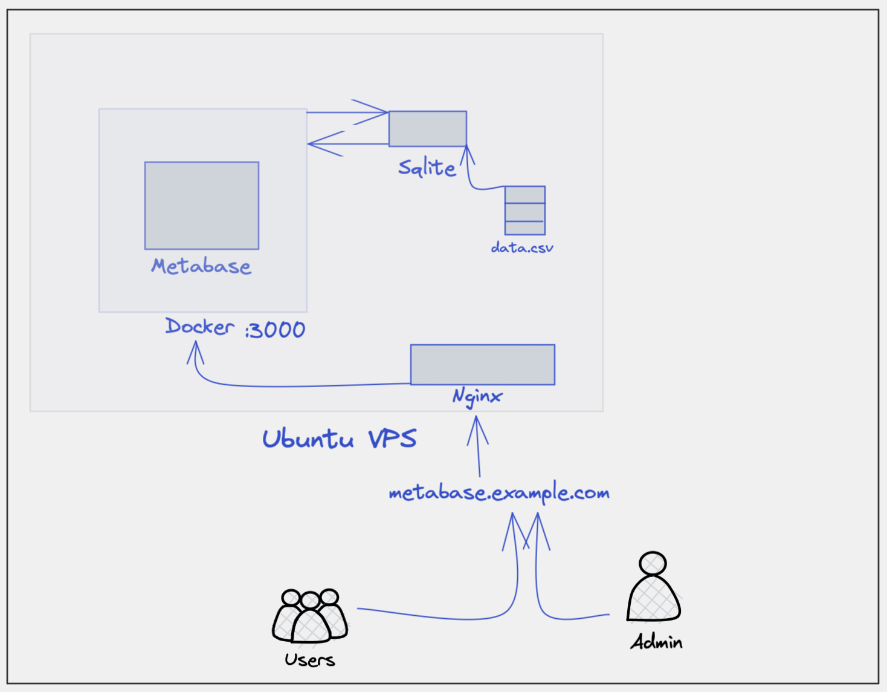
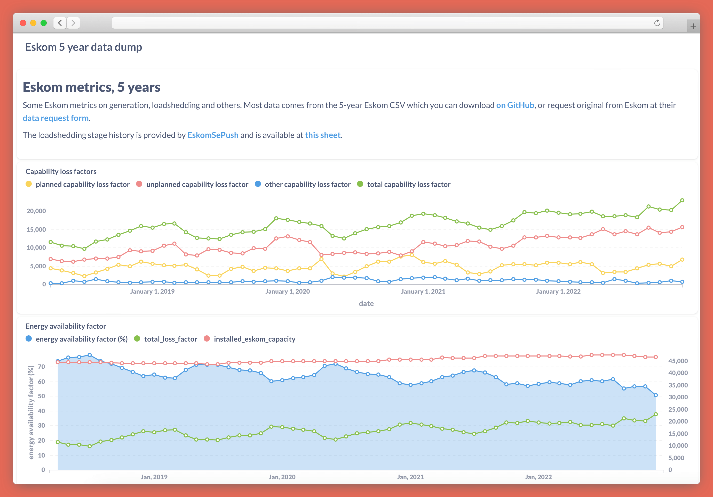
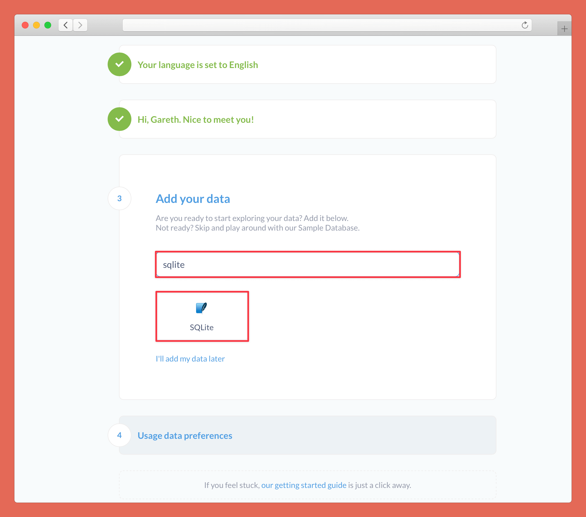
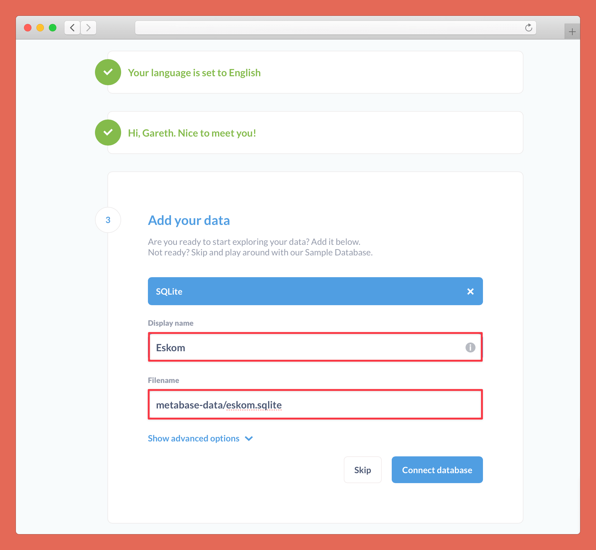
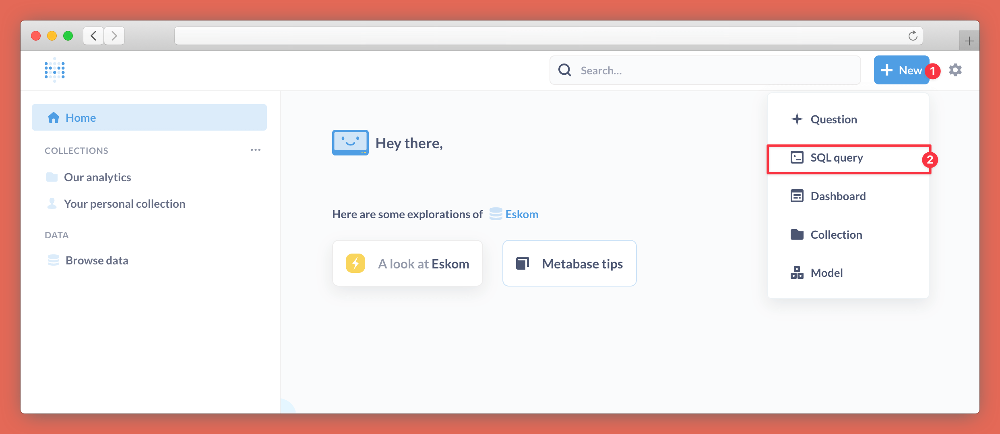
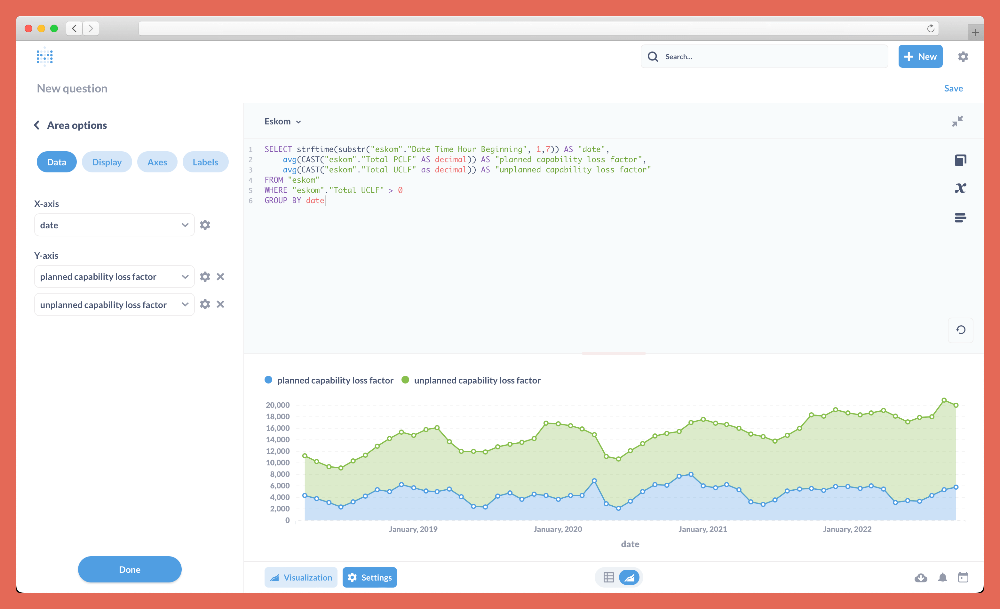
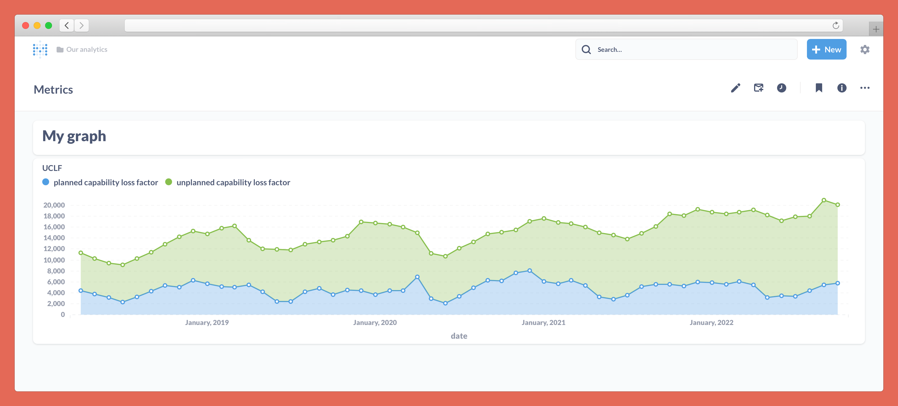
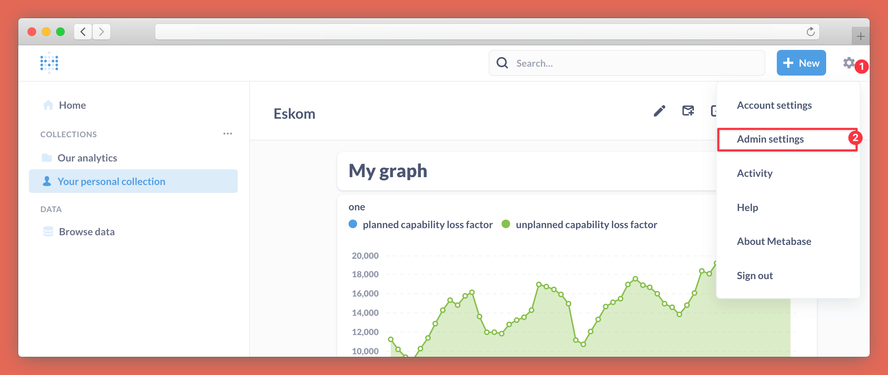
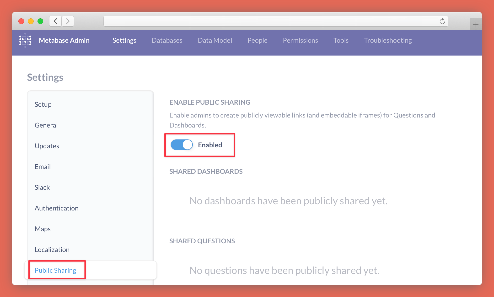
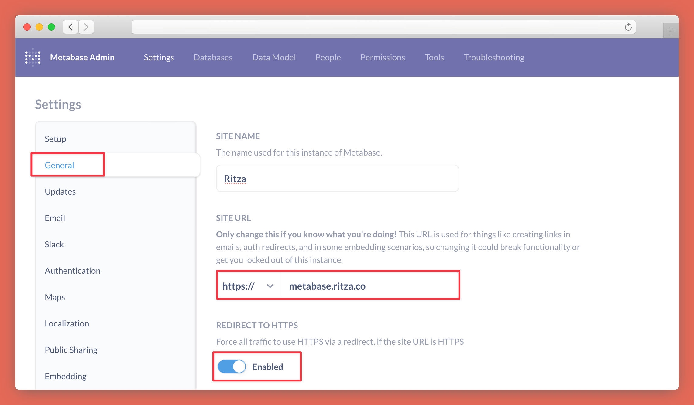

---
hide:
- navigation
---

# Data visualization with Metabase from CSV files with SQLite

[Metabase](https://metabase.com) is an open-source, data-visualization platform you can use to build graphs and dashboards, loading data from various data sources including SQLite.

This tutorial will show you how to:

* Import data from a CSV file into SQLite.
* Set up a new Metabase instance on an Ubuntu VPS using Docker and map a volume to your SQLite file (outside Docker).
* Use Nginx as a reverse proxy with a custom domain to access Metabase, like `metabase.example.com`.
* Write some custom Metabase queries to visualize the data and build a dashboard.
* Make the dashboard public.

The final system will look like this:



And an example dashboard that you can create with Metabase is [this one on electricity generation metrics](https://metabase.dwyer.co.za/public/dashboard/8a1e3f60-e53f-44c4-b045-cdcb35254ecb).



## What you need

* A VPS running Ubuntu Server or your favorite Linux distro.
* A CSV dataset to visualize. For the examples, we'll be using [this one](https://github.com/sixhobbits/eskom_scraper/blob/main/ESK2745.csv) that contains five years of data relating to Eskom, South Africa's electricity provider.
* A domain name and the ability to configure DNS and add a custom A record to point a subdomain like `metabase.example.com` to the IP address of your VPS.
* Some experience using SSH and command line tools to install and configure software.

## Import the CSV data into SQLite

*To keep the examples simple, we'll do everything directly on the VPS. If you prefer using your own machine, you can do many of these steps locally and then transfer the files to the VPS using SCP, Git, or whatever method makes you happiest.*

First, make sure you have SQLite installed by running the following:

```bash
sudo apt update
sudo apt install sqlite3
```

Now we'll create a subdirectory for our Metabase data sources and download our CSV file:

```bash
mkdir metabase-data
cd metabase-data
wget https://raw.githubusercontent.com/sixhobbits/eskom_scraper/main/ESK2745.csv
```

Then we create a new SQLite database. You can use any extension you like, but `.db` or `.sqlite` are conventional.

```bash
sqlite3 eskom.sqlite
```

This will open a SQL prompt that gives you read/write access to the new `eskom.sqlite` database created using the previous command.

Let's go into `.csv` mode and import the CSV data. Once it's done (you'll see some warnings if you're using the example file, but you can ignore these), type `.exit` to close the SQL prompt:

```
.mode csv
.import ESK2745.csv eskom
.exit
```

Now type `ls` to confirm that the new database was created as expected. You should see `eskom.sqlite` (or whatever you called your database) in the output:

```bash
ls
```

Now we have our data in a CSV database, ready to import into Metabase, so let's install that. There are a few ways to install Metabase but the easiest is using Docker.

## Install Docker

Follow the relevant instructions to install Docker from the official website. Don't use `snap` or `apt-get` to install Docker on Ubuntu as the repository versions can be buggy.

For Ubuntu 22.04, follow the instructions [available here](https://docs.docker.com/engine/install/ubuntu/).


### Docker command

Once Docker is installed, you can run a Metabase container with the following command. This assumes that you created `metabase-data` in your home directory. If you created it somewhere else, change the first part of the volume mapping (`-v ~/metabase-data`) to point to your metabase-data directory.

```bash
sudo docker run -d -p 3000:3000 \
    -v ~/metabase-data:/metabase-data \
    -e "MB_DB_FILE=/metabase-data/metabase.db" \
    --name metabase metabase/metabase
```

This runs Metabase on port 3000. We map our host `metabase-data` directory to a directory inside the container and we tell Metabase to use the lightweight `metabase.db` file for its own internal databases (to track the dashboards and queries that we'll create in Metabase).

For production use cases, it's preferable to use Postgres instead as Metabase's database but that's a bit more tricky to set up and SQLite works well enough.


## Nginx configuration

Now that Docker is running in the background, we'll set up an Nginx reverse proxy to allow traffic from the outside world to pass through our domain and on to Metabase.

You should already have bought a domain from a provider such as Namecheap and configured it (or a subdomain of it) with an A record to point at the IP address of your VPS.

Now install Nginx with the following command:

```bash
sudo apt install nginx
```

Create a configuration file in `/etc/nginx/sites-available`. If your DNS A record points `metabase.example.com` to your VPS IP address, then you'd do the following.

Create the file (or use Vim or Emacs or whatever text editor you like the most):

```bash
sudo nano /etc/nginx/sites-available/metabase.example.com.conf
```

Then add the following, substituting the `server_name` with your own domain as Nginx will use this to decide what traffic triggers this `server` rule:


```
server {
    server_name metabase.example.com;

    location / {

      proxy_set_header    Host $host;
      proxy_set_header    X-Real-IP $remote_addr;
      proxy_set_header    X-Forwarded-For $proxy_add_x_forwarded_for;
      proxy_set_header    X-Forwarded-Proto $scheme;
      proxy_pass          http://localhost:3000;
    }
}
```

To activate the site, you need to put a symlink in `sites-enabled`. You can do this with the following command, again substituting the filename you used before:

```bash
sudo ln -s /etc/nginx/sites-available/metabase.example.com.conf /etc/nginx/sites-enabled/
```

## Install Certbot and get a certificate

To serve your dashboard over HTTPS instead of HTTP, get a free SSL certificate from Let's Encrypt. On Ubuntu 22.04, you can do this using `certbot`, which you can install with:


```bash
sudo snap install --classic certbot
```

On other platforms, you can get exact instructions to install `certbot` from [certbot.eff.org/instructions](https://certbot.eff.org/instructions).

Once Certbot is installed, run:

```bash
sudo certbot --nginx
```

And choose your domain from the list. Certbot will change the Nginx configuration files you wrote in the previous step to work with HTTPS and the newly generated certificates. If everything works as expected, you should see a message similar to the following:

```
Deploying certificate
Successfully deployed certificate for metabase.example.com to /etc/nginx/sites-enabled/metabase.example.com.conf
Congratulations! You have successfully enabled HTTPS on https://metabase.example.com

- - - - - - - - - - - - - - - - - - - - - - - - - - - - - - - - - - - - - - - -
If you like Certbot, please consider supporting our work by:
 * Donating to ISRG / Let's Encrypt:   https://letsencrypt.org/donate
 * Donating to EFF:                    https://eff.org/donate-le
- - - - - - - - - - - - - - - - - - - - - - - - - - - - - - - - - - - - - - - -
```

## Set up Metabase

Before we use Metabase, there's a once-off set-up step. Visit your domain (for example, https://metabase.example.com) in your browser and go through the set-up wizard.

The first two steps are to set your name, language, and a password to access the Metabase admin panel. Then you'll need to link the SQLite database we created in the first step. Search for "sqlite" and select SQLite in step 3.





Enter the path to your database. If you're using the same data and structure as we did above, the path will be `metabase-data/eskom.sqlite`. Connect to the database.



Complete step 4 and then press "Take me to Metabase".

## Create a Metabase query

On the main page, you'll see Metabase has already set up some automated analysis for you. Unfortunately, because SQLite doesn't have a proper date-time field, automated analysis of date-related data is not very good. We'll ignore it and create our own queries using SQL rather.

In the top right, press "New" and then "SQL query".



In the following screen, you'll get a SQL editor. Choose "Eskom" (or whatever your database is called) using the dropdown in the top left and then enter a query. For example:


```SQL
SELECT strftime(substr("eskom"."Date Time Hour Beginning", 1,7)) AS "date",
    avg(CAST("eskom"."Total PCLF" AS decimal)) AS "planned capability loss factor",     
    avg(CAST("eskom"."Total UCLF" AS decimal)) AS "unplanned capability loss factor"
FROM "eskom"
WHERE "eskom"."Total UCLF" > 0
GROUP BY date
```

In our example dataset, we have hourly data over five years, which is a bit too fine-grained to create useful graphs, so we take a substring of the first seven characters of our data column, which gives us something like `2018-06`. We pass this to `strftime`, which is SQLite's function to cast strings to a DATETIME format.

We cast the columns we are interested in to decimal format and give them more friendly names (which will automatically be used in the graph).

Run the query using the play button in the right-hand toolbar or by pressing Command-Enter.

In the bottom left, press "Visualization" and choose "Area" and you'll see a chart similar to the one shown below.



## Save the query and add it to a dashboard

In Metabase, you can have a collection of queries on a dashboard so you can quickly see the visual output of several queries at once.

Click "Save" in the top right corner and give your query a name. Metabase will prompt you to add the query to a dashboard. Choose "yes please" and then choose "Create a new dashboard", give it a name, and press "Create".

You'll be taken to the Metabase visual dashboard editor where you can resize the card added from the query above and move it around. Use the "Aa" button in the top right to add text (for example, a name for the card just above it) to your dashboard if you would like to. Press "Save".

Now you'll be taken to the view version of your dashboard, which will look like the following.




## Allow public dashboards

By default, Metabase operates in private mode, so only people who have an account on your Metabase instance can view your data.

If you'd like to make dashboards public, go to admin settings by pressing the cog icon in the top right.




Under "Public sharing" toggle "Enabled" to on.



Now navigate to "General settings" and configure your domain under "Site URL". Choose "https://" from the dropdown to the left of the domain and toggle "Redirect to HTTPS" to on.



Press "Exit admin" in the top right corner and navigate back to your dashboard by going to the "My analytics" collection in the top left corner and choosing the dashboard you created earlier.

Open the Share panel by pressing the share icon and toggle "Enable sharing" to on (in the admin settings, we enabled sharing as an option, but your dashboards are all still private by default. Now you are choosing to make this specific dashboard public).


Copy the URL and share it with anyone you want!

You can go back to your dashboard and add or edit any cards (queries) at any time and these changes will automatically reflect on the public link.
