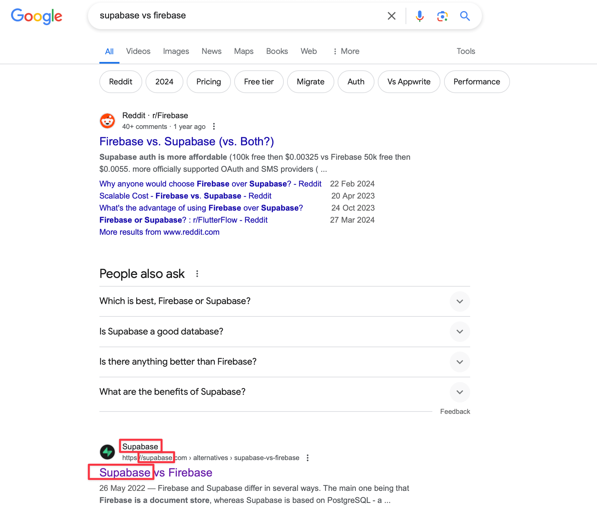

---
hide:
  - navigation
---

# Competitor comparisons: what, why and how

A common category of articles that we work on at [Ritza](https://ritza.co) are "competitor comparisons". This is a form of marketing where you compare yourself to your competitors, either for SEO (a lot of people search "X vs Y" on Google), or as part of your sales process (so you don't have to answer the question "Why should I choose you instead of Y?" for the millionth time).

This is a popular and deceptively simplistic form of content marketing. It's easy to do, but also easy to do wrong. We've done this in many variations and with different goals for several customers, so here's what we've learned through that process.

Eric from HitSubscribe has a [great video on Competitor Comparisons](https://www.youtube.com/watch?v=Ijngo6AZBug) which we'll reference a few times in this post, so it's worth a watch.

## Four patterns for comparion posts

The main patterns of comparison posts we see are:

* "X vs Y": the classic - comparing two things head-to-head
* "X vs Y vs Z": useful if you are much smaller than two well-known competitors
* "Alternative to X": picking up disgruntled customers from X 
* "Migrating from X to Y": helping people get free

Let's take a closer look at each.

### X vs Y articles

If you are fairly well know but up against a better-known encumbant, then this is a great format. For example Supabase does this to compare themselves to Firebase in [Supabase vs Firebase](https://supabase.com/alternatives/supabase-vs-firebase). It's easy to rank for articles like this because you probably already have a strong keyword in your domain name, which Google uses as a strong signal when ranking. 

Even though the Supabase article is fairly short and probably not the best of several comparisons out there, it ranks number 2, after reddit.

* This is a great format for SEO if people already know about you and are actively comparing you against your competition. It lets you steer the narrative (though as noted in Eric's video, you need to be aware that your readers are going to be default skeptical on any claims you make so make extra effort to be completely honest and refer to objective data as much as you can).
* This can also work well for people who are already predisposed to prepare your product. For example, maybe you met them in person or already convinced them that your product is better but they need to make the case to internal stakeholders before signing off on a deal. We've seen cases where people say "We know you're better, but we need to prove it because our <CTO/Board/Advisors> are asking why we don't go for the safer and better known option".
* This can also be helpful for top-of-funnel and general awareness of your product. Often your landing page does a pretty bad job of letting people understand what your product is because it says something like "The easiest way to get everyone on the same page. In one place. Finally". When people are searching for "X vs Y", it might not be because they are wondering which one to buy, but because they know what "Y" does and they are learning what "X" does and trying to understand it. If they're already knowledgeable about "Y" you can use that to your advantage by funneling that audience to your comparison page and quickly get them up to speed on exactly what your offering is.
* This isn't always a super valuable option if you're still relatively unknown as people might not find it. In this case, see X vs Y vs Z for how you can raise awareness among people looking to compare two of your better-known competitors.

### X vs Y vs Z articles

This is very similar to the X vs Y pattern discussed above, but you do a three-way comparison. For example, if you were to start a new competitor to Firebase and Supabase called "BestBaaS". If you wrote "BestBaaS vs Supabase", you wouldn't get much SEO benefit as no one knows about BestBaaS, so no-one is searching for it. 

Maybe people would still find value in this in understanding what your product is, and the motivation behind building a new competitor in an established market, but if you're still on the smaller side you probably care more about top-of-funnel and getting page views.

In this case, you instead write "Supabase vs Firebase vs BestBaaS". The term "Supabase vs Firebase" gets a lot of traffic, so if you can write the best thing on the internet to help people compare those, then you might rank number 1. After helping people choose between Supabase and Firebase, that's a great time to throw in a quick 'or check out this third option if you value A, B, C', with a shout out to your biggest differentiating factors. Even if 80% of people simple take the information you provided about your competitors and go with one of them, hopefully 20% will at least consider you as a third option.

This works well if you're much smaller than two well known competitors, especially if there aren't too many articles already comparing your two biggest competitors.

If both of your biggest competitors already have an X vs Y page up, it's going to be hard to beat them in many cases, and this might not be a good pattern to try.

### Alternative to X articles

This pattern provides another way for you to take advantage of a bigger competitor with more search traffic. A good example of this is [Plausible's Alternative to Google Analytics](https://plausible.io/vs-google-analytics) article. 

A lot of their customers come as unhappy GA customers. These people likely don't even know there are viable GA alternatives. They almost certainly haven't heard of Plausible, so they aren't going to be searching "Google Analytics vs Plausible" but they might find plausible by looking for alternatives to the one platform that they do know.

This is a great format if your competitor is an established 'default' in the space. Big platforms always have unhappy customers, so you can use their churn as your lead generation.

### Migrate from X to Y articles

Articles that show you in detail how to migrate from a competitor's platform to yours are usually going to be useful much further down the funnel. In many cases, this will be most useful to someone who has already bought your product, so it might not fall under marketing at all. 

However don't underestimate how sticky platforms are. Even if someone is convinced that you're a better option, they might have a hard time moving, so anything you can do to

* prove it's possible to do the migration
* help them do the migration with as few resources as possible
* help them precisely estimate what they need for the migration and how long it will take

is going to be useful. As with the previous patterns, honesty is really important here. If write something like this:

> Migrating from X to Y is an easy three step process. First you should define and analyse your needs and design a solution. Then you should implement the solution. Finally, make sure to maintain the solution.

then you're not going to make any friends. Rather do the work of setting up your competitor's product, loading in some example data, and then figuring out how to move that onto yours. Figure out what is likely to be hard for your customers doing this (presumably with much more complicated requirements), and demonstrate with code samples, screenshots, and maybe a repository of helper scripts, that it's feasible to do.

### Building up a complementary collection 

You don't have to choose between the patterns listed above. Often it's useful to do all of them. For example

* Alternative to X: let people discover your offering Y when they're unhappy with X.
* X vs Y: once you're piqued their interest, show the advantages of your offering over X.
* Migrate from X to Y: show them how easy it is to move and give them the information they need to plan a migration project internally.

## Benchmarking and academia

These article patterns, especially X vs Y, often get close to benchmarking or formal, academic comparisons. You'll find a lot of these for database offerings especially. It can be hard to draw a line between a marketing post and an academic study, and this can cause several issues around

* ethics (if you're doing it as an academic project you should have much stronger requirements around neutrality, not cherry-picking favourable results, and declaring your biases)
* timelines (academic studies can take months or years to complete, while a marketing article is usually expected to be completed in weeks)

Depending on your exact field, and especially in more Big Enterprise settings, you'll probably also discover reports from places like Gartner and Forrester. Again, it might be tempting to try to do something with the amount of detail and rigour that you see in those reports, but keep in mind that those are usually compiled over months or years with input from hundreds of people, so remember to keep your expectations realistic.

## Legality

I'm not a legal expert, but as [mentioned by Eric](https://www.youtube.com/watch?v=Ijngo6AZBug) in the video you'll probably want to discuss your approach with someone who is before implementing it. Rules about competitive advertising vary across the globe, but often the main considerations are:

* No defamation - you're not allowed to lie about your competitors to make them seem worse than you.
* No confusion - you're not allowed to use their name or brand in a way that their users might get confused about who is who.
* Life's not fair - if their legal team and budget is much bigger than yours, and they sue you, you're probably not going to have a good time, even if you did nothing wrong, so be careful about 'poking the bear', especially if that bear is known for aggresive legal action.

## Neutrality and promotion

Finding the right balance between neutrality and promotion can be hard. If you host comparison articles on your own domain (as we usually recommend that you do), you don't want to say anything bad about your own product. 

But your readers are also default-skeptical (as they know you have a vested interest in convincing them that you are better), so some candid self-criticism can help change that impression and convince them that the article is a good source of objective information.

Overall, don't be afraid to brag a little where it's justified and feel free to point out flaws in your competitor, but this should be done tastefully and subtly. Don't drop a comparison table with 10 checkmarks on your side and 10 Xs for your competitor. Don't have a series of 10 sections where you 'win' for all 10. If a reader sees stuff like this (even if it's true) they are going to lose all trust and close the page immediately. 

Instead give a balanced take, ideally showing objective data wherever you can (even if it's slightly cherry-picked ;) ).

## Producing comparison articles

At [Ritza](https://ritza.co), we specialise in producing comparison articles for highly technical companies. We'll onboard to you and your competitor, try them both out and write articles in any or all of the formats mentioned above.

Of course, you can also do this in house and often that is the better option, especially if you already have experts in-house that know your own platform and your competitors well. 

Advantages of using our services include 

* We've done it before: we know what to look out for, how to do the keyword research, and how to find a balance between promotion and objectivity
* We'll give you our honest feedback: while our articles will emphasise your strong points and show you at your best, we'll also give you private feedback about how you can improve your own product to truly beat your competitors.

