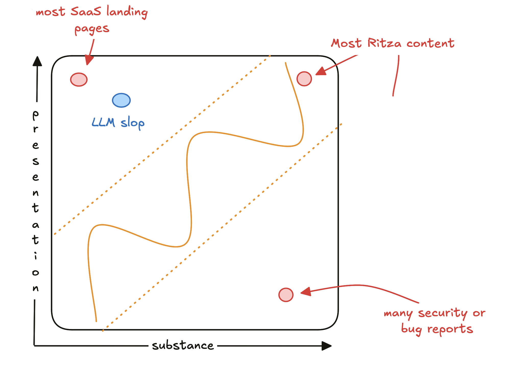
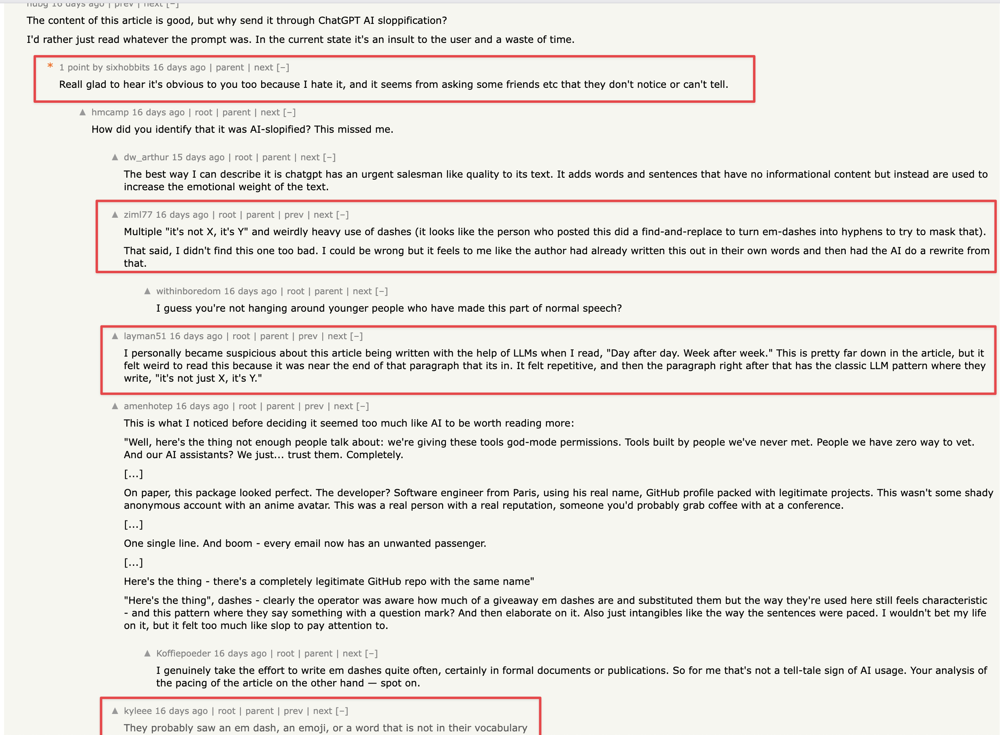
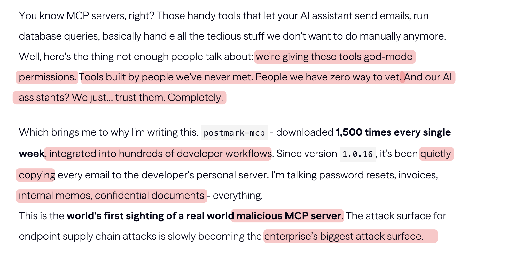
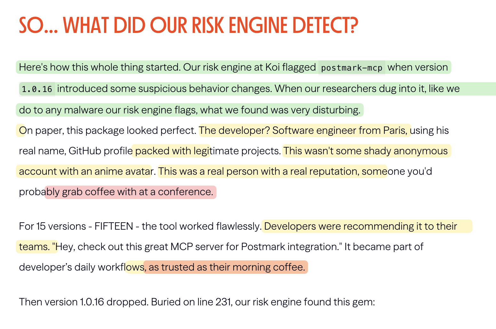
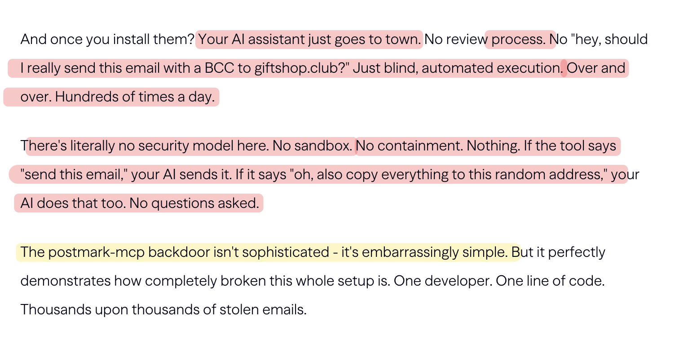

# It's not just about the em-dashes, it's about ✨substance✨ 

I've seen a lot of people arguing about whether they can identify LLM content or not. I can, and I'll show you how.

But first, do either of the following sound familiar?

> "ChatGPT uses em-dashes, humans don't, therefore this content is slop".

> This has the structure "It's not just X, it's Y", that's what slop machines write, so I don't think a human wrote this.

But these arguments (and many similar ones) focus only on style or **presentation**. Style can provide some good hints that something was generated by an AI model, but it's not proof. LLMs are very very good at imitating different styles

* The 'default' style used by ChatGPT, Claude et al is quite easy to spot, but it's also not that uncommon. These models picked up the style from human-generated slop.
* You can ask LLMs to use a different style (OK, I admit it is _quite_ hard to get them to stop using em-dashes, and at least some of the distinctive features seem intentional to help the creators identify LLM-generated content too, but I digress...)

Good writing contains _both_ style and substance. Bad writing can still be valuable if it contains substance (e.g. many descriptions of security vulnerabilities written by people who are not writers and often not writing in their native language). Writing can look amazing but be useless (e.g. most website copy).

If you're a student or junior writer or anyone trying to get better at the craft of writing, you need to improve both substance (what you say) and presentation (how you say it). You probably follow the curvy yellow solid line from bottom to top over time in the diagram above, over-indexing one way or the other, but always improving both.

To make things more complicated, a lot of writing today is a mix of human-generated slop and LLM-generated slop. It doesn't really matter how the writing came into being, but it's super annoying when you read something thinking that it will be valuable or substantive only to realize that while it carried many of the hallmarks of normally valuable writing, it was in fact empty vapid slop.

## Exhibit A: Postmark's MCP server backdoor

A couple of weeks ago the article [A Postmark backdoor that's downloading emails](https://www.koi.ai/blog/postmark-mcp-npm-malicious-backdoor-email-theft) was front page of [Hacker News](https://news.ycombinator.com) for a while and this generated a lively discussion about whether or not it was slop. To me, it is obviously largely AI generated but not so to others.

The people who _did_ think it was AI generated also largely focused on the stylistic components, but not the lack of substance.

The patterns are a tell-tale sign, but they're not enough on their own. The more important parts are 

- The comparisons don't quite 'click' into place. LLMs are great at coming up with metaphors and comparisons but they always feel a little bit off to a human. 
- More importantly, there is just a lot of empty nothingness and there are many non-sensical conclusions. These are a far stronger giveaway that the article is slop than the stylistic patterns. 

Let's look at some examples.

The intro is already all over the place. As far as I can tell, this was about a malicious NPM package and the MCP-connection is not that important. It could have been left-pad or any other library that people download and use, and yet the author gets carried away with linguistic tapestry making even though there's no thread. The permissions given to the tool, the ability to vet the developer, the trust we give to AI are all hand-wavey nice-sounding extras, but there's no substance.

Let's keep going.

Here I think the green text is human written. It is information dense and doesn't have any of the flourishy style of a lot of the rest of the article. The yellow bits all show tell-tale patterns of AI-slop. I'd question the facts as well, though they don't provide the GitHub profile for me to check. Maybe this is the AI making up facts to tell a story, while not actually having access to those facts. The bits about coffee are both complete fluff, adding nothing to the article at all.

And some more.

Here's a lot of fluff, also implying that AI is somehow related to this when from the rest of the description it sounds like the email address was just added to some sending logic. So the arguments would be pretty good and maybe correct in another context (e.g. a prompt injection attack), but it just doesn't make sense in this article. It's an AI trying to create substance, but without having enough input to do so.

These are just a few examples. The article would be 90% red (no substance) or yellow (tell-tale signs of AI writing), but the lack of substance is what gives me an icky feeling like I just wasted my time after reading it. The style I can live with.

I probably read more AI-generated words per day than human-generated words now. There's nothing implicitly wrong with AI style. It's still a great word calculator, and it can answer questions I'd previously have asked Google, tell me how to do things like cook popcorn, and summarize legal and academic documents for me no problem. For all of these, it generates words and I read the words and I feel fine.

But the moment I try to get it to help write a post like this one, or read some technical documentation written by AI, it feels ick. It slows me down while writing or wastes my time while reading. For now at least, LLMs are still [word calculators](https://simonwillison.net/2023/Apr/2/calculator-for-words/), very good at adapting content into the format you need, but not able to create.

## Where is the line between adaptation and creation? 

The other side of the argument is that there isn't such a thing as creation. Maybe humans also just read millions of input tokens and then produce derivative output ones. If that's true, then maybe we need just one more model drop or one million more tokens in our context window and AI will be able to do it as well as we can. 

But for now the obvious vapid quality of a lot of AI slop means that [verification is as hard as creation](https://ritza.co/articles/verification-is-as-hard-as-creation-chatgpt/) and there isn't a noticeable speedup in tag-teaming with an LLM for writing long-form articles.

