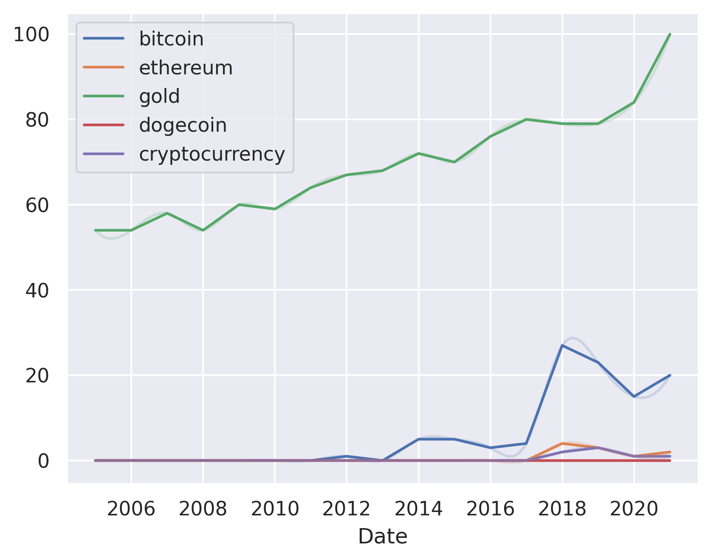

---
hide:
  - navigation
---

# bitcoin vs. ethereum vs. gold vs. dogecoin vs. cryptocurrency vs. dollar

## Bitcoin vs. ethereum

**Bitcoin** is a cryptocurrency and worldwide payment system. It is the first decentralized digital currency, as the system works without a central bank or single administrator.

**Ethereum** is a decentralized platform that runs smart contracts: applications that run exactly as programmed without any possibility of downtime, censorship, fraud or third-party interference.

Consider Bitcoin if you want to invest in a cryptocurrency that is the most established and has the highest market capitalization.

Consider Ethereum if you want to invest in a cryptocurrency that has a more diverse use case and is more flexible.

## Bitcoin vs. gold

**Bitcoin** is a cryptocurrency that is decentralized and not regulated by any government. Bitcoin is a digital currency that is not backed by any physical commodity.

**Gold** is a precious metal that is used as a store of value and a medium of exchange. Gold is a commodity that is not regulated by any government.

Consider Bitcoin if you want to invest in a cryptocurrency that is not regulated by any government.

Consider gold if you want to invest in a commodity that is not regulated by any government.

## Bitcoin vs. dogecoin

**Bitcoin** is a cryptocurrency that is decentralized and uses a peer-to-peer system to confirm transactions.

**Dogecoin** is a cryptocurrency that is decentralized and uses a peer-to-peer system to confirm transactions.

Consider Bitcoin if you want to invest in a cryptocurrency that has a large market cap and is accepted by many merchants.

Consider Dogecoin if you want to invest in a cryptocurrency that has a small market cap and is accepted by few merchants.

## Bitcoin vs. cryptocurrency

**Bitcoin** is a cryptocurrency that is decentralized and not controlled by any government or bank. Bitcoin is a digital currency that is not tied to a bank or government and allows users to spend money anonymously.

**Cryptocurrency** is a digital currency that is not tied to a bank or government and allows users to spend money anonymously.

Consider Bitcoin if you want to be able to spend money anonymously and without a bank or government controlling the currency.

Consider cryptocurrency if you want to be able to spend money anonymously and without a bank or government controlling the currency.

## Bitcoin vs. dollar

**Bitcoin** is a cryptocurrency that is decentralized and not controlled by any central authority.

**Dollar** is a currency that is centralized and controlled by a central authority.

Consider Bitcoin if you want to invest in a cryptocurrency that is decentralized and not controlled by any central authority.

Consider dollar if you want to invest in a currency that is centralized and controlled by a central authority.

## Dogecoin vs. ethereum

**Dogecoin** is a cryptocurrency that was created as a joke in 2013. It has a fast transaction time and a low transaction fee.

**Ethereum** is a cryptocurrency that was created in 2015. It has a slower transaction time and a higher transaction fee.

Consider Dogecoin if you're looking for a cryptocurrency with a fast transaction time and low transaction fee.

Consider Ethereum if you're looking for a cryptocurrency with a slower transaction time and a higher transaction fee.

DISCLAIMER: This article was written by a generative AI model.
