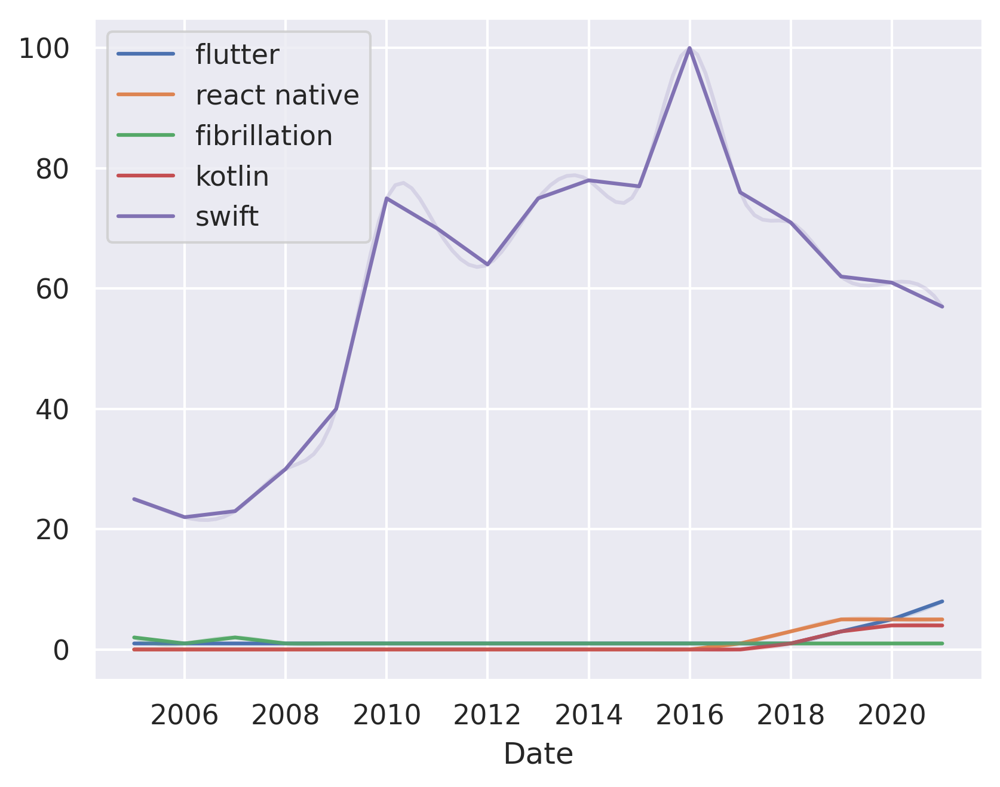

---
hide:
  - navigation
---

# flutter vs. react native vs. fibrillation vs. kotlin vs. swift vs. xamarin
## Flutter vs. react native

**Flutter** is a mobile app SDK for building high-quality native apps on iOS and Android. It is a reactive framework that is based on Dart and is open-source.

**React Native** is a cross-platform mobile app SDK for building native mobile apps using React.

Consider Flutter if you want to build a mobile app with a reactive framework and want to use Dart.

Consider React Native if you want to build a mobile app with a cross-platform SDK and want to use React.

## Fibrillation vs. flutter

**Fibrillation** is a library for creating reactive user interfaces in Python. It is a high-level library that is easy to use and can be used to create animations, games, and other types of interactive applications.

**Flutter** is a cross-platform mobile app SDK for developing applications for iOS and Android. It is a reactive framework that is based on Dart.

Consider Fibrillation if you are looking for a high-level library for creating reactive user interfaces.

Consider Flutter if you are looking for a reactive framework for developing cross-platform mobile apps.

## Flutter vs. kotlin

**Flutter** is a mobile app SDK for building high-quality native apps on iOS and Android. It is written in the Dart programming language and is open-source.

**Kotlin** is a programming language that runs on the Java Virtual Machine and can be compiled to JavaScript source code.

Consider Flutter if you want to build native apps for iOS and Android with a single codebase.

Consider Kotlin if you want to build a cross-platform app with a single codebase.

## Flutter vs. swift

**Flutter** is a mobile app SDK for building cross-platform apps. It is written in the Dart programming language and is open-source.

**Swift** is a programming language developed by Apple for iOS, macOS, watchOS, tvOS, and Linux.

Consider Flutter if you want to build cross-platform mobile apps with a language that is open-source.

Consider Swift if you want to build mobile apps with a language that is supported by Apple.

## Flutter vs. xamarin

**Flutter** is a mobile app SDK for creating high-quality native interfaces on iOS and Android. Flutter is a reactive, declarative language that is compiled to native code and uses a reactive framework.

**Xamarin** is a cross-platform mobile app development framework that allows you to create native iOS, Android and Windows apps with C#.

Consider Flutter if you want to create a cross-platform mobile app with a reactive framework.

Consider Xamarin if you want to create a native mobile app with a reactive framework.

## Kotlin vs. swift

**Kotlin** is a statically-typed programming language that runs on the Java Virtual Machine and also can be compiled to JavaScript source code. Kotlin is a general-purpose programming language that can be used for Android development, server-side development, and much more.

**Swift** is a general-purpose, multi-paradigm, compiled programming language that runs on Apple's iOS, macOS, tvOS, and watchOS operating systems.

Consider Kotlin if you want to use a language that is interoperable with Java and is also used by Google.

Consider Swift if you want to use a language that is interoperable with Objective-C and is also used by Apple.

## React Native vs. swift

**React Native** is a framework for building native mobile apps using JavaScript. It is a cross-platform framework that allows you to build mobile apps for iOS and Android.

**Swift** is a programming language developed by Apple that is used to create iOS and macOS applications.

Consider React Native if you want to build a mobile application for both iOS and Android.

Consider Swift if you want to build an iOS or macOS application.

## React Native vs. xamarin

**React Native** is a framework for building native mobile apps using JavaScript. React Native is a cross-platform framework that can be used to develop apps for iOS, Android, Windows, and more.

**Xamarin** is a cross-platform mobile development framework that allows you to share code between iOS, Android, and Windows apps.

Consider React Native if you want to build native mobile apps with JavaScript.

Consider Xamarin if you want to build cross-platform mobile apps with C#.

## Swift vs. xamarin

**Swift** is a programming language developed by Apple for iOS, macOS, watchOS, tvOS, and Linux. Swift is a general-purpose programming language that is designed to work with Apple's Cocoa and Cocoa Touch frameworks.

**Xamarin** is a cross-platform mobile app development framework that allows developers to create native apps for Android, iOS, and Windows Phone.

Consider Swift if you are looking for a general-purpose programming language that is designed to work with Apple's Cocoa and Cocoa Touch frameworks.

Consider Xamarin if you are looking for a cross-platform mobile app development framework that allows you to create native apps for Android, iOS, and Windows Phone.

**Disclaimer: this article was written by generative AI**.

