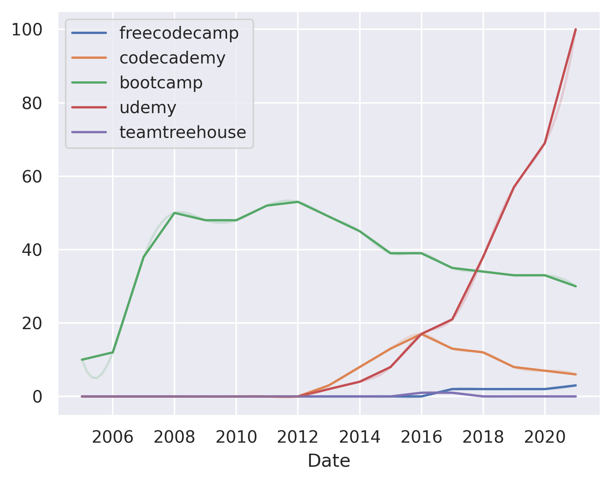

---
hide:
  - navigation
---

# freecodecamp vs. codecademy vs. bootcamp vs. udemy vs. teamtreehouse vs. coursera

## Codecademy vs. freecodecamp

**Codecademy** is an interactive website that teaches you how to code. It is a great place to start if you are new to programming.

**freecodecamp** is an online community of developers sharing their developer journey from complete beginners to experts through articles, blog posts and discussions.

Consider Codecademy if you are looking for a free, interactive way to learn how to code.

Consider freecodecamp if you are looking for a more comprehensive, community-driven learning experience.

## Bootcamp vs. freecodecamp

**Bootcamp** is a short, intensive program that teaches you the basics of a programming language or framework.

**Freecodecamp** is a free, online, self-paced course that teaches you the basics of programming languages and frameworks.

Consider Bootcamp if you want to learn the basics of a programming language or framework in a short period of time.

Consider Freecodecamp if you want to learn the basics of programming languages and frameworks for free, at your own pace.

## Freecodecamp vs. udemy

**Freecodecamp** is a free online coding bootcamp that teaches web development through a series of projects.

**Udemy** is an online learning platform with over 50,000 courses on a variety of topics.

Consider Freecodecamp if you are looking for a free, online coding bootcamp with a focus on web development.

Consider Udemy if you are looking for a variety of courses on a variety of topics.

## Freecodecamp vs. teamtreehouse

**Freecodecamp** is a free online coding bootcamp that teaches web development and data science skills. 

**Teamtreehouse** is a paid online coding bootcamp that teaches web development and data science skills.

Consider Freecodecamp if you are looking for a free coding bootcamp that teaches web development and data science skills.

Consider Teamtreehouse if you are looking for a paid coding bootcamp that teaches web development and data science skills.

## Coursera vs. freecodecamp

**Coursera** is a MOOC (Massive Open Online Course) platform that offers courses in a variety of subjects from programming to music. Coursera is a paid service with a monthly subscription fee.

**FreeCodeCamp** is a free online platform that offers a variety of courses in programming, data science, and design. FreeCodeCamp is a free service with no monthly subscription fee.

Consider Coursera if you want to learn programming and data science and don't mind paying a monthly subscription fee.

Consider FreeCodeCamp if you want to learn programming and data science for free and don't mind not having a monthly subscription fee.

## Codecademy vs. udemy

**Codecademy** is an online interactive platform that teaches you how to code through interactive lessons. Codecademy is best suited for beginners who want to learn how to code.

**udemy** is an online learning platform that offers courses on various topics. udemy is best suited for those who want to learn new skills or brush up on existing skills.

Consider Codecademy if you want to learn how to code and are looking for a free, interactive platform.

Consider udemy if you want to learn new skills or brush up on existing skills and are looking for a free, interactive platform.

## Codecademy vs. coursera

**Codecademy** is a free online interactive programming course that teaches you the basics of programming in a fun way.

**Coursera** is a free online education platform that offers courses from top universities and organizations.

Consider Codecademy if you want to learn the basics of programming in a fun way.

Consider Coursera if you want to learn from the best universities and organizations.

## Coursera vs. udemy

**Coursera** is a MOOC (Massive Open Online Course) platform that offers courses from top universities and companies. Coursera offers courses in many subjects, including computer science, business, humanities, and social sciences.

**udemy** is a marketplace for online courses that offers over 40,000 courses in a wide variety of subjects.

Consider Coursera if you want to take courses from top universities and companies.

Consider udemy if you want to take courses from a wide variety of instructors and in a wide variety of subjects.

## Codecademy vs. teamtreehouse

**Codecademy** is an online interactive platform for learning how to code. It has a focus on teaching programming languages, such as Python, JavaScript, and Ruby.

**Teamtreehouse** is an online interactive platform for learning how to code. It has a focus on teaching programming languages, such as Python, JavaScript, and Ruby.

Consider Codecademy if you are looking for a free, interactive platform for learning how to code.

Consider Teamtreehouse if you are looking for a paid, interactive platform for learning how to code.

## Teamtreehouse vs. udemy
 **Teamtreehouse** is a website that offers online courses for web development, design, data science, and more. 

**Udemy** is an online learning platform that offers courses on a wide variety of topics.

Consider Teamtreehouse if you are looking for a website that offers courses on a wide variety of topics.

Consider Udemy if you are looking for a website that offers courses on web development, design, data science, and more.

