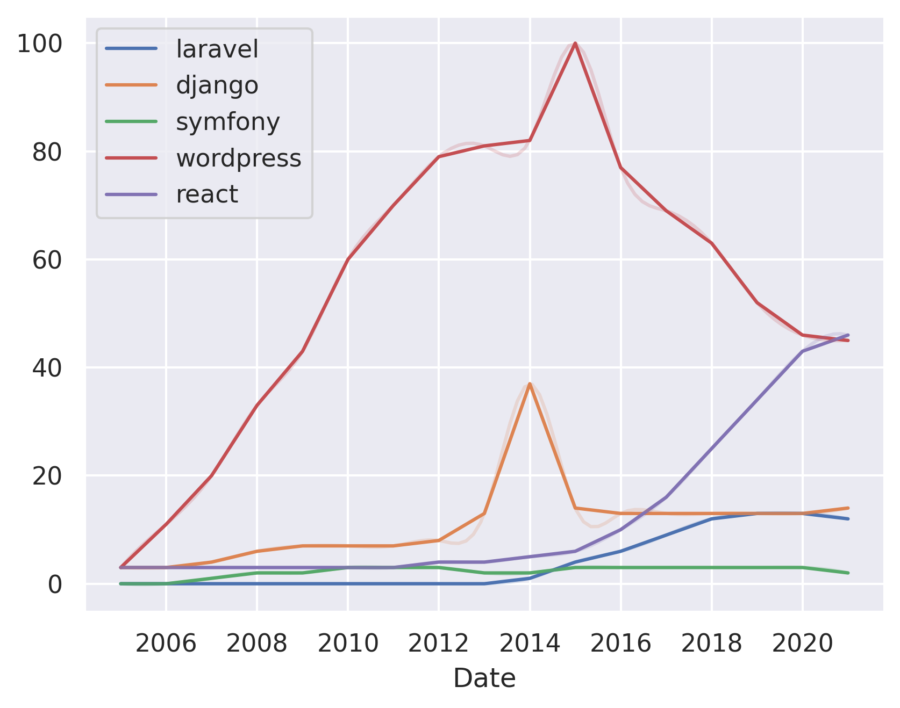

---
hide:
  - navigation
---

# laravel vs. django vs. symfony vs. wordpress vs. react vs. node

## Django vs. laravel

**Django** is a free and open-source web framework written in Python. It follows the model-view-template (MVT) architectural pattern and is designed to be a high-level framework that can be used to create a variety of web applications.

**Laravel** is a free and open-source web framework written in PHP. It follows the model-view-controller (MVC) architectural pattern and is designed to make the development process faster and easier.

Consider Django if you want a high-level framework that is designed to be a good starting point for a variety of web applications.

Consider Laravel if you want a framework that is designed to be a good starting point for web applications and is also easy to learn.

## Laravel vs. symfony

**Laravel** is a free, open-source PHP framework for web development. It is a model-view-controller (MVC) framework that aims to make the development process a lot more enjoyable. Laravel is a popular choice for those who are looking for a framework that is well-documented and has a large community of developers.

**Symfony** is a free, open-source PHP framework for web development. It is a model-view-controller (MVC) framework that aims to make the development process a lot more enjoyable. Symfony is a popular choice for those who are looking for a framework that is well-documented and has a large community of developers.

Consider Laravel if you want a framework that is well-documented and has a large community of developers.

Consider Symfony if you want a framework that is well-documented and has a large community of developers.

## Laravel vs. wordpress

**Laravel** is a PHP framework for web development that includes many features such as routing, sessions, views, and a modular packaging system.

**WordPress** is a content management system (CMS) that allows you to create a website or blog.

Consider Laravel if you want a framework that is more robust and has a larger community.

Consider WordPress if you want a CMS that is more lightweight and has a larger community.

## Laravel vs. react

**Laravel** is a PHP framework that is designed for the development of web applications following the model-view-controller (MVC) architectural pattern. 

**React** is a JavaScript library for building user interfaces.

Consider Laravel if you are looking for a framework that is designed for web applications and is easy to learn.

Consider React if you are looking for a library that is easy to learn and is designed for building user interfaces.

## Laravel vs. node

**Laravel** is a PHP framework that is designed to make the development process a lot easier by providing a lot of the necessary tools out of the box. 

**Node.js** is a JavaScript runtime built on Chrome's V8 JavaScript engine. Node.js is used to build scalable network applications.

Consider Laravel if you are looking for a framework that is easy to learn and has a lot of features out of the box.

Consider Node.js if you are looking for a framework that is easy to learn and has a lot of features out of the box.

## Django vs. react

**Django** is a high-level Python web framework that encourages rapid development and clean, pragmatic design. Django is a "batteries-included" framework that provides many features out-of-the-box.

**React** is a JavaScript library for building user interfaces. React is a declarative, efficient, and flexible JavaScript library for building user interfaces.

Consider Django if you want a framework that is easy to learn and offers many features out-of-the-box.

Consider React if you want to build a user interface with a declarative, efficient, and flexible library.

## Node vs. react

**Node.js** is a JavaScript runtime environment that allows you to run JavaScript on the server-side.

**React** is a JavaScript library for building user interfaces.

Consider Node.js if you want to create server-side applications with JavaScript.

Consider React if you want to create user interfaces with JavaScript.

DISCLAIMER: This article has been generated by a GPT-3 model.