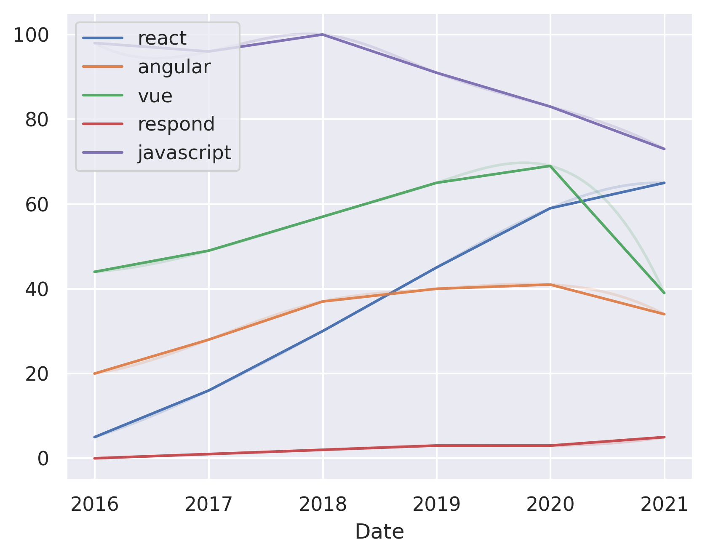

---
hide:
  - navigation
---

# react vs. angular vs. vue vs. respond vs. javascript vs. node
## Angular vs. react

**Angular** is a framework for building web applications with a focus on data binding, dependency injection, and testing. Angular is a TypeScript-based framework that is open-source and maintained by Google.

**React** is a JavaScript library for building user interfaces. React is maintained by Facebook and is open-source.

Consider Angular if you want to build a large, complex application with a focus on data binding, dependency injection, and testing.

Consider React if you want to build a small, exploratory project that doesn't require a substantial amount of data.

## React vs. vue

**React** is a JavaScript library for building user interfaces. It is a declarative, efficient, and flexible JavaScript library for building user interfaces.

**Vue.js** is a progressive JavaScript framework for building user interfaces. It is a library for building interactive web interfaces.

Consider React if you want to build large, complex applications with a declarative, efficient, and flexible JavaScript library for building user interfaces.

Consider Vue.js if you want to build interactive web interfaces with a progressive JavaScript framework.

## React vs. respond
 **React** is a JavaScript library for building user interfaces. React is a declarative, efficient, and flexible JavaScript library for building user interfaces.

**respond.js** is a lightweight and fast JavaScript library for building user interfaces.

Consider React if you want a declarative, efficient, and flexible JavaScript library for building user interfaces.

Consider respond.js if you want a lightweight and fast JavaScript library for building user interfaces.

## Javascript vs. react

**Javascript** is a programming language that is used to create interactive web pages.

**React** is a JavaScript library for building user interfaces.

Consider Javascript if you want to create interactive web pages.

Consider React if you want to create interactive web pages with a library that is easy to learn and use.

## Node vs. react

**Node.js** is a JavaScript runtime environment for server-side and networking applications. Node.js is a cross-platform runtime environment that is used to build server-side and networking applications.

**React** is a JavaScript library for building user interfaces. React is a library for building user interfaces that is used to create interactive UIs.

Consider Node.js if you are looking for a runtime environment that is used to build server-side and networking applications.

Consider React if you are looking for a library for building user interfaces that is used to create interactive UIs.

## Angular vs. vue

**Angular** is a framework for building web applications with the goal of making it easier to create complex, large-scale applications. Angular is a TypeScript-based framework that uses a declarative template syntax.

**Vue.js** is a progressive framework for building user interfaces. It is a library that focuses on the view layer only and is easy to learn and use.

Consider Angular if you are looking for a framework that is opinionated and has a lot of features.

Consider Vue.js if you are looking for a lightweight framework that is easy to learn and use.

## Angular vs. javascript

**Angular** is a front-end web application framework that is used to create single-page applications. Angular is a TypeScript-based open-source framework maintained by Google.

**Javascript** is a programming language that is used to create interactive web pages.

Consider Angular if you are looking for a framework that is easy to learn and has a large community.

Consider Javascript if you are looking for a language that is easy to learn and has a large community.

