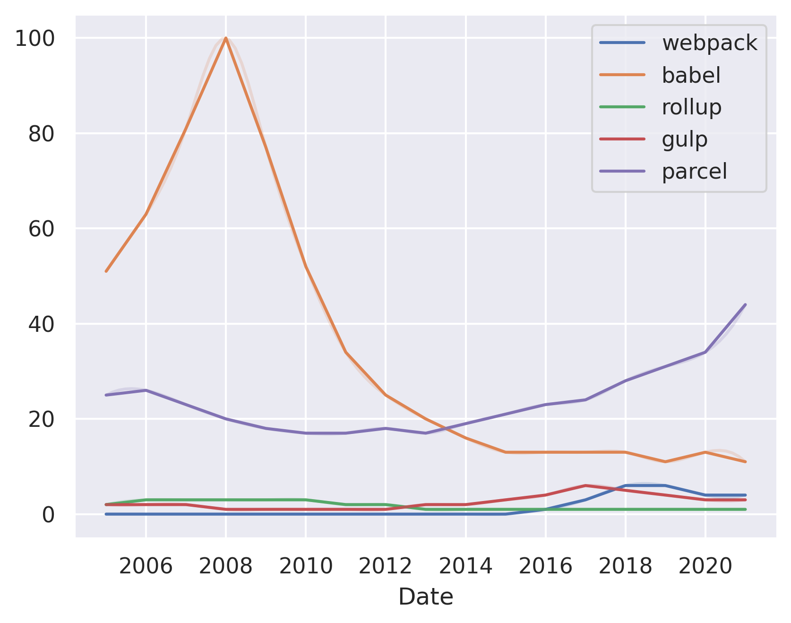

---
hide:
  - navigation
---

# webpack vs. babel vs. rollup vs. gulp vs. parcel vs. vite

## Babel vs. webpack
 **Babel** is a JavaScript compiler that allows you to use new features of ECMAScript before they are implemented in browsers. 

**webpack** is a module bundler for modern JavaScript applications. It is a module bundler that can be used in a variety of ways, from a build-time tool to a development-time tool.

Consider Babel if you want to use new JavaScript features that are not yet implemented in browsers.

Consider webpack if you want to bundle your JavaScript application for production.

## Rollup vs. webpack
 **Rollup** is a module bundler for JavaScript modules. It is a minimalistic alternative to webpack and is best suited for smaller projects.

**Webpack** is a module bundler for JavaScript modules. It is a more robust alternative to Rollup and is best suited for larger projects.

Consider Rollup if you are looking for a minimalistic alternative to webpack.

Consider Webpack if you are looking for a more robust alternative to Rollup.

## Gulp vs. webpack

**Gulp** is a JavaScript task runner that automates tasks such as minification, compilation, unit testing, linting, etc. Gulp is a streaming build system, meaning it doesn't have to wait for tasks to finish before executing the next one.

**Webpack** is a module bundler that bundles JavaScript files for usage in a browser. Webpack is a module bundler that bundles JavaScript files for usage in a browser.

Consider Gulp if you want to automate tasks such as minification, compilation, unit testing, linting, etc.

Consider Webpack if you want to bundle JavaScript files for usage in a browser.

## Parcel vs. webpack

**Parcel** is a zero configuration web application bundler that is fast and easy to use.

**webpack** is a module bundler that bundles JavaScript files for usage in a browser.

Consider Parcel if you want a fast and easy to use bundler for your web application.

Consider webpack if you want a bundler that can bundle your JavaScript files for usage in a browser.

## Vite vs. webpack

**Vite** is a web-based IDE that is designed to be a fast and lightweight alternative to traditional IDEs. It is a cloud-based IDE that runs on any device and is accessible from any browser.

**webpack** is a module bundler for JavaScript applications. It is used to bundle JavaScript files for usage in a browser.

Consider Vite if you want a lightweight IDE that is accessible from any browser.

Consider webpack if you want to bundle JavaScript files for usage in a browser.

## Parcel vs. rollup

**Parcel** is a zero-configuration bundler that supports all module formats and works with any JavaScript library.

**Rollup** is a module bundler that supports ES6 modules and can be used with any module format.

Consider Parcel if you want a zero-configuration bundler that supports all module formats and works with any JavaScript library.

Consider Rollup if you want a module bundler that supports ES6 modules and can be used with any module format.

## Gulp vs. parcel

**Gulp** is a task runner that automates tasks such as minification, compilation, unit testing, linting, etc. Gulp is a JavaScript task runner that is based on Node.js and can be used with any programming language.

**Parcel** is a zero-configuration web application bundler that is based on webpack. Parcel is a JavaScript bundler that is based on webpack and can be used with any programming language.

Consider Gulp if you want to automate tasks such as minification, compilation, unit testing, linting, etc.

Consider Parcel if you want to automate tasks such as minification, compilation, unit testing, linting, etc. and want to use a JavaScript bundler.

DISCLAIMER: This article was written by a generative AI model.

**Disclaimer**: this article was generated using an LLM