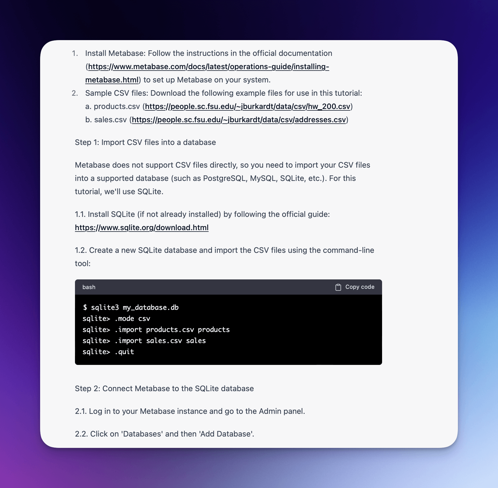

---
hide:
  - navigation
---

# GPT3.5 vs GPT4 for programming tutorials and some predictions

At Ritza, we create guides and tutorials for developers. I've been keeping a close eye on GPT's ability to do this automatically. 

We weren't that worried by GPT3.5 as it often made up fake information. Even a small amount of "wrong" information means that the total amount of effort saved is very little, as all of the information has to be verified, and [verification is nearly as hard as creation](https://ritza.co/articles/verification-is-as-hard-as-creation-chatgpt/). 

We're still examining GPT4, but so far it seems to make up information a lot less. For example, we recently wrote an introduction to [Analysing CSV datasets with Metabase](https://ritza.co/articles/data-visualisation-with-metabase-from-csv/). If you ask GPT3.5 to write the same article, it makes the (false) claims that Metabase has native CSV support (it doesn't), and that there's an "Add database" page on the home screen (there isn't).

By contrast, GPT4 doesn't make either mistake. It first shows you how to convert the CSV file to SQLite, and then correctly tells you where to find the "Add database" button.

Of course, one example isn't science, but so far I'm impressed. I'll keep investigating, but it's already very clear that GPT4 and future GPT models are going to drastically change how programmers work.

Some predictions:

## #1: Programmers stop using Google and documentation and use GPT directly to kickstart all projects

I think this is the most likely scenario. It's already a poorly kept secret (and central tenant of Ritza's business model) that developers often skip reference docs and look for a tutorial to use as a starting point. If GPT is already this good at producing 'on demand' tutorials, developers won't have to open the top 3-4 tutorials on Google and figure out which pieces are still up-to-date and which pieces they need to get to their own specific goal.

Instead, they'll use GPT to iterate on the starter code until they reach the limit of its knowledge or capabilities. 

There is already some early work (e.g. [by Stripe](https://stripe.com/en-gb-fr/newsroom/news/stripe-and-openai)) to integrate an AI assistant _into_ developer docs, but why would a developer visit a separate docs site if they already have GPT open and GPT already has the information contained in the docs site? 

I've seen [some discussion](https://news.ycombinator.com/item?id=35159447) on the fact that "We can't all use AI, someone has to generate the training data", but it is well within GPT's current and future capabilities to use much _less_ training data for new updates. It knows how to write docs, guides, code, and summaries. You can already feed it code changes and have it update documentation, or vice-versa, so it's not clear to me that "we can't all use AI". Someone will be poking the initial inputs a bit (e.g. the code) and then those inputs will be used to generate more inputs and outputs (e.g. examples, docs, guides).

If this happens, it will be much harder for _anyone_ to build a "moat". Creating pretty much anything just got a lot easier, and creation would probably be constrained mainly by how much GPT access you have (how many tokens, whether only through the UI or also the API, and which model).

Instead of indirectly training or fine-tuning new versions of GPT, we'll do it far more directly. Not: "Here's a tutorial of how to use the latest version of software package X." but "Here are the commit hashes since the previous version of software package X that you already know about. Read them and tell me how to do Y".

Many people think that AI will create a lot more blog spam and useless SEO articles that are only designed to get clicks rather than provide the reader with any value, but once anyone can create these articles they become even _less_ valuable. There's an entire content industry that is largely driven by companies who want to rank well on Google. If people stop using Google, that industry will stop producing content.

This is not going to happen in weeks or even months though. The people talking about ChatGPT are in a fast-moving world that is eager to adopt new trends. Slower moving industries will take time to adapt. Many engineers haven't even tried ChatGPT yet. Even when industries like corporate finance 'catch up' and realise it is potentially valuable, there will be many legal and other hurdles to jump over before it gets properly integrated into every developer's workflow.

In the meantime, those engineers will still be relying on Google and Stackoverflow.

## \#2: Google wakes up and attempts to build a serious GPT competitor and we see ads in LLM output

We'll very soon see ads embedded into the output from large language models. OpenAI gets a lot of criticism for not being "Open", and for censorship and safety rails, but compared to Google they are still very much in the "Build cool things for the sake of it" part of their growth journey. Google is firmly in the "protect profits by finding new and better places to put adverts" of theirs. The Google exec team has already tried to rush-release some GPT competitor-type things, but so far they have clearly been a lot less groundbreaking than OpenAI.

Hosted language models are going to allow far more personalised ads than we have now. By analysing browsing history and other PII, companies can already predict a lot about us and influence our behaviour in horrible ways. But there are still a lot of "guess the blanks" of what people are doing between interactions. With Google, I might read 10-20 articles and then spend some "offline" time figuring out the connections between those articles, all of which are hosted on different servers.

With toolls like GPT, the host has access to every single input and output in a clear sequence. If GPT produces something that is 90% of what I want and I ask it to refine the last 10%, that all gets sent to the host as well. 

I imagine there are already projects at Google that go beyond the emergency response we've seen - to spin up an actual technical team similar to the one that built ChatGPT, and build a model that is similar to GPT. It might take months or years to release, but when we see it, it will have ads.

## #3: The 'tech' bubble continues deflating, but tech grows fast in 'low-tech' industries like construction, education, agriculture, etc

Even with the brutal tech layoffs, there are still a lot of businesses that survive only by selling to other technology businesses, sometimes several levels deep. A lot of SaaS apps used by sales, marketing, customer support, and others can now be replicated far more quickly and cheaply by internal engineering teams, and the remaining bigger tech companies will build their own versions of stuff instead of buying it. Build vs buy will swing more towards "build". 

At the same time, industries that didn't previously have the expertise they needed to take real advantage of technology will be able to take advantage of tech more easily. Building CRUD apps, scraping tools, and all kinds of automation that low-code has been promising for years will actually become accessible by non-technical people.

People with "real" jobs (ones that interact with the non-digital world) will be building and deploying their own apps with the help of GPT. 

No-code solutions never fixed the "customer doesn't know what they want" problem. GPT does. You can ask it to do something, get frustrated with it and ask it to do it again, slowly giving it more examples and telling it what it got wrong until you get what you want.

## #4: More tech jobs will suffer

People often think of the world as a place with a constant amount of work to be done. If the work gets easier, there will be less to 'go around'. Hence people have predicted since the industrial revolution and every 'revolution' since that we'd all work less and have more free time.

In reality, as nearly everyone has experienced, work creates more 'work'. Programming got a lot easier with the release of Python and other high-level programming languages, but it didn't mean we needed fewer programmers. There was just more to do. 

That said, there are a lot of developers right now who build basic frontends or CRUD apps or run basic SQL queries which can all now be done by AI. There will be less demand for them.

DevOps, product management, and design will still be in-demand as even though GPT can do these things, the "verification is as hard as creation" applies more to them. If your server is down, GPT can suggest what to do to fix it, but it will be a while before people are willing to rely on it in high-stakes and ill-defined scenarios. 

We'll probably see some reversal of current trends where electrical engineers and people with other more practical skills moved into software engineering. Electrical engineering rates will probably go up even more, while software engineering rates go down.

Technology as an industry is already a tough field to get into. You have to learn a bunch of algorithmic stuff that you will not use much, and then learn how to do production engineering on-the-job. At my first internship, I gained valuable experience by building some data-syncing scripts for a senior manager. The code was very straight forward, but it gave me insights into how the company worked, and how to work with semi-technical people. Today, that manager could use ChatGPT to build a better quality version of the script I created instead.

Everyone now has access to as many 'interns' as they want as they can ask ChatGPT to do intern-level tasks. As we make the easy work easier and easier, it gets harder for people to use that work to level up, making it harder to get a job without experience.

## #5: People will value in-person interactions more

People will get tired of constantly talking to AI. We'll see a shift back to in-person settings for training and education, entertainment, and sales. People will pay a premium for in-person versions of things that could easily be done online. Online communities will suffer. Meetups will thrive.

## #6: White-collar service work will either grow or shrink overall

This one I'm not sure about. On the one hand, GPT will make it more obvious just how many of us are in "[bullshit jobs](https://en.wikipedia.org/wiki/Bullshit_Jobs)", as people realise that the "Is AI really intelligent" debate is more about "Were humans pretty dumb this whole time?" and not "Wow is AI actually smart now?"

There are many people calling the collapse of the services bubble, and ChatGPT could definitely be a trigger for this.

That said, we've made service work much easier every year for decades with tools like Google Docs, instant messaging, faster internet, and by adding millions of "digital natives" to the workforce, and so far it's only grown the amount of service work what is 'needed'. 

Will making work even easier continue that trend, or will we finally hit a breaking point? I'll pick a 'wait and see' stance for this one.

