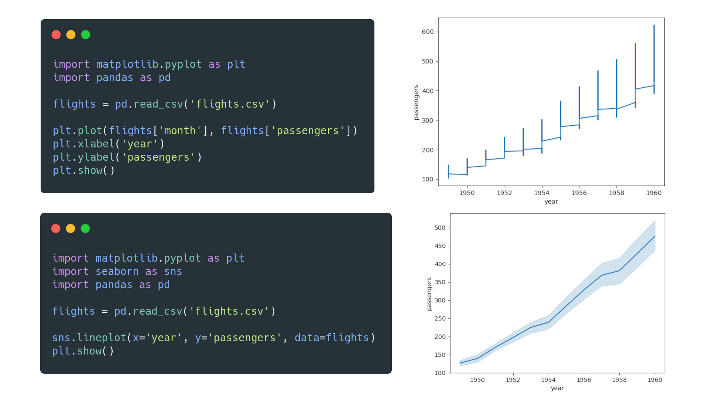
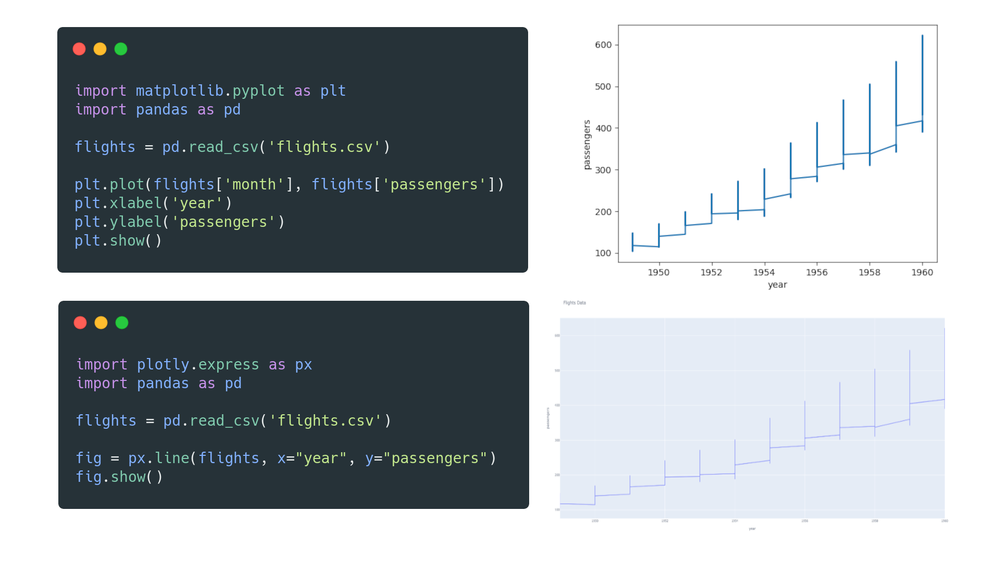
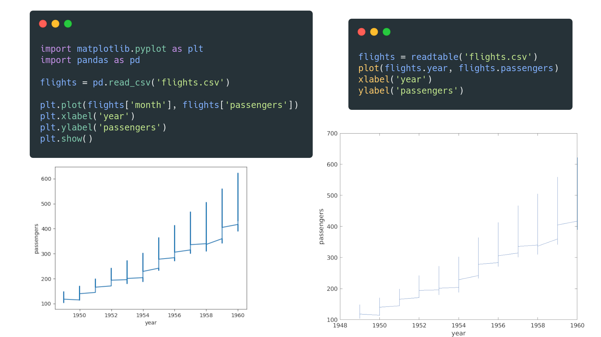
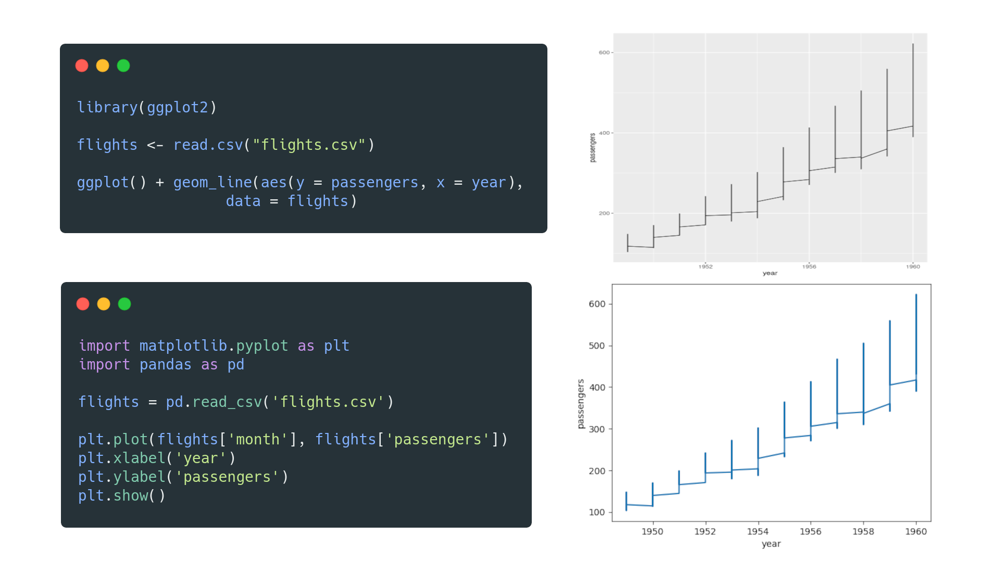
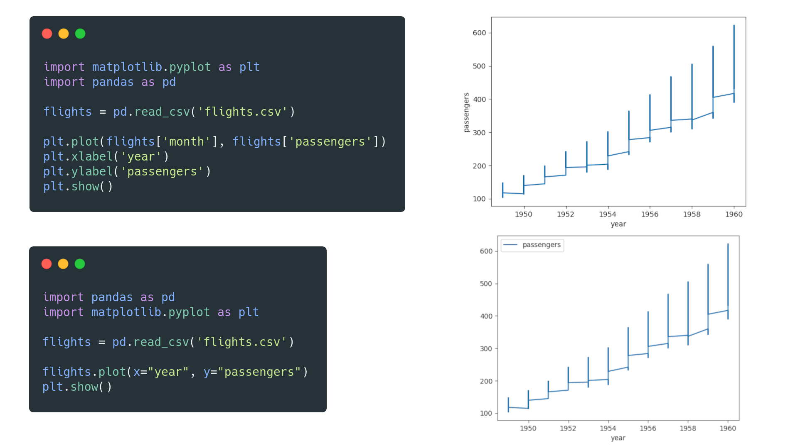
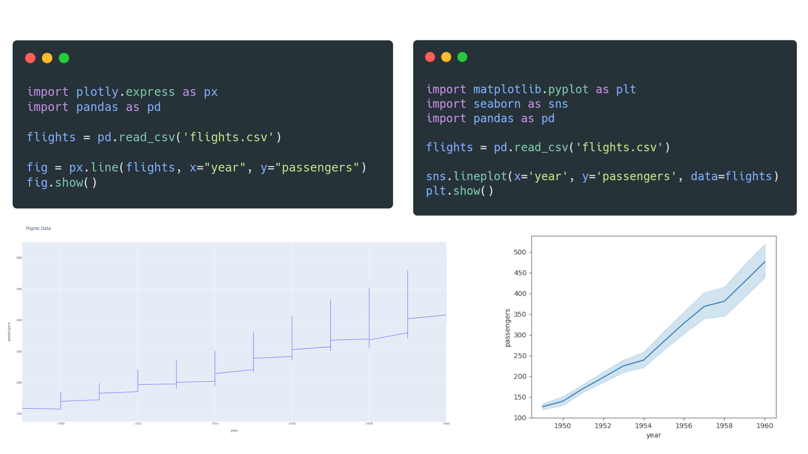
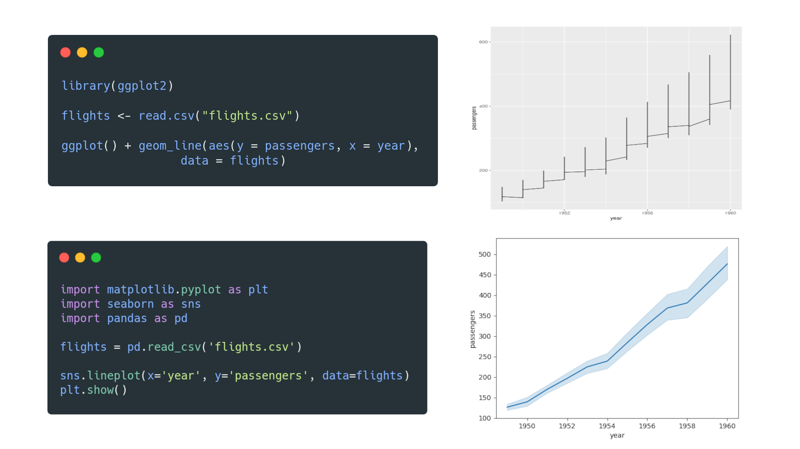
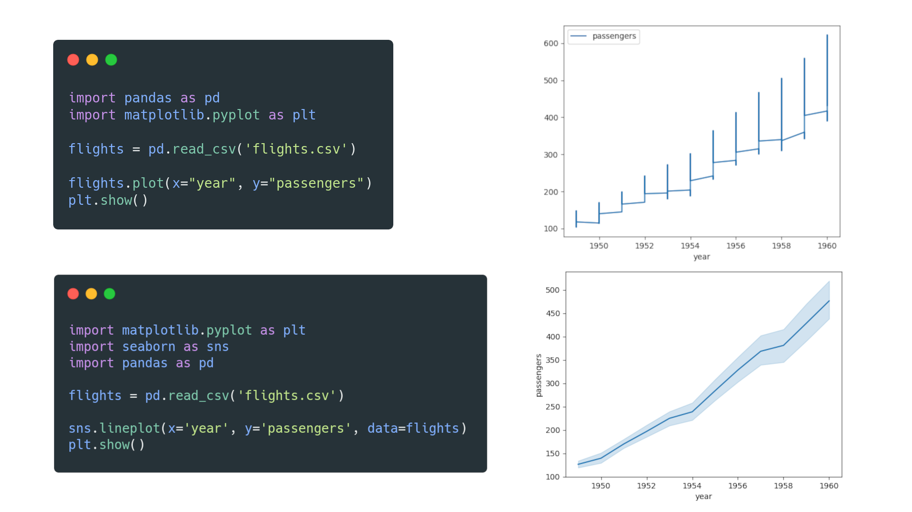

---
hide:
  - navigation
---

# Matplotlib vs. seaborn vs. Plotly vs. MATLAB vs. ggplot2 vs. pandas

Representing data visually has become essential to understanding and interpreting information, and numerous tools and packages have emerged to meet this need. Let's look at the differences and use cases for the most common visualization tools.

## Matplotlib vs. seaborn
**Matplotlib** is a popular plotting package that is being continuously developed. It offers numerous rendering backends and uses a verbose syntax, giving plots a high degree of flexibility and customizability. 

**seaborn** is a Python plotting library built on top of Matplotlib. It allows for a concise but limited approach to quickly visualize data sets with better-looking style defaults than Matplotlib.

Consider Matplotlib if you want to create highly customized plots or are looking to learn the plotting tool behind seaborn.

Consider seaborn if you want to write concise code and create plots (especially statistical plots) with more attractive default styles in less time.

## Matplotlib vs. Plotly
**Matplotlib** is an open-source plotting library for creating visualizations within Python. It is best suited to initial exploratory analysis or minimalistic graph designs. Matplotlib is also designed to have similarities with MATLAB.

**Plotly** is a mostly open-source data analytics and visualization tool (with some closed-source products and services). It creates interactive charts for web browsers and supports multiple languages, such as Python, Julia, R, and MATLAB.

Consider Matplotlib if you want a fully open-source package, if you are looking for an interface with similarities to MATLAB, or if you are switching from MATLAB.

Consider Plotly if you don't mind some closed-source packages or if you want to display your interactive data visualizations on the web. If you use other programming languages besides Python, Plotly's graphing library is the better option.

## MATLAB vs. Matplotlib
**MATLAB** is a programming language dedicated to mathematical and technical computing through the closed-source MATLAB IDE. MATLAB can integrate with code written in other languages, such C, C++, Java, .NET and Python.

**Matplotlib** provides a MATLAB-like interface with its Pyplot module. However, performance issues can be observed when creating complicated plots with Matplotlib.

Consider MATLAB if you are an engineer or scientist (not computer scientist) and you are able to pay for a MATLAB license.

Consider Matplotlib if you want an open-source plotting library with versatility. Matplotlib has the added benefit of more algorithms created for Python.

## ggplot2 vs. Matplotlib
**ggplot2** is a visualization library for the R programming language that lets users intuitively create graphs by declaring the desired output

**Matplotlib** is a visualization library for the Python programming language that lets users specify how a graph should be produced.

Consider ggplot2 if you are using R and want a declarative or less verbose approach to creating plots.

Consider Matplotlib if you are relatively new to data visualization with Python or have more experience with Python than R.

## Matplotlib vs. pandas
**Matplotlib** is a visualization library that combines other libraries, such as NumPy and pandas, to create visual representations of data.

**pandas** is a library for mainly tabular data manipulation and analysis, with built-in plotting functions that rely on Matplotlib. 

Consider Matplotlib on top of pandas if you want to have full control over your visualizations.

Consider only pandas if you want to organize and rearrange your data to create proof-of-concept visualizations without using other libraries explicitly.

## Plotly vs. seaborn
**Plotly** is a partly open-source analysis and visualization tool with support for web based, 3D, and animated plots. Plotly allows for a high degree of customization and interactivity, and supports multiple languages.

**seaborn** is a fully open-source Python visualization library built on top of Matplotlib to create visually appealing plots quickly. seaborn does not have built-in 3D and animation capabilities without the use of Matplotlib.

Consider Plotly if you use languages such as Python, R, MATLAB, Perl and Julia, or if you specifically want interactive or animated web-based plots.

Consider seaborn if you want to quickly create visually appealing graphs with Matplotlib functionality in the background.

## ggplot2 vs. seaborn
**ggplot2** is a declarative plotting library for R that uses a layered approach to concisely describe graph components and build visualizations in a structured manner.

**seaborn** is an imperative plotting library for Python that builds Matplotlib-based visualizations using less code and with some limitations.

Consider ggplot2 if you use R and prefer to define your visualization's look than describe the steps to create it. A similar approach for Python is also available with the "plotnine" package.

Consider seaborn if you use Python and want to create Matplotlib visualizations, without having to interact with Matplotlib much.

## pandas vs. seaborn
**pandas** is a Python library that provides a concise way to manipulate data in tabular format. It has built-in plotting methods (with limited customization) using Matplotlib.

**seaborn** is a Python plotting library that functions as a wrapper around Matplotlib. seaborn integrates heavily with pandas to create visually appealing Matplotlib graphs.

Consider only pandas if you want to manipulate your data and quickly build visualizations with no in-depth control over the visualization itself.

Consider seaborn with pandas if you want a full visualization package with more control and customizability.

