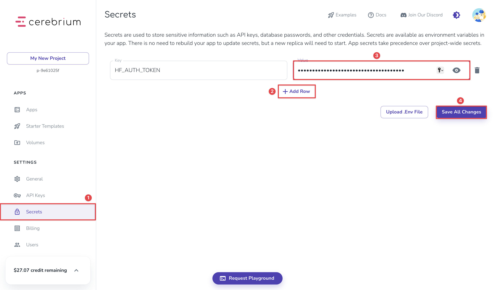
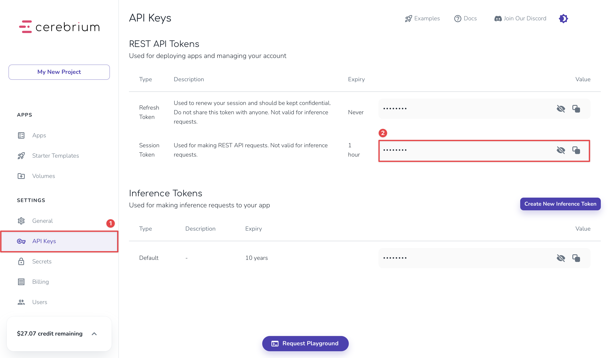

# How To Migrate From OpenAI to Cerebrium for Cost-Predictable AI Inference

If you're building an AI application, you probably started with OpenAI's convenient APIs. However, as your application scales, you'll need more control over costs, models, and infrastructure. 

Cerebrium is a serverless AI infrastructure platform that lets you run open-source models on dedicated hardware with predictable, time-based pricing instead of token-based billing.

This guide will show you how to build a complete chat application with OpenAI, migrate it to Cerebrium by changing just two lines of code, and add performance and cost tracking to compare the two approaches to AI inference using real data. When you're done, you'll have a working chat application that demonstrates the practical differences between token-based and compute-based pricing models, and the insights you need to choose the right approach for your use case.

## Prerequisites

To follow along with this guide, you'll need Python 3.10 or higher installed on your system. You'll also need the following (all free):

- [OpenAI API key](https://platform.openai.com/).
- [Cerebrium account](https://cerebrium.ai/) (includes free tier access to test GPU instances up to A10 level).
- [Hugging Face token](https://huggingface.co/) (free account required).
- Llama 3.1 model access on Hugging Face. Visit [meta-llama/Meta-Llama-3.1-8B-Instruct](https://huggingface.co/meta-llama/Meta-Llama-3.1-8B-Instruct) and click "Request access" to get approval from Meta (typically takes a few minutes to a few hours).

Familiarity with Python and API calls is helpful, but we'll walk through each step in detail.

## Creating an OpenAI Chatbot

We'll build a complete chat application that works with OpenAI as our foundation and enhance it throughout the tutorial without ever needing to modify the core chat logic.

Create a new directory for the project and set up the basic structure:

```bash
mkdir openai-cerebrium-migration
cd openai-cerebrium-migration
```

Install the dependencies:

```bash
pip install openai==1.55.0 python-dotenv==1.0.0 art==6.1 colorama==0.4.6
```

Create a `.env` file to store API credentials:

```env
OPENAI_API_KEY=your_openai_api_key_here

CEREBRIUM_API_KEY=your_cerebrium_api_key_here

CEREBRIUM_ENDPOINT_URL=your_cerebrium_endpoint_url_here
```

Replace `your_openai_api_key_here` with your actual OpenAI API key. 

Now we'll build the `chat.py` file step by step. 

Start by creating the file and adding the imports:

```python
import os
import time
from dotenv import load_dotenv
from openai import OpenAI
from art import text2art
from colorama import init, Fore, Style
```

These imports handle environment variables, OpenAI client creation, ASCII art generation, and colored terminal output.

Add the initialization below the imports:

```python
load_dotenv()

init(autoreset=True)
```

Add this `display_intro` function:

```python
def display_intro(use_cerebrium, endpoint_name):
    print("\n")
    
    if use_cerebrium:
        ascii_art = text2art("Cerebrium", font="tarty1")
        print(f"{Fore.MAGENTA}{ascii_art}{Style.RESET_ALL}")
    else:
        ascii_art = text2art("OpenAI", font="tarty1")
        print(f"{Fore.WHITE}{ascii_art}{Style.RESET_ALL}")
        
    print(f"Connected to: {Fore.CYAN}{endpoint_name}{Style.RESET_ALL}")
    print("\nType 'quit' or 'exit' to end the chat\n")
```

This function provides visual feedback when we switch between endpoints.

Add the main function that handles the chat logic:

```python
def main():    
    # OpenAI endpoint
    client = OpenAI(api_key=os.getenv("OPENAI_API_KEY"))
    model = "gpt-4o-mini"

    endpoint_name = "OpenAI (GPT-4o-mini)"
    use_cerebrium = False
    
    display_intro(use_cerebrium, endpoint_name)
    
    conversation = []
    
    while True:
        user_input = input("You: ").strip()
        
        if user_input.lower() in ['quit', 'exit', 'bye']:
            print("Goodbye!")
            break
        
        if not user_input:
            continue
        
        conversation.append({"role": "user", "content": user_input})
```

This function sets up the endpoint configuration and handles the basic chat loop.

Add the response handling logic inside the `main` function's `while` loop:

```python
        try:
            print("Bot: ", end="", flush=True)
            
            chat_completion = client.chat.completions.create(
                messages=conversation,
                model=model,
                stream=True,
                stream_options={"include_usage": True},
                temperature=0.7
            )
            
            bot_response = ""
            for chunk in chat_completion:
                
                if chunk.choices[0].delta.content:
                    content = chunk.choices[0].delta.content
                    print(content, end="", flush=True)
                    bot_response += content
            
            print()
            
            conversation.append({"role": "assistant", "content": bot_response})
            
        except Exception as e:
            print(f"❌ Error: {e}")
            conversation.pop()
```

Finally, add the script execution guard at the end of the file:

```python
if __name__ == "__main__":
    main()
```

Test the chatbot by running:

```bash
python chat.py
```

You'll see the OpenAI ASCII art, and you can start chatting with GPT-4o mini. Ask a question to verify that the app works correctly. Responses will stream in real-time.


## Deploying a Cerebrium Endpoint With vLLM and Llama 3.1

Now we'll create a Cerebrium endpoint that serves the same OpenAI-compatible interface using vLLM and an open-source model. When we're done, we'll be able to switch to a self-hosted open-source model endpoint by changing just two lines of code.

### Configuring Hugging Face Access for Llama 3.1

First, make sure you have access to the Llama 3.1 model on Hugging Face. If you haven't already requested access, visit [meta-llama/Meta-Llama-3.1-8B-Instruct](https://huggingface.co/meta-llama/Meta-Llama-3.1-8B-Instruct) and click "Request access".

Next, create a Hugging Face token by going to [Hugging Face settings](https://huggingface.co/settings/tokens), clicking "New token", and selecting "Read" permissions.

Add your Hugging Face token to your Cerebrium project secrets. Go to your Cerebrium dashboard, select your project, and add `HF_AUTH_TOKEN` with your Hugging Face token as the value.



### Setting Up a Cerebrium Account and API Access

[Create a free Cerebrium account](https://cerebrium.ai/) and navigate to your dashboard. In the "API Keys" section, copy your session token and save it for later – you'll need it to authenticate with the deployed endpoint.



Add the session token to the `.env` file as a `CEREBRIUM_API_KEY` variable:

```env
OPENAI_API_KEY=your_openai_api_key_here

CEREBRIUM_API_KEY=your_cerebrium_api_key_here

CEREBRIUM_ENDPOINT_URL=your_cerebrium_endpoint_url_here
```

### Building the OpenAI-Compatible vLLM Endpoint

Start by installing the Cerebrium CLI and creating a new project:

```bash
pip install cerebrium
cerebrium login
cerebrium init openai-compatible-endpoint
cd openai-compatible-endpoint
```

We'll build the `main.py` file step by step to understand each component. 

Start with the imports and authentication:

```python
from vllm import SamplingParams, AsyncLLMEngine
from vllm.engine.arg_utils import AsyncEngineArgs
from pydantic import BaseModel
from typing import Any, List, Optional, Union, Dict
import time
import json
import os
from huggingface_hub import login

login(token=os.environ.get("HF_AUTH_TOKEN"))
```

These imports provide the vLLM async engine for model inference, Pydantic models for data validation, and Hugging Face authentication for model access.

Add the vLLM engine configuration:

```python
engine_args = AsyncEngineArgs(
    model="meta-llama/Meta-Llama-3.1-8B-Instruct",
    gpu_memory_utilization=0.9,  # Set GPU memory utilization
    max_model_len=8192  # Set max model length
)
engine = AsyncLLMEngine.from_engine_args(engine_args)
```

This configuration uses 90% of available GPU memory and sets an 8K-token context window, optimizing for throughput while maintaining reasonable memory usage.

Now add the Pydantic models that define the OpenAI-compatible response format:

```python
class Message(BaseModel):
    role: str
    content: str

class ChoiceDelta(BaseModel):
    content: Optional[str] = None
    function_call: Optional[Any] = None
    refusal: Optional[Any] = None
    role: Optional[str] = None
    tool_calls: Optional[Any] = None

class Choice(BaseModel):
    delta: ChoiceDelta
    finish_reason: Optional[str] = None
    index: int
    logprobs: Optional[Any] = None

class Usage(BaseModel):
    completion_tokens: int = 0
    prompt_tokens: int = 0
    total_tokens: int = 0

class ChatCompletionResponse(BaseModel):
    id: str
    object: str
    created: int
    model: str
    choices: List[Choice]
    service_tier: Optional[str] = "default"
    system_fingerprint: Optional[str] = "fp_cerebrium_vllm"
    usage: Optional[Usage] = None
```

These models ensure the Cerebrium endpoint returns the same JSON structure as OpenAI's API, enabling drop-in compatibility.

Add the chat template formatting function:

```python
def format_llama_chat_prompt(messages: list) -> str:
    formatted_prompt = "<|begin_of_text|>"
    
    for message in messages:
        msg = Message(**message)
        
        formatted_prompt += f"<|start_header_id|>{msg.role}<|end_header_id|>\n\n"
        
        formatted_prompt += f"{msg.content}<|eot_id|>"
    
    formatted_prompt += "<|start_header_id|>assistant<|end_header_id|>\n\n"
    
    return formatted_prompt
```

This function converts OpenAI's message format to Llama 3.1's specific chat template.

Add the main inference function:

```python
async def run(
    messages: list, 
    model: str, 
    run_id: str, 
    stream: bool = True, 
    temperature: float = 0.7, 
    top_p: float = 0.95,
    max_tokens: Optional[int] = None,
    max_completion_tokens: Optional[int] = None,
    **kwargs
):
    formatted_prompt = format_llama_chat_prompt(messages)
    
    effective_max_tokens = max_tokens or max_completion_tokens or 2000
    
    stop_tokens = [
        "</s>",                  
        "<|eot_id|>",            
        "<|start_header_id|>",   
        "<|end_header_id|>",     
    ]
    
    sampling_params = SamplingParams(
        temperature=temperature,
        top_p=top_p,
        max_tokens=effective_max_tokens,
        stop=stop_tokens,
        skip_special_tokens=True,
    )
    
    results_generator = engine.generate(formatted_prompt, sampling_params, run_id)
    previous_text = ""
    token_count = 0

    async for output in results_generator:
        outputs = output.outputs
        new_text = outputs[0].text[len(previous_text):]
        previous_text = outputs[0].text
        token_count += len(new_text.split())  
        
        is_final_chunk = outputs[0].finish_reason is not None
        
        choice = Choice(
            delta=ChoiceDelta(content=new_text),
            finish_reason=outputs[0].finish_reason if is_final_chunk else None,
            index=0
        )
        
        usage = None
        if is_final_chunk and stream:
            usage = Usage(
                completion_tokens=token_count,
                prompt_tokens=len(formatted_prompt.split()),
                total_tokens=token_count + len(formatted_prompt.split())
            )
        
        response = ChatCompletionResponse(
            id=run_id,
            object="chat.completion.chunk",
            created=int(time.time()),
            model=model,
            choices=[choice],
            usage=usage
        )
        
        print(response.model_dump())
        yield f"data: {json.dumps(response.model_dump())}\n\n"

    yield "data: [DONE]\n\n"
```

This function handles the core inference logic, streaming responses in OpenAI's response format while using vLLM's async engine for efficient processing.

Replace the contents of the `cerebrium.toml` configuration file with this configuration:

```toml
[cerebrium.deployment]
name = "1-openai-compatible-endpoint"
python_version = "3.10"
docker_base_image_url = "debian:bookworm-slim"
disable_auth = true
include = ['./*', 'main.py', 'cerebrium.toml']
exclude = ['.*']

[cerebrium.hardware]
cpu = 2
memory = 12.0
compute = "AMPERE_A10"

[cerebrium.dependencies.pip]
vllm = "latest"
pydantic = "latest"

[cerebrium.scaling]
min_replicas = 0
max_replicas = 5
cooldown = 30
replica_concurrency = 1
response_grace_period = 900
scaling_metric = "concurrency_utilization"
scaling_target = 100
scaling_buffer = 0
roll_out_duration_seconds = 0
```

This configuration specifies an A10 GPU with 2 CPU cores and 12GB of memory, providing a good balance of performance and cost for most applications.

Deploy the endpoint:

```bash
cerebrium deploy
```

When the app has successfully deployed, you should see a message like this:

```js
╭─────────────────────────────────  openai-compatible-endpoint is now live!   ──────────────────────────────────╮
│ App Dashboard: https://dashboard.cerebrium.ai/projects/p-your-project-id/apps/p-your-project-id-openai-compatible-endpoint  │
│                                                                                                                 │
│ Endpoints:                                                                                                      │
│ POST https://api.cortex.cerebrium.ai/v4/p-your-project-id/openai-compatible-endpoint/{function_name}                 │
╰─────────────────────────────────────────────────────────────────────────────────────────────────────────────────╯
```

After deployment, copy the endpoint URL and add it to the `.env` file, replacing `{function_name}` with `run`:

```env
OPENAI_API_KEY=your_openai_api_key_here

CEREBRIUM_ENDPOINT_URL=https://api.cortex.cerebrium.ai/v4/p-your-project-id/openai-compatible-endpoint/run

CEREBRIUM_API_KEY=your_jwt_token_here
```

## Migrating From OpenAI to Cerebrium by Changing Just Two Lines of Code

Now you can migrate from OpenAI to Cerebrium by changing just two lines in the `chat.py` file. Navigate back to the main project directory and open `chat.py`.

Replace the current endpoint:

```python
client = OpenAI(api_key=os.getenv("OPENAI_API_KEY"))
model = "gpt-4o-mini"
```

With this:

```
client = OpenAI(
    base_url=os.getenv("CEREBRIUM_ENDPOINT_URL"),
    api_key=os.getenv("CEREBRIUM_API_KEY"),
)
model = "meta-llama/Meta-Llama-3.1-8B-Instruct"
```

To migrate to Cerebrium, you only need to make two changes:

1. Add the `base_url` parameter to the OpenAI client.
2. Update the `model` name.

Next, update `endpoint_name` and `use_cerebrium` to ensure the CLI provides visual feedback for the change.

Replace these lines:

```python
endpoint_name = "OpenAI (GPT-4o-mini)"
use_cerebrium = False
```

With these updated lines:

```python
endpoint_name = "Cerebrium vLLM (Llama 3.1)"
use_cerebrium = True
```

Run the application again:

```bash
python chat.py
```

You'll see the same streaming interface, but now it's using the Cerebrium endpoint with Llama 3.1 instead of OpenAI with GPT-4o-mini. The chat functionality remains identical – same streaming, same interface – but now it's running on your infrastructure.


> **Note:** You may notice a delay of 30-60 seconds on your first prompt as Cerebrium spins up the GPU instance. This is called a "cold start," which occurs because `min_replicas` is set to `0` in the configuration, meaning the instance shuts down when not in use to save costs. Cerebrium doesn't charge for cold start time – you only pay once the model starts processing your request. For production applications with consistent traffic, you can set `min_replicas = 1` to keep an instance always running and eliminate cold starts.

## Implementing the Automatic Cost and Performance Comparison

To add comprehensive cost and performance tracking, we'll create a `pricing.py` file that automatically enhances the existing chat application without requiring any changes to `chat.py`.

Start by creating the `pricing.py` file with the pricing constants:

```python
import re
from colorama import Fore, Style

OPENAI_PRICING = {
    "gpt-4o-mini": {
        "input_per_1m_tokens": 0.15,
        "output_per_1m_tokens": 0.60,
        "cached_input_per_1m_tokens": 0.075
    }
}

CEREBRIUM_PRICING = {
    "AMPERE_A10": {
        "gpu_per_second": 0.000306,
        "cpu_per_vcpu_per_second": 0.00000655,
        "memory_per_gb_per_second": 0.00000222
    }
}

CEREBRIUM_HARDWARE = {
    "cpu_vcores": 2,
    "memory_gb": 12.0,
    "gpu_type": "AMPERE_A10"
}
```

These constants define the pricing models from both services.

Next, add the utility functions for text analysis:

```python
def estimate_tokens(text):
    """Rough token estimation: ~4 characters per token"""
    return len(text) // 4

def count_words(text):
    """Count words in text"""
    return len(re.findall(r'\b\w+\b', text))
```

These functions collect word count and estimate token count (we'll use these to calculate costs later).

Add the OpenAI cost calculation function:

```python
def calculate_openai_stats(bot_response, response_time, chunks, final_usage, model):
    """Calculate OpenAI stats from response data"""
    pricing = OPENAI_PRICING[model]
    
    # Use actual usage data
    prompt_tokens = final_usage.prompt_tokens
    completion_tokens = final_usage.completion_tokens
    total_tokens = final_usage.total_tokens
    
    # Handle cached tokens if available
    cached_tokens = 0
    if hasattr(final_usage, 'prompt_tokens_details') and final_usage.prompt_tokens_details:
        cached_tokens = getattr(final_usage.prompt_tokens_details, 'cached_tokens', 0)
    
    regular_input_tokens = prompt_tokens - cached_tokens
    
    # Calculate costs
    input_cost = (regular_input_tokens / 1_000_000) * pricing["input_per_1m_tokens"]
    cached_cost = (cached_tokens / 1_000_000) * pricing["cached_input_per_1m_tokens"]
    output_cost = (completion_tokens / 1_000_000) * pricing["output_per_1m_tokens"]
    total_cost = input_cost + cached_cost + output_cost
    
    return {
        'prompt_tokens': prompt_tokens,
        'completion_tokens': completion_tokens,
        'total_tokens': total_tokens,
        'cached_tokens': cached_tokens,
        'regular_input_tokens': regular_input_tokens,
        'input_cost': input_cost,
        'cached_cost': cached_cost,
        'output_cost': output_cost,
        'total_cost': total_cost,
        'cost_per_token': total_cost / max(total_tokens, 1),
        'response_time': response_time,
        'chunks': chunks,
        'bot_response': bot_response
    }
```

This function calculates a response cost estimate using OpenAI's token-based pricing, including separate costs for input, cached input, and output tokens.

Add the Cerebrium cost calculation function:

```python
def calculate_cerebrium_stats(bot_response, response_time, chunks):
    if response_time == 0:
        return None
    
    hardware = CEREBRIUM_HARDWARE
    pricing = CEREBRIUM_PRICING[hardware["gpu_type"]]
    
    # Calculate per-second costs
    gpu_cost_per_second = pricing["gpu_per_second"]
    cpu_cost_per_second = pricing["cpu_per_vcpu_per_second"] * hardware["cpu_vcores"]
    memory_cost_per_second = pricing["memory_per_gb_per_second"] * hardware["memory_gb"]
    total_cost_per_second = gpu_cost_per_second + cpu_cost_per_second + memory_cost_per_second
    
    # Calculate total costs
    gpu_cost = response_time * gpu_cost_per_second
    cpu_cost = response_time * cpu_cost_per_second
    memory_cost = response_time * memory_cost_per_second
    total_cost = response_time * total_cost_per_second
    
    # Estimate tokens and words
    estimated_tokens = estimate_tokens(bot_response)
    word_count = count_words(bot_response)
    
    return {
        'response_time': response_time,
        'chunks': chunks,
        'gpu_cost': gpu_cost,
        'cpu_cost': cpu_cost,
        'memory_cost': memory_cost,
        'total_cost': total_cost,
        'estimated_tokens': estimated_tokens,
        'word_count': word_count,
        'cost_per_token': total_cost / max(estimated_tokens, 1),
        'cost_per_word': total_cost / max(word_count, 1),
        'tokens_per_second': estimated_tokens / max(response_time, 1),
        'hardware': hardware
    }
```

This function calculates time-based costs for Cerebrium, breaking down GPU, CPU, and memory costs separately.

Add these functions to format and display the findings:

```python
def create_aligned_box(lines, title="Response Stats"):
    if not lines:
        return ""
    
    max_content_width = max(len(line) for line in lines) + 2
    title_width = len(f"─ {title} ") + 4
    box_width = max(max_content_width, title_width)
    
    top_border = f"─ {title} " + "─" * (box_width - len(f"─ {title} "))
    bottom_border = "─" * box_width
    
    padded_lines = []
    for line in lines:
        padded_lines.append(f"  {line}")
    
    return "\n".join([top_border] + padded_lines + [bottom_border])

def display_openai_stats(stats):
    if not stats:
        return
    
    word_count = count_words(stats['bot_response'])
    tokens_per_second = stats['completion_tokens'] / max(stats['response_time'], 1)
    cost_per_word = stats['total_cost'] / max(word_count, 1)
    
    lines = [
        f"{Fore.CYAN}🚀 Speed: {stats['response_time']:.2f}s | {tokens_per_second:.1f} tokens/sec | {stats['chunks']} chunks",
        f"{Fore.YELLOW}💰 Cost Breakdown:",
        f"{Fore.YELLOW}   • Input ({stats['regular_input_tokens']} tokens): ${stats['input_cost']:.6f}",
    ]
    
    if stats['cached_tokens'] > 0:
        lines.append(f"{Fore.YELLOW}   • Cached input ({stats['cached_tokens']} tokens): ${stats['cached_cost']:.6f}")
    
    lines.extend([
        f"{Fore.YELLOW}   • Output ({stats['completion_tokens']} tokens): ${stats['output_cost']:.6f}",
        f"{Fore.YELLOW}   • Total: ${stats['total_cost']:.6f}",
        f"{Fore.GREEN}📊 Efficiency: ${stats['cost_per_token']:.8f}/token | ${cost_per_word:.6f}/word",
        f"{Fore.MAGENTA}🔧 Method: Token-based pricing (15¢/1M input, 60¢/1M output)",
        f"{Fore.WHITE}   Model: gpt-4o-mini | Total tokens: {stats['total_tokens']}"
    ])
    
    box = create_aligned_box(lines, "OpenAI Response Stats")
    print(f"\n{box}")

def display_cerebrium_stats(stats):
    if not stats:
        return
    
    lines = [
        f"{Fore.CYAN}🚀 Speed: {stats['response_time']:.2f}s | {stats['chunks']} chunks | ~{stats['tokens_per_second']:.0f} tokens/sec",
        f"{Fore.YELLOW}💰 Cost Breakdown:",
        f"{Fore.YELLOW}   • A10 GPU: ${stats['gpu_cost']:.6f} ({stats['response_time']:.2f}s × $0.000306/s)",
        f"{Fore.YELLOW}   • CPU (2 cores): ${stats['cpu_cost']:.6f} ({stats['response_time']:.2f}s × $0.0000131/s)",
        f"{Fore.YELLOW}   • Memory (12GB): ${stats['memory_cost']:.6f} ({stats['response_time']:.2f}s × $0.0000267/s)",
        f"{Fore.YELLOW}   • Total: ${stats['total_cost']:.6f}",
        f"{Fore.GREEN}📊 Efficiency: ~${stats['cost_per_token']:.6f}/token | ${stats['cost_per_word']:.6f}/word",
        f"{Fore.MAGENTA}🔧 Method: Time-based pricing - you pay for compute seconds",
        f"{Fore.WHITE}   Hardware: AMPERE_A10 + 2 vCPUs + 12GB RAM",
        f"{Fore.WHITE}   Estimated: {stats['estimated_tokens']} tokens | {stats['word_count']} words"
    ]
    
    box = create_aligned_box(lines, "Cerebrium Response Stats")
    print(f"\n{box}")
```

These functions create a formatted output that displays the different pricing models and performance metrics.

Finally, add the entry point function that will be used in the `chat.py` file:

```python
def calculate_and_display_stats(bot_response, response_time, chunks, final_usage, use_cerebrium, model):
    if use_cerebrium:
        stats = calculate_cerebrium_stats(bot_response, response_time, chunks)
        display_cerebrium_stats(stats)
    else:
        stats = calculate_openai_stats(bot_response, response_time, chunks, final_usage, model)
        display_openai_stats(stats)
```

This function automatically detects which endpoint is being used and displays the appropriate statistics.

### Adding the Cost and Performance Analysis to the Chatbot

Let's integrate the pricing module with the chat application by including performance tracking in `chat.py`.

First, add the pricing module import below the existing imports:

```python
from pricing import calculate_and_display_stats
```

Next, add performance tracking variables to the response handling section. Find the line that starts the response handling:

```python
print("Bot: ", end="", flush=True)
```

Add tracking variables right after it:

```python
print("Bot: ", end="", flush=True)

start_time = time.time()
chunks = 0
final_usage = None
```

These variables track response time, number of streaming chunks, and token usage data.

Now update the streaming loop to capture the tracking data. Find the current streaming loop:

```python
for chunk in chat_completion:
    if chunk.choices[0].delta.content:
        content = chunk.choices[0].delta.content
        print(content, end="", flush=True)
        bot_response += content
```

Replace it with this enhanced version:

```python
for chunk in chat_completion:
    chunks += 1
    
    if hasattr(chunk, 'usage') and chunk.usage:
        final_usage = chunk.usage
    
    if chunk.choices and chunk.choices[0].delta.content:
        content = chunk.choices[0].delta.content
        print(content, end="", flush=True)
        bot_response += content
```

This captures the number of chunks and token usage information during streaming.

Finally, add the cost and performance analysis right after the response completes. Find the line that prints a newline after the response:

```python
print()
```

Add the analysis call right after this line:

```python
response_time = time.time() - start_time
calculate_and_display_stats(
    bot_response, response_time, chunks, final_usage, 
    use_cerebrium, model
)
```

This calculates the total response time and calls our pricing analysis function with all the collected data.

Now run your chat application again:

```bash
python chat.py
```

You'll see that detailed cost and performance statistics automatically appear after each response.


## Comparing OpenAI and Cerebrium Performance With Real Data

Now that we have comprehensive tracking in place, let's examine actual performance data from identical prompts sent to both services. The results show clear differences in both speed and cost that impact infrastructure decisions.

### What the Numbers Tell Us

For simple questions like, "What is the capital of France?":

**OpenAI**:

```bash
─ OpenAI Response Stats ──────────────────────────────────────
  🚀 Speed: 1.62s | 4.3 tokens/sec | 10 chunks
  💰 Cost Breakdown:
     • Input (14 tokens): $0.000002
     • Output (7 tokens): $0.000004
     • Total: $0.000006
  📊 Efficiency: $0.00000030/token | $0.000001/word
  🔧 Method: Token-based pricing (15¢/1M input, 60¢/1M output)
     Model: gpt-4o-mini | Total tokens: 21
─────────────────────────────────────────────────────────────────
```


**Cerebrium**:

```bash
─ Cerebrium Response Stats ──────────────────────────────────────
  🚀 Speed: 2.13s | 8 chunks | ~3 tokens/sec
  💰 Cost Breakdown:
     • A10 GPU: $0.000652 (2.13s × $0.000306/s)
     • CPU (2 cores): $0.000028 (2.13s × $0.0000131/s)
     • Memory (12GB): $0.000057 (2.13s × $0.0000267/s)
     • Total: $0.000737
  📊 Efficiency: ~$0.000105/token | $0.000123/word
  🔧 Method: Time-based pricing - you pay for compute seconds
     Hardware: AMPERE_A10 + 2 vCPUs + 12GB RAM
     Estimated: 7 tokens | 6 words
─────────────────────────────────────────────────────────────────
```


For longer responses like, "Explain the difference between machine learning and deep learning":

**OpenAI**: 

```bash
─ OpenAI Response Stats ──────────────────────────────────────
  🚀 Speed: 10.69s | 54.5 tokens/sec | 585 chunks
  💰 Cost Breakdown:
     • Input (16 tokens): $0.000002
     • Output (582 tokens): $0.000349
     • Total: $0.000352
  📊 Efficiency: $0.00000059/token | $0.000001/word
  🔧 Method: Token-based pricing (15¢/1M input, 60¢/1M output)
     Model: gpt-4o-mini | Total tokens: 598
─────────────────────────────────────────────────────────────────
```

**Cerebrium**:

```bash
─ Cerebrium Response Stats ──────────────────────────────────────
  🚀 Speed: 34.86s | 541 chunks | ~21 tokens/sec
  💰 Cost Breakdown:
     • A10 GPU: $0.010668 (34.86s × $0.000306/s)
     • CPU (2 cores): $0.000457 (34.86s × $0.0000131/s)
     • Memory (12GB): $0.000929 (34.86s × $0.0000267/s)
     • Total: $0.012054
  📊 Efficiency: ~$0.000017/token | $0.000029/word
  🔧 Method: Time-based pricing - you pay for compute seconds
     Hardware: AMPERE_A10 + 2 vCPUs + 12GB RAM
     Estimated: 730 tokens | 414 words
─────────────────────────────────────────────────────────────────
```

These numbers are expected - OpenAI has heavily optimized infrastructure running at massive scale, while our Cerebrium deployment uses default settings on a single A10 GPU.

### The Advantages of Self-Hosting

Despite the initial performance gap, self-hosting with Cerebrium offers advantages that don't show up in these raw numbers:

**Hardware control:** You can upgrade from an A10 to an H100 GPU and see 3-5 times faster inference speeds. OpenAI's hardware is fixed - you have no control over the underlying infrastructure.

**Cost predictability:** OpenAI's costs scale unpredictably with output length. A chatbot that generates long responses during peak hours can blow through budgets. Cerebrium's time-based pricing gives you precise cost control.

**Model flexibility:** This example runs Llama 3.1 8B, but it could deploy Llama 3.1 70B for better quality, or switch to specialized models for coding, math, or other domains. OpenAI limits users to pre-selected models.

**Optimization potential:** These Cerebrium numbers represent an unoptimized deployment. You can tune GPU memory usage, implement request batching, adjust inference parameters, and optimize for your specific use case.

**Data privacy:** Your data never leaves your infrastructure. For applications handling sensitive information, this control is often a legal requirement rather than a preference.

This guide compares OpenAI's production-optimized service against a basic Cerebrium deployment. The real question is whether the control and optimization potential justify the initial performance difference.

## Optimizing a Cerebrium Deployment

The performance gap between OpenAI and Cerebrium reveals significant optimization potential: You can improve the performance of Cerebrium deployments by changing configurations and upgrading hardware. Let's explore how vLLM optimization can close this gap.

### Memory and Context Optimization

The `gpu_memory_utilization=0.9` setting in the `main.py` allocates 90% of available GPU memory to maximize throughput. For applications with varying load patterns, reduce this to 0.7 to allow for memory spikes:

```python
engine_args = AsyncEngineArgs(
    model="meta-llama/Meta-Llama-3.1-8B-Instruct",
    gpu_memory_utilization=0.7,  # More conservative memory usage
    max_model_len=8192
)
```

The `max_model_len=8192` parameter controls the context window. Decrease it for faster responses when you don't need long conversations:

```python
engine_args = AsyncEngineArgs(
    model="meta-llama/Meta-Llama-3.1-8B-Instruct",
    gpu_memory_utilization=0.9,
    max_model_len=4096  # Faster responses, shorter context
)
```

Reducing the context window from 8192 to 4096 tokens typically improves response times by 20-30% while using less GPU memory.

### Batch Processing for High-Volume Applications

For production workloads, implement batching by adjusting the `replica_concurrency` setting in `cerebrium.toml`:

```toml
[cerebrium.scaling]
replica_concurrency = 4  # Allow 4 concurrent requests per replica
```

This setting allows multiple requests to share GPU resources simultaneously. Instead of processing requests one at a time, vLLM can batch them together, dramatically improving cost efficiency. A single A10 GPU can handle 4-8 concurrent requests with minimal performance impact per request.

### Hardware Upgrades for Maximum Performance

Upgrading your GPU hardware provides the biggest performance improvement. The example in this guide runs Cerebrium's entry-level A10 deployment option, but more powerful GPUs offer significantly improved inference times.

Update `cerebrium.toml` to upgrade your GPU:

```toml
[cerebrium.hardware]
cpu = 4
memory = 24.0
compute = "AMPERE_A100_40GB"  # Upgrade from A10
```

**Hardware upgrade options:**

- **A10 → L40s**: 2-3x faster inference, better for production workloads.
- **A10 → A100 (40GB)**: 3-4x faster inference, ideal for high-throughput applications.  
- **A10 → H100**: 5-8x faster inference, matches OpenAI's performance levels.

An H100 upgrade would likely bring response times from 34.86s to under 8s for long responses, making Cerebrium competitive with OpenAI's speed while maintaining cost predictability.

The hardware upgrade path gives you control that OpenAI's hosted service can't match. Scale performance based on your specific needs rather than hoping for infrastructure improvements from a third party.

## Conclusion

Migrating from OpenAI to Cerebrium requires changing just two lines of code, but the decision involves more than technical convenience. Our hands-on testing revealed clear trade-offs:

- **OpenAI excels at:** Speed, cost for short responses, and ease of use.
- **Cerebrium excels at:** Cost predictability, model choice, data control, and optimization potential.

The real value proposition depends on your specific requirements. If you need cost predictability, model flexibility, data privacy, or performance optimization, Cerebrium offers compelling advantages. If you prioritize speed and cost-efficiency for short responses, OpenAI remains competitive.

Migration has never been easier thanks to OpenAI-compatible endpoints. Change two lines of code, and applications run on self-hosted infrastructure with the same API they already use.

Try [Cerebrium](https://www.cerebrium.ai/) today with $30 available on the free tier, plus [step-by-step tutorials](https://docs.cerebrium.ai/v4/examples/featured) that walk through setting up and optimizing today's top-performing models. Take control of AI infrastructure before the next OpenAI bill surprises you.

## Further Reading

Ready to explore self-hosting? These [tutorials](https://docs.cerebrium.ai/v4/examples/featured) will give you hands-on experience with the tools and techniques covered in this article:

- [Deploy Mistral 7B with vLLM](https://docs.cerebrium.ai/v4/examples/mistral-vllm) - Start with a popular open-source model and the vLLM inference engine.
- [Create an OpenAI-compatible endpoint with vLLM](https://docs.cerebrium.ai/v4/examples/openai-compatible-endpoint-vllm) - Build drop-in replacements for OpenAI API calls.
- [Benchmarking vLLM, SGLang and TensorRT for Llama 3.1 API](https://docs.cerebrium.ai/v4/examples/benchmarking-vllm-sglang-tensorrt) - Compare performance across different inference engines.
- [Running Llama 3 8B with TensorRT-LLM](https://docs.cerebrium.ai/v4/examples/llama-3-tensorrt) - Achieve maximum performance with NVIDIA's optimized serving engine.
