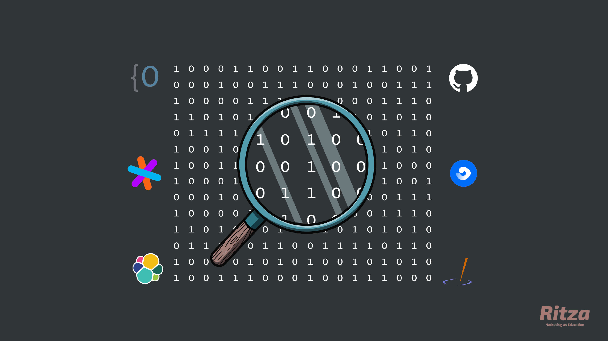

---
hide:
  - navigation
---

# OpenGrok vs Sourcegraph vs GitHub vs FishEye vs Source Insight vs Elasticsearch

## OpenGrok vs Sourcegraph

OpenGrok and Sourcegraph are both open-source code search and navigation tools.

OpenGrok is one of the pioneers in code-search and navigation tools and was developed by Sun Microsystems back in 2004. OpenGrok has become an Oracle open-source project since Oracle acquired Sun. OpenGrok is written in Java and is still actively maintained. 

Sourcegraph has a more comprehensive feature offering with a more modern and user-friendly interface. With Sourcegraph, you can search entire codebases across multiple code hosts. 
 The tool came along in 2017 and is gradually becoming the "go-to" tool when it comes to code search. Sourcegraph has overtaken OpenGrok in popularity amongst developers when comparing Google trends and GitHub activity and stars. 

Consider OpenGrok if it's already the tool your company/peers use for code search and navigation. 

Consider SourceGraph if you are looking for a modern, well maintained and comprehensive code search and intelligence tool. 

## OpenGrok vs GitHub

GitHub is a code hosting platform with version control (Git) and collaboration features while OpenGrok is a code search and cross-referencing engine. 

Consider GitHub for hosting your code to make use of their version control and collaboration features. 

Consider OpenGrok if you need to add the power of code search and cross-referencing on top of your version control service/platform, ie. integrating OpenGrok with your GitHub repositories.

## OpenGrok vs Fisheye

Fisheye is a commercial revision-control browser and search engine owned by Atlassian Inc. It is freely available to open-source projects and non-profits. With Fisheye, developers can search code, visualize and report on activity, and search through commits, files, revisions or teammates across SVN, Git, Mercurial, CVS and Perforce. 

While OpenGrok is a similar code search and cross-referencing engine, it has superior code search capabilities and supports multiple version control systems. However, OpenGrok falls short on a few key features like visual reports on activity. 

Consider Fisheye if your team uses Jira for easy integration and collaboration, or if you have a need for the reporting features that Fisheye provides.

Consider OpenGrok if you are already accustomed to the OpenGrok workflow or if you use a version control system that is not supported by Fisheye.

## OpenGrok vs Source Insight

OpenGrok is a fast source code search and cross-reference engine while Source Insight is a programming editor, code browser and analyzer that helps developers understand code. Source Insight provides syntax highlighting, code navigation and customizable keyboard shortcuts.  It goes beyond editing functionality and is a tool to understand a large source codebase. For this reason, it’s called a "program editor and analyzer”.

Consider OpenGrok if you are simply looking for a code search and cross-referencing engine to bolt on top of your existing workflow.

Consider Source Insight if you are looking for an all-in-one programming tool that includes code search and collaboration features along with code analysis.

## OpenGrok vs Elasticsearch

OpenGrok is a universal code search and navigation tool for developers. OpenGrok is a stand-alone tool with its own search engine.

Elasticsearch is a low-level search engine that other applications can use to provide search functionality. Elasticsearch is not an end-user product, it's just a search engine that provides low-level indexing and query APIs to your own applications, but you need to build the UI, syncing, analysis, deployment, etc. yourself.

Consider Elasticsearch if you plan to build your own application with strong search capabilities. 

Consider OpenGrok if you are looking for a stand-alone code search and navigation tool. 

## GitHub vs Sourcegraph

GitHub is a code host with version control functionality using Git.

Sourcegraph is a web-based code search and navigation tool for developers. Sourcegraph's superior search functionality can easily be added on top of GitHub with Sourcegraph integration for larger organizations.

Consider GitHub alone if you work in a small organization where GitHub's search functionality covers your needs.

Consider Sourcegraph if you work in a larger organization and need more powerful search and collaboration functionality.

