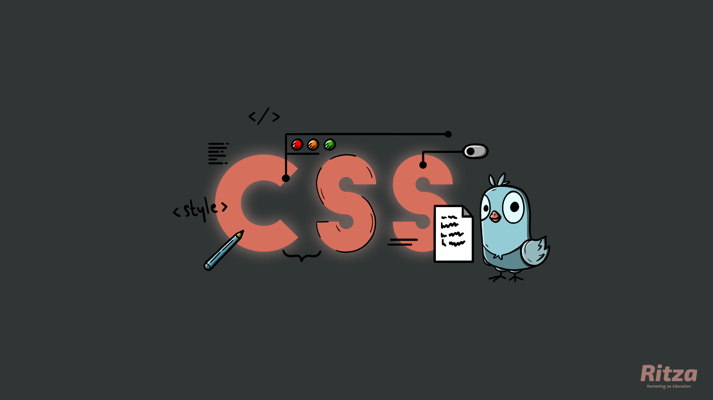

---
hide:
  - navigation
---

# Tailwind CSS vs. Bootstrap vs. Material UI vs. Styled Components vs. Bulma vs. SASS

Let's take a look at some CSS framework options and the major differences between them to help you decide on one that works for you.

## Bootstrap vs. Tailwind CSS
**Bootstrap** is a popular CSS framework with a responsive, mobile-first approach and a decade worth of documentation.

**Tailwind CSS** is a newer framework and way of styling HTML that challenges established conventions.

Consider Bootstrap if you prefer an established framework that comes with predefined design templates.

Consider Tailwind CSS if you prefer a highly-customizable framework that doesn't impose design choices.  

## Material UI vs. Tailwind CSS
**Material UI** is a React component library based on Google's Material Design.

**Tailwind CSS** is a CSS framework that comes with predefined classes rather than components as the building blocks of UI design.

Consider Material UI if you are an avid React user and don't have the time to build a custom UI from scratch.

Consider Tailwind CSS if you want to build a custom UI within your markup while writing minimal custom css.

## Styled Components vs. Tailwind CSS
**Styled Components** is a React CSS-in-JavaScript framework you can use to write custom CSS using JavaScript.

**Tailwind CSS** allows you to build UIs using multiple abbreviated class names as opposed to semantic classes.

Consider Styled Components if you're looking to stay within the React ecosystem and create custom React/CSS components.

Consider Tailwind CSS if you have no experience with JavaScript/React and want to create reusable custom components.

## Bulma  vs. Tailwind CSS
**Bulma** is a mobile-first CSS framework similar to Bootstrap, only lightweight with a limited number of components and JavaScript exclusion.

**Tailwind CSS** employs a different methodology that places best-practices on the back-burner in favour of flexible UI designing.

Consider Bulma if you want to use CSS components to build responsive sites with a gentle learning curve.

Consider Tailwind CSS for an un-opinionated approach to design using a fairly new framework and method utilizing micro classes in your markup.

## Sass vs. Tailwind CSS
**Sass** generates CSS for you using its own scripted language. Sass aims to be a concise way of writing CSS. 

**Tailwind CSS** allows you to apply styles directly to elements using abbreviated classes in your markup rather than writing custom CSS.

Consider Sass if you would like to write much of the CSS yourself only with a more stable syntax.
 
Consider Tailwind CSS if you want to quickly create designs using micro classes. Keep in mind this may be unreadable for non-Tailwind users.

## Bootstrap vs. Material UI
**Bootstrap** is a beginner-friendly framework that comes with pre-packaged UI components and JavaScript plugins that will do most of the heavy lifting when designing and building a website. 

**Material UI** offers reusable pre-designed components and layouts based on Google's Material Design.

Consider Bootstrap if you want to keep complexity low and still have many style options to pick from.

Consider Material UI if you can use React and want a more stable implementation of a design system within React.

## Sass vs. Styled Components
**Sass** is a scripting language that compiles into plain CSS, making it debugging-friendly.  

**Styled Components** allows for creating customized and reusable components, but with the drawback of somewhat difficult debugging due to writing CSS in JavaScript. Styled Components has Sass support too.

Consider Sass if you essentially *do not* want to lock yourself into a specialized workflow with a steeper learning curve.

Consider Styled Components if you want to reduce the chance of overriding styling as styles are not globally scoped.

## Material UI vs. Styled Components
**Material UI** is a CCS-in-JS framework that provides ready-to-use components, themes and user interfaces.

**Styled Components** is similar to Material UI, but gives you the ability to build custom CSS components.

Consider Material UI if you want to cut down production time by using a UI library with consistent designs and a vast community behind it.

Consider Styled Components for a more hands-on approach to creating custom UIs.

## Bootstrap vs. Bulma 
**Bootstrap** is a framework that has been around long enough to build up an extensive set of design choices and community.

**Bulma** is like a smaller version of Bootstrap with less complexities, providing beginners with comparable benefits. 

Consider Bootstrap if you're looking to step up to a much larger design palette using a framework built on Sass. Keep in mind that bootstrap can *sometimes* be overly complex and encumbered, leading to bulky apps and websites.

Consider Bulma if you would much rather do without the complexities of Bootstrap (specifically JavaScript) but still want some of the component creation taken care of by a tiny, non-intrusive framework.

## Bulma  vs. Material UI
**Bulma** is a mobile-first CSS framework aimed at simpler usage scenarios, pre-packaged with a number of ready-to-use components.

**Material UI** uses a pre-defined Material Design system for use in React. Besides basic components, Material UI also comes with UI elements like sliders, drop downs, navigation bars, etc.

Consider Bulma if you simply want to build a usable website in less time with fewer complications. 

Consider Material UI if you want a robust, well-documented design system to use in your React app.

## Bootstrap vs. Sass
**Bootstrap** is a collection of pre-designed UI components and best practices, now built on Sass.

**Sass** is a scripting language that provides a clear, concise approach to writing custom css.

Consider Bootstrap if you don't want to build a custom design from scratch.

Consider Sass if you want to  write custom CSS with scripting benefits and tools such as nesting, mixins, and inheritance, whilst keeping your CSS fairly maintainable.
